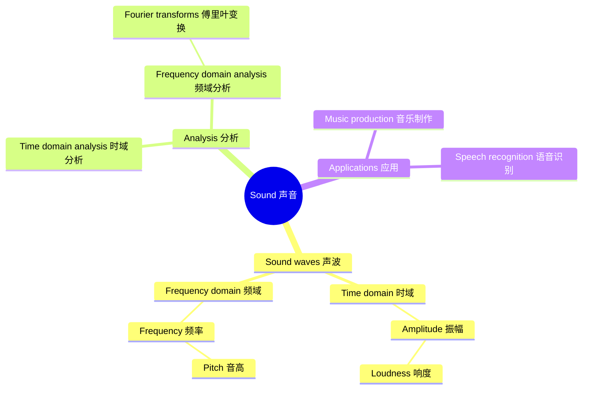
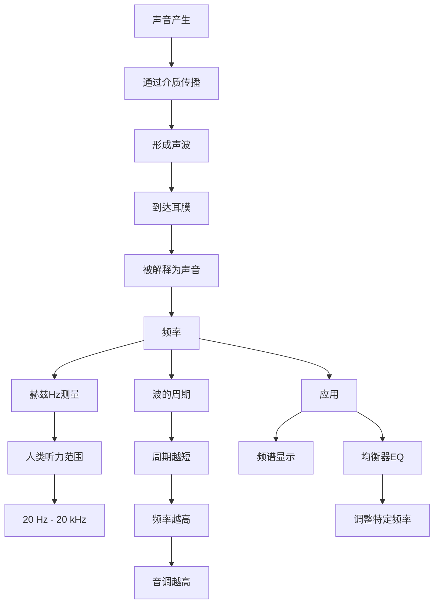

(Source:  [aliyun.com: 015 Understanding frequency](https://tingwu.aliyun.com/doc/transcripts/4l6xqabkvgbd9m2y))

### **时域与频域分析**
- **时域分析**关注信号随时间的变化，例如波形图显示的是声波随时间的起伏。
- **频域分析**则关注信号的频率成分，通过将信号分解成各个特定频率的正弦或余弦波来显示其组成。这通常使用频谱仪或快速傅里叶变换（FFT）技术来完成。

理解这些基本概念对于理解和处理声音至关重要。它们不仅适用于音乐，也适用于通信、声学工程、环境评估等多个领域。通过对声波特性的深入理解，我们可以开发出各种技术和工具来优化声音的质量、增强听觉体验或减少噪声污染。



我选择思维导图的原因如下：

1. 内容结构：提供的信息包含多个相互关联的概念，思维导图非常适合展示这种层次结构和关联关系。

2. 概念关系：思维导图允许我们从中心概念（声音）出发，向外扩展到相关的子概念和属性，清晰地展示了各个概念之间的联系。

3. 信息组织：通过将信息分为声波特性、分析方法和应用等几个主要分支，思维导图帮助我们更好地组织和理解这些概念。

4. 直观性：相比其他图表类型，思维导图更直观地展示了声音这一核心概念与其他相关概念的关系，使读者能够快速把握整体结构。

5. 扩展性：如果需要添加更多相关概念或细节，思维导图可以很容易地进行扩展，而不会影响整体结构。

这个思维导图准确地反映了用户提供的内容，展示了声波的主要特性（时域和频域）、分析方法以及应用领域。它还突出了一些关键概念，如振幅与响度的关系，频率与音高的关系，以及傅里叶变换在频域分析中的作用。通过这种可视化方式，读者可以更容易理解这些声学和信号处理概念之间的联系。
```
1
00:00:00,370 --> 00:00:03,550
Before we jump into working with our audio files in Audition

2
00:00:03,560 --> 00:00:05,930
let's go over a few fundamental concepts

3
00:00:05,930 --> 00:00:08,690
Firstwe'll start by talking about frequency

4
00:00:08,740 --> 00:00:10,040
When sound is created

5
00:00:10,050 --> 00:00:11,490
it travels through a medium

6
00:00:11,500 --> 00:00:12,430
usually air

7
00:00:12,440 --> 00:00:15,340
by changes in pressure in the form of waves

8
00:00:15,390 --> 00:00:17,410
And when those waves reach our eardrums

9
00:00:17,410 --> 00:00:19,160
we interpret that as sound

10
00:00:19,310 --> 00:00:22,790
The timing of those waves is what's known as the frequency

11
00:00:22,830 --> 00:00:24,340
Or to take​‌​‌​​‌‌​​‌‌​​‌‌‌‌​‌‌‌​‌​​‌‌‌‌​‌​​‌‌​​‌‌‌​‌‌​​‌‌​‌‌‌‌‌​‌‌‌‌‌​​‌‌‌‌​‌‌‌​‌​‌​‌‌‌​‌​​‌‌‌‌​‌‌‌‌​​​‌‌‌‌‌‌​​‌‌‌‌​‌​​‌‌​‌​‌​​‌‌‌‌‌‌​​‌‌​​​‌​​‌‌​​‌‌‌‌​‌‌​​‌​​‌‌​‌‌‌‌‌​‌​‌‌‌​​‌‌‌​​‌​​‌‌​‌​‌​​‌‌​​‌‌​​‌‌‌​​‌​​‌‌‌‌‌​​​‌‌‌​‌‌​​‌‌‌​‌‌‌‌​‌‌‌‌‌​​‌‌​​‌‌‌‌​‌​‌‌‌​​‌‌​​‌‌​​‌‌​​‌‌‌‌​‌‌‌​‌​​‌‌​‌‌‌‌‌​‌​​‌‌‌‌​‌‌​​‌​​‌‌‌‌​‌‌‌​‌‌‌‌‌​​‌‌​‌​‌​​‌‌​‌‌​​​‌‌‌‌‌‌​​‌‌‌‌​‌​​‌‌‌​​‌‌‌​‌​‌‌‌​​‌‌​‌‌​​​‌‌​‌‌‌‌‌​‌‌‌​‌‌‌​‌​​‌‌‌‌​‌​​​‌​​‌‌​​‌‌‌‌​‌‌‌‌​​​‌‌​‌‌‌​​‌‌‌‌‌​​​‌‌​‌‌‌‌‌​‌‌‌​‌​​‌‌‌‌​‌‌‌​‌‌‌‌‌​​‌‌​‌​‌‌‌​‌​​‌‌​​‌‌​‌​‌​​‌‌​‌‌​​​‌‌‌‌​‌​​‌‌​​‌‌‌‌​‌​‌​‌‌‌​‌‌‌​‌‌‌​‌​‌‌​​​‌‌‌​‌‌‌‌​‌​​‌‌‌‌​‌​‌​‌‌‌​‌​‌​‌‌‌​‌​‌‌‌‌‌​‌‌​​‌‌‌​‌​‌​‌​​‌‌​‌​‌‌‌​‌‌​​‌‌‌​‌‌‌​‌‌‌​‌‌‌​‌​​‌‌‌‌​‌​​‌‌‌​​‌‌‌​‌​​‌‌​​‌‌‌​​‌​​‌‌‌‌​‌​​‌‌​‌​‌‌‌​‌​‌‌‌‌‌​‌​‌‌‌‌‌​‌​​‌‌‌‌​‌‌​​‌‌‌​‌‌​​‌‌‌​‌​‌​‌​​‌‌‌‌​‌‌‌​‌‌‌​‌‌‌​‌‌‌​‌‌‌​‌​​‌‌​​‌‌‌​​‌​​‌‌​​‌‌‌‌​‌​​‌‌​​‌‌​‌​‌‌‌​‌‌​‌‌‌‌​‌‌​​‌​​‌‌‌‌‌‌​​‌‌​‌‌‌​​‌‌​​‌‌‌‌​‌‌‌​‌​​‌‌​​‌‌​​‌‌‌‌​‌‌‌​‌‌‌‌​​​‌‌‌​‌‌‌‌​‌‌‌​‌‌‌​‌‌‌​‌‌‌​‌‌​​‌​​‌‌​‌​‌‌‌​‌​‌‌‌​​‌‌​‌‌​​​‌‌‌‌​‌‌‌​‌​‌‌‌​​‌‌‌‌‌​​​‌‌​‌​‌​​‌‌‌‌​‌​​‌‌‌​‌‌‌‌​‌‌​‌‌‌‌​‌‌​​‌‌‌​‌​‌‌‌‌‌​‌‌​‌‌‌‌​‌‌​‌‌‌‌​‌‌‌‌‌​​‌‌‌‌‌‌​​‌‌​‌‌‌​​‌‌‌​‌‌‌‌​‌‌​‌‌‌‌​‌‌​​‌​​‌‌​​‌‌​​‌‌‌​​‌​​‌‌‌​​‌​​‌‌​‌​‌‌‌​‌‌‌‌‌‌‌‌‌‌‌‌‌‌‌‌‌‌‌‌‌‌‌‌‌‌‌‌‌‌‌‌‌‌‌‌‌‌‌‌‌‌‌‌‌‌‌‌‌‌‌‌‌‌‌‌‌‌‌‌‌‌‌‌‌‌‌‌‌‌‌‌‌‌‌‌‌‌‌‌‌‌‌‌‌‌‌‌‌‌‌‌‌‌‌‌‌‌‌‌‌‌‌‌‌‌‌‌‌‌‌‌‌‌‌‌‌‌‌‌‌‌‌‌‌‌‌‌‌‌‌‌‌‌‌‌‌‌‌‌‌‌‌‌‌‌‌‌‌‌‌‌‌‌‌‌‌‌‌‌‌‌‌‌‌‌‌‌‌‌‌‌‌‌‌‌‌‌‌‌‌‌‌‌‌‌‌‌‌‌‌‌‌‌‌‌‌‌‌‌‌‌‌‌‌‌‌‌‌‌‌‌‌‌‌‌‌‌‌‌‌‌‌‌‌‌‌‌‌‌‌‌‌‌‌‌‌‌‌‌‌‌‌‌‌‌‌‌‌‌‌‌‌‌‌‌‌‌‌‌‌‌‌‌‌‌‌‌‌‌‌‌‌‌‌‌‌‌‌‌‌‌‌‌‌‌‌‌‌‌‌‌‌‌‌‌‌‌‌‌‌‌‌‌‌‌‌‌‌‌‌‌‌‌‌‌‌‌‌‌‌‌‌‌‌‌‌‌‌‌‌‌‌‌‌‌‌‌‌‌‌‌‌‌‌‌‌‌‌‌‌‌‌‌‌‌‌‌‌‌‌‌‌‌‌‌‌‌‌‌‌‌‌‌‌‌‌‌‌‌‌‌‌‌‌‌‌‌‌‌‌‌‌‌‌‌‌‌‌‌‌‌‌‌‌‌‌‌‌‌‌‌‌‌‌‌‌‌‌‌‌‌‌‌‌‌‌‌‌‌‌‌‌‌‌‌‌‌‌‌‌‌‌‌‌‌‌‌‌‌‌‌‌‌‌‌‌‌‌‌‌‌‌‌‌‌‌‌‌‌‌‌‌‌‌‌‌‌‌‌‌‌‌‌‌‌‌‌‌‌‌‌‌‌‌‌‌‌‌‌‌‌‌‌‌‌‌‌‌‌‌‌‌‌‌‌‌‌‌‌‌‌‌‌‌‌‌‌‌‌‌‌‌‌‌‌‌‌‌‌‌‌‌‌‌‌‌‌‌‌‌‌‌‌‌‌‌‌‌‌‌‌‌‌‌‌‌‌‌‌‌‌‌‌‌‌‌‌‌‌‌‌‌‌‌‌‌‌‌‌‌‌‌‌‌‌‌‌‌‌‌‌‌‌‌‌‌‌‌‌‌‌‌‌‌‌‌‌‌‌‌‌‌‌‌‌‌‌‌‌‌‌‌‌‌‌‌‌‌‌‌‌‌‌‌‌‌‌‌‌‌‌‌‌‌‌‌‌‌‌‌‌‌‌‌‌‌‌‌‌‌‌‌‌‌‌‌‌‌‌‌‌‌‌‌‌‌‌‌‌‌‌‌‌‌‌‌‌‌‌‌‌‌‌‌‌‌‌‌‌‌‌‌‌‌‌‌‌‌‌‌‌‌‌‌‌‌‌‌‌‌‌‌‌‌‌‌‌‌‌‌‌‌‌‌‌‌‌‌‌‌‌‌‌‌‌‌‌‌‌‌‌‌‌‌‌‌‌‌‌‌‌‌‌‌‌‌‌‌‌‌‌‌‌‌‌‌‌‌‌‌‌‌‌‌‌‌‌‌‌‌‌‌‌‌‌‌‌‌‌‌‌‌‌‌‌‌‌‌‌‌‌‌‌‌‌‌‌‌‌‌‌‌‌‌‌‌‌‌‌‌‌‌‌‌‌‌‌‌‌‌‌‌‌‌‌‌‌‌‌‌‌‌‌‌‌‌‌‌‌‌‌‌‌‌‌‌‌‌‌‌‌‌‌‌‌‌‌‌‌‌‌‌‌‌‌‌‌‌‌‌‌‌‌‌‌‌‌‌‌‌‌‌‌‌‌‌‌‌‌‌‌‌‌‌‌‌‌‌‌‌‌‌‌‌‌‌‌‌‌‌‌‌‌‌‌‌‌‌‌‌‌‌‌‌‌‌‌‌‌‌‌‌‌‌‌‌‌‌ the word literally

12
00:00:24,350 --> 00:00:26,920
how frequently the wave fluctuates

13
00:00:27,310 --> 00:00:28,190
To show you what I mean

14
00:00:28,190 --> 00:00:29,800
let's look at this file here

15
00:00:29,870 --> 00:00:32,680
Nowyou might guess just by looking at the waveform

16
00:00:32,690 --> 00:00:35,840
that this is three identical sounds played in succession

17
00:00:36,120 --> 00:00:38,130
but if I hit the space bar to play

18
00:00:38,140 --> 00:00:43,230
you'll hear that it's actually three distinct tones and each one sounding higher than the previous

19
00:00:48,480 --> 00:00:48,690
Now

20
00:00:48,700 --> 00:00:51,960
if we move the play head back to the start and zoom in on this

21
00:00:51,960 --> 00:00:54,570
you'll see this isn't actually a solid block at all

22
00:00:54,880 --> 00:00:56,970
It's actually made up of waves

23
00:00:57,260 --> 00:00:59,290
And when we talk about the frequency

24
00:00:59,300 --> 00:01:05,580
we're referring to how long it takes for this wave to complete one cycle like this

25
00:01:05,590 --> 00:01:08,190
The way that we measure these waves is with hertz

26
00:01:08,200 --> 00:01:09,930
or cycles per second

27
00:01:10,010 --> 00:01:14,080
So this particular wave has 440 cycles per second

28
00:01:14,090 --> 00:01:16,620
or rather 440 Hz

29
00:01:16,790 --> 00:01:18,520
The more cycles per second

30
00:01:18,530 --> 00:01:20,620
the higher the pitch of the sound

31
00:01:20,680 --> 00:01:23,960
So if I hover my mouse over this navigator up here

32
00:01:23,960 --> 00:01:25,360
when I get this little hand icon

33
00:01:25,360 --> 00:01:29,560
it means I can click and drag and I'll move across to our next tone

34
00:01:29,670 --> 00:01:32,650
And you'll see that the waves are actually closer together here

35
00:01:32,650 --> 00:01:33,340
Or rather

36
00:01:33,350 --> 00:01:35,510
it has more cycles per second

37
00:01:35,740 --> 00:01:39,120
The tone of this frequency is 880 Hz

38
00:01:39,560 --> 00:01:43,070
And if we go to the last tone on our waveform here

39
00:01:43,080 --> 00:01:48,900
you'll see that they're even closer together with a frequency of 1760 Hz

40
00:01:48,910 --> 00:01:52,580
Although we usually measure in kilohertz to anything over 1000 hertz

41
00:01:52,690 --> 00:01:53,770
So in this case

42
00:01:53,780 --> 00:01:56,420
it would be 1．76 kHz

43
00:01:56,620 --> 00:02:03,220
It's generally accepted that the range of human hearing is somewhere between 20 Hz and 20 kHz

44
00:02:03,280 --> 00:02:12,760
Understanding what frequency is and how it works can be very helpful when working in audio because it allows you to target specific frequencies or ranges of frequencies

45
00:02:12,950 --> 00:02:14,000
Later in this course

46
00:02:14,000 --> 00:02:21,210
we'll look at how we can use things like the spectral frequency display to identify specific frequencies in our files

47
00:02:21,250 --> 00:02:28,230
as well as using EQ effects like the graphic equalizer to make that frequency louder or softer

48
00:02:28,440 --> 00:02:31,180
This leads us to another important concept of audio

49
00:02:31,190 --> 00:02:32,600
and that is amplitude

50
00:02:32,610 --> 00:02:34,280
which we'll cover in the next video

```


这段文字介绍了声音的基本概念,主要讲解了频率。

声音是通过空气中的压力变化以波的形式传播的。当这些波到达我们的耳朵时,我们就能听到声音。频率指的是这些波的时间间隔,也就是波的振动速度。

频率用赫兹(Hz)来测量,表示每秒钟波的周期数。频率越高,音调就越高。人类能听到的声音频率大约在20 Hz到20 kHz之间。

文中用了一个音频文件作为例子,展示了三个不同频率的音调:440 Hz、880 Hz和1760 Hz(1.76 kHz)。通过放大波形,可以看到频率越高,波形越密集。

了解频率对音频处理很有帮助。在Audition软件中,可以使用频谱显示来识别特定频率,还可以用均衡器来调整某些频率的音量。

这些知识为后续学习音频处理奠定了基础,下一个要学习的重要概念是振幅。
根据提供的内容，我选择使用流程图来表示声音的基本概念和频率的关系。以下是相应的Mermaid图表：



我选择使用流程图的原因是：

1. 内容描述了声音从产生到被感知的过程，这是一个线性的流程。

2. 流程图能清晰地展示频率这个核心概念与其他相关概念的关系。

3. 图表还能展示频率的应用和影响，如对音调的影响以及在音频处理中的应用。

这个流程图从声音的产生开始，通过介质传播形成声波，到达耳膜被解释为声音。然后重点展示了频率这个概念，包括其测量单位（赫兹）、人类听力范围、频率与波的周期和音调的关系，以及在音频处理中的应用（如频谱显示和均衡器）。

这个图表准确地反映了原文中关于声音和频率的主要概念及其关系，为读者提供了一个直观的理解框架。
