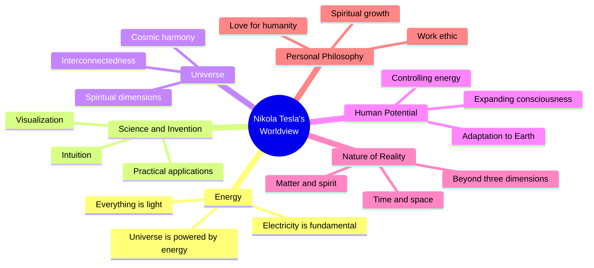
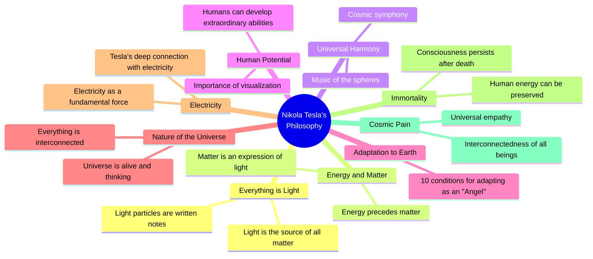

> [!error]
>  特斯拉错误地认为 X 射线是纵波，就像等离子体中产生的波一样。
Tesla incorrectly believed that X-rays were longitudinal waves, such as those produced in waves in plasmas.(Source:  [wikipedia.org: Nikola Tesla ](https://en.wikipedia.org/wiki/Nikola_Tesla))


(Source:  [youtube.com: “EVERYTHING IS LIGHT ✨” – The Incredible Interview with Nikola Tesla In 1899](https://youtu.be/_7j1ERKeyTI?t=136))

(Source:  [linkedin.com: (25) “Everything Is Light” – The Incredible Interview With Nikola Tesla In 1899 | LinkedIn](https://www.linkedin.com/pulse/everything-light-incredible-interview-nikola-tesla-1899-sten-rigedahl-s5qge/))

```
## “Everything Is Light” – The Incredible Interview with Nikola Tesla In 1899

Nikola Tesla is undeniably one of the most significant inventors to ever live on our planet. Interestingly, despite his immense importance and contributions to science, he remains largely overlooked in history books.

Interviews with Tesla are exceptionally scarce, but the few that exist provide valuable insights into the mindset of this brilliant scientist. His primary objective was to provide people worldwide with limitless, free power.

I find Nikola Tesla to be one of the most brilliant minds that ever lived, and I find it very intriguing how his works seem to encompass science, metaphysics, and spirituality as one. It just makes so much more sense and think we are still struggling to catch up with him 125 years after this interview.

Many of the people I partner with are very much aligned with Nikola Tesla's thinking.

> **_“Everything is Light. In one of its rays is the destiny of the nations, each nation has its own ray in that great source of light, which we see, like the Sun. And remember, there is no man who has existed and who has not died!_**

Here is the interview that the scientist Nikola Tesla gave to the magazine “Immortality” and the journalist John Smith, in his laboratory in Colorado Springs in the year 1899:

  

**JOURNALIST**: Mr. Tesla, you have gained the glory of the man who got involved in the cosmic processes. Who are you, Mr. Tesla?

**TESLA**: It’s an interesting question, Mr. Smith, and I’ll try to give you the right answer.

**JOURNALIST**: They say that you are from the country of Croatia, the area called Lika, where together with the people grow trees, rocks and starry sky. They say that his hometown is named after the flowers of the mountain and that the house where he was born is next to the forest and the church.

**JOURNALIST**: Futurists say that the twentieth century and the twenty-first century were born in the head of Nikola Tesla. They hold the magnetic field in reverse and sing hymns to the induction motor. His creator was called “the hunter who caught the light in his nets from the depths of the earth,” and “the warrior who caught fire from heaven.” He is said to be the father of the alternating current, which will make Physics and Chemistry dominate half the world. The industry will proclaim him as his supreme saint, a banker for the greatest benefactors. In the laboratory of Nikola Tesla for the first time an atom has been broken. A weapon has been created that produces seismic vibrations. There, black cosmic rays were discovered. Five races will pray to him in the temple of the future, because he has taught them a great secret: that the elements of Empedocles can be watered with the life forces of the ethers.

**TESLA**: Yes, these are some of my most important discoveries. Yet I am a defeated man. I have not achieved the greatest of my goals.

**JOURNALIST**: What would that wish be, Mr. Tesla?

**TESLA**: I wanted to light up the whole earth. There is enough electricity to create a second sun. Light would appear around the equator, like a ring around Saturn. Humanity is not prepared for greatness. In Colorado Springs I have impregnated the earth with electricity. We can also water the other energies, such as positive mental energy, found in the music of Bach or Mozart, or in the verses of the great poets.

Inside the Earth, there are energies of joy, peace, and love that are expressed for example through a flower that grows from the earth, food that comes out of it and everything that makes it the home of man. I’ve spent years looking for ways that this energy could influence people. The beauty and aroma of roses can be used as a medicine and the sun’s rays as food. Life has an infinite number of forms and the duty of scientists is to find them in all forms of matter. Three things are essential in this regard. All I do is look for them. I know I will not find them, but I will not give them up.

**TESLA**: One problem is food. What energy, stellar or terrestrial, can feed the hungry on Earth? With what wine can thirst be watered, so that people can cheer their heart and understand that they are gods? It is another thing to destroy the power of evil and the suffering in which man’s life passes! Sometimes they occur as an epidemic in the depths of space. In this century the disease had spread from Earth to the Universe. The third thing is: is there an excess of light in the Universe? I discovered a star that according to astronomical and mathematical laws could disappear, and still nothing would change. That star is in this galaxy. Its light can be emitted with such density that it fits into a sphere smaller than an apple and at the same time heavier than our Solar System. Religions and philosophies teach that man can become the Christ, Buddha, and Zarathustra.

What I am trying to prove is revolutionary and almost inaccessible. It is what must be done in the Universe so that each being is born as Christ, Buddha or Zarathustra. I know that gravity is adverse to everything I have to fly and my intention is not to make flight devices (aircraft or missiles), but to teach the individual to regain consciousness on their own wings … I am also trying to awaken contained energy in the air. There are major energy sources. What is considered as empty space is only a manifestation of matter that is not awake? There is no empty space on this planet, nor in the Universe … Black holes, of which astronomers speak, are the most powerful sources of energy and life.

**JOURNALIST**: In the window of your room at the Waldorf-Astoria hotel on the thirty-third floor, the birds arrive every morning.

**TESLA**: A man must be sensitive to birds. This is because of their wings. The human being once had them real and visible!

**JOURNALIST**: You have not stopped flying from those distant days in Smiljan!

**TESLA**: I wanted to fly from the roof and I fell: the calculations of the children can be mistaken. Remember that the wings of youth want to have everything in life!

**JOURNALIST**: Have you ever been married? It is not known whether you have affection for love or for some woman. The photos of the youth show that he was an attractive man.

**TESLA**: Yes, I did not. There are two points of view: either one has much affection or nothing at all. The middle point serves to rejuvenate the human race. Women for certain men nourish and strengthen their vitality and spirit. Being alone does the same to other people. I chose that second path.

**JOURNALIST**: His fans complain that he is attacking relativity. The strange thing is his claim that matter has no energy. Everything is imbued with energy, where is it?

**TESLA**: First was energy and then matter.

**JOURNALIST**: Mr. Tesla, it’s like when you said that you were born to your father and not of yourself.

**TESLA**: Exactly! What about the birth of the Universe? The matter is created from the original and eternal energy that we know as light. She shone and the stars, the planets, the man and everything on Earth and in the Universe appeared. The matter is an expression of infinite forms of light because the energy is older than it.

There are four laws of Creation. The first is that the mind can not conceive or mathematically measure the source of the whole bewildering and dark plot, in that plot fits the whole Universe. The second law resides in expansive darkness, which is the true nature of light, of the inexplicable, and is transformed into light. The third law is the need for light to become a matter of light. The fourth law is: there is no beginning or end; The three previous laws always take place and Creation is eternal.

**JOURNALIST**: In hostility to Theory of Relativity you go so far that you hold conferences against your creator at your birthday parties …

**TESLA**: Remember: space is not curved, but the human mind that can not comprehend infinity and eternity! If relativity has been clearly understood by its creator he would gain immortality even physically, if it pleased him. I am part of a light and it is music. Light fills my six senses: I see, hear, feel, smell, touch and think. Thinking about it is my sixth sense. Light particles are written notes.

Lightning can be an entire sonata. Thousand lightning balls are a concert. For this concert, I created a ball of lightning that can be heard on the frozen peaks of the Himalayas. About Pythagoras and mathematics, a scientist can not and should not infringe on these two. Numbers and equations are signs that mark the music of the spheres. If Einstein had heard those sounds, he would not have created Theory of Relativity. These sounds are messages directed to the mind about which life has a meaning, that the Universe exists in perfect harmony, and its beauty is the cause and effect of Creation.

This music is the eternal cycle of stellar skies. The smallest star has completed the composition and is also part of the celestial symphony. The heartbeats of man are part of the symphony of the Earth. Newton learned that the secret is in geometric arrangement and the movement of the celestial bodies. He acknowledged that the supreme law of harmony exists in the Universe. Curved space is chaos, chaos is not music. Einstein is the messenger of the age of noise and fury.

**JOURNALIST**: Mr. Tesla, do you hear that music?

**TESLA**: I hear it all the time. My spiritual ear is as large as the sky we see above us. I raised my natural ear with the radar. According to the Theory of Relativity, two parallel lines will meet in infinity. That is why the curvature of Einstein’s space will straighten out. Once created, the sound lasts forever, for a man can disappear, but it still exists in the silence that is the greatest power of man. No, I have nothing against Mr. Einstein. He is a very kind person and has done many good things, some of which will become part of the music. I am going to write to you and try to explain that the ether exists and that its particles are what keep the universe in harmony, and life in eternity.

**JOURNALIST**: Tell me, please, what conditions does an Angel adopt on Earth?

**TESLA**: I have ten of them. I keep a good watchful record.

**JOURNALIST**: I’ll document all your words, dear Mr. Tesla.

**TESLA**: The first requirement is a high awareness of your mission and the work to be done. It must, albeit only vaguely, exist in the first few days. Let us not be falsely modest: The oak knows that it is an oak tree, a shrub beside it which is a shrub. When he was twelve, he was certain he would reach Niagara Falls. I knew from my childhood that I would get most of my discoveries, although I was not entirely clear … The second condition to adapt is determination. All I could, I finished it.

**JOURNALIST**: What is the third condition of the adjustment, Mr. Tesla?

**TESLA**: Guide for all the vital and spiritual energies that work. Therefore, the purification of the many effects and needs that man has. Therefore, I have not lost anything, I just won. So I enjoy every day and night. Note: Nikola Tesla was a happy man … The fourth requirement is to adjust the physical set with work.

**JOURNALIST**: What do you mean, Mr. Tesla?

**TESLA**: First, the maintenance of the whole. The body of man is a perfect machine. I know my circuit and what is good for it. Food that almost all people eat, to me is harmful and dangerous. Sometimes I visualize cooks of the world being all conspiring against my … Touch my hand.

**JOURNALIST**: It’s cold.

**TESLA**: Yes. The bloodstream can be controlled, and many processes in and around us. Why are you scared, young man?

**JOURNALIST**: Mark Twain wrote The Mysterious Stranger, a wonderful book about Satan, inspired by you.

TESL**A**: The word “Lucifer” is more charming. Mr. Twain likes to joke. As a child, I was healed once when I read his books. When we met here and told him, he was so moved that he cried. We became friends and he often came to my laboratory. He once asked me to show him a machine that vibration causes a feeling of happiness. It was one of those inventions for entertainment, which I sometimes like to do. I warned Mr. Twain not to remain under those vibrations.

He ignored it and stayed longer. It ended up being like a rocket clutching the pants and entered a certain room. It was devilishly funny, although I was serious. But to adjust the physical circuit, in addition to food, sleep is very important. From a long and exhausting work, which requires a superhuman effort, after an hour of sleep would be completely recovered. I have acquired the ability to manage sleep, fall asleep and wake up at the designated time.

If I do something I do not understand, I force myself to think of my dream to find a solution. The fifth adjustment condition is a memory. Perhaps in most people, the brain is the guardian of knowledge about the world and knowledge gained through life. My brain is engaged in things more important than remembering, it is gathering what is required at a given moment, that is, everything around us. You just have to internalize it.

Everything we have once seen, heard, read and learned accompanies us in the form of particles of light. To me, these particles are obedient and files. As a student, I learned from memory Goethe’s Faust, my favorite book, in German, and now I can recite it wholeheartedly. I held my inventions for years “in my head”, before carrying them out.

JOURNALIST: You often mention the power of visualization.

TESLA: I’m going to have to thank the visualization for everything I’ve invented. The events of my life and my inventions are real in front of my eyes, like any occurrence or article. In my youth, I was afraid of not knowing what it is, but later I learned to use this power as an exceptional talent and a gift. He nourished and protected jealously. I also did the corrections through visualization in most of my inventions and ended them that way. By visualizing mentally I solve complex mathematical equations.

For that gift I have, I will receive the distinction of the High Lama in Tibet. My sight and hearing are perfect, and I dare say that they are stronger than in others. I hear the thunder 150 kilometers away and I see colors in the sky that others can not see. This expansion of vision and hearing I have had since I was a child. Later I developed it consciously.

**JOURNALIST**: In his youth, he was several times seriously ill. Is a disease a requirement for adjustment?

**TESLA**: Yes. It is often the result of over-exhaustion or life force, but it is often the purification of the mind and body from the toxins that have accumulated. It is necessary for a man to suffer from time to time. The source of most diseases is in the spirit. Therefore, the spirit can cure almost all diseases. When I was a student, I was sick with anger that ravaged the Lika region. I healed because my father finally allowed me to study technology, which was my life.

The illusion for me has not been a disease, but the ability of the mind to penetrate beyond the three dimensions of the Earth. I have had illusions all my life, and I have received them like all the other phenomena that surround us. Once, in childhood, he was walking along the river with my uncle and said: “From the water, trout appears, I’ll throw a stone and cut”. That’s what happened. Frightened and surprised, my uncle exclaimed: “Vade retro, Satan!” He was an educated person and spoke in Latin … I was in Paris when I saw my mother’s death. In the sky, full of light and music, clouds were missing, they were wonderful creatures. One of them had the character of the mother who looked at me with infinite love. As the vision disappeared, I knew my mother had died.

**JOURNALIST**: What is the seventh adjustment, Mr. Tesla?

**TESLA**: Knowledge of how to transform mental and vital energy into what we want, and achieve control of all feelings. Hindus call it Kundalini-Yoga. This knowledge can be learned, for what is needed many years, or can also be acquired by birth. Most of them I have acquired by birth. They are in the closest relationship with sexual energy, which is one of the most widespread in the universe. The woman is the greatest thief of that energy, and therefore of spiritual power. I have always known and for this reason, I have been alert. From myself, I have created what I wanted: a reflective and spiritual machine.

**JOURNALIST**: Set the ninth, Mr. Tesla?

**TESLA**: Do your best, any day, anytime, not to forget who we are and why we are on Earth. There are extraordinary people who are struggling with illness, deprivation, or society that hurts them with their stupidity, incomprehension, persecution and other problems that the country is full. There are many fallen angels on Earth.

**JOURNALIST**: What is the tenth adaptation?

**TESLA**: It’s the most important. Write in the magazine that Mr. Tesla has played. And he spent all his life playing and enjoyed it. JOURNALIST: Mr. Tesla! Whether in connection with your conclusions or your work, is this a game?

TES**LA**: Yes, dear boy. How much I wanted to play with electricity! I always shudder when I hear the story of the Greek who stole the fire. A terrible story about tracks and eagles pecking at his liver. Could it be that Zeus did not have enough lightning and thunder, and was damaged by fervor? There is a misunderstanding … Lightning is the most beautiful toys that can be found. Do not forget to highlight in his text that Nikola Tesla was the first man who discovered the rays.

**JOURNALIST**: Mr. Tesla, you’re talking about angels and their adaptation to Earth.

**TESLA**: It’s really the same. He can write the following: he dared to take upon himself the prerogatives of Indra, Zeus, and Perun. Imagine one of these Gods in a black nightgown, with bowler hat and white cotton gloves, preparing rays, fires, and earthquakes for the elite of New York City!

**JOURNALIST**: The readers love the humor of our newspaper. It confuses me by saying that their findings have enormous benefits for people and that at the same time represent a game, many will frown.

**TESLA**: Dear Mr. Smith, the problem is that people take everything very seriously. If they did not, they would be happier and much longer. A Chinese proverb says that tremendousness reduces life. But for readers of the newspaper do not frown, let’s go back to the things they consider important.

**JOURNALIST**: They would love to know your philosophy.

**TESLA**: Life is a rhythm that must be understood. I feel the rhythm, I let it lead and I consent. It was very nice and gave me the knowledge I have. All that lives is in a deep and wonderful relationship: the man and the stars, the amoebas and the sun, the heart and the circulation of an infinite number of worlds.

These ties are unbreakable but can be tame, propitiate and begin to create new and different relationships in the world, and not violate the old. Knowledge comes from space. Our vision is the perfect set. We have two eyes: the earthly and the spiritual. It is recommended that they become an eye.

The Universe is alive in all its manifestations, like a thinking animal. The stone is a thinking and sensitive being, such as plants, beasts, and man. A star that shines asks to be seen and if we were not self-absorbed we would understand its language and its message. The breath, the eyes and the ears of the man have to fulfill the breath, the eyes and the ears of the Universe.

**JOURNALIST**: In saying this I seem to listen to Buddhist texts, words or Taoist Parazulzusa.

**TESLA**: That’s right! This means that there is a general knowledge and that there is the Truth that man has always possessed. In my feeling and experience, the Universe has a single substance and a supreme energy with an infinite number of the manifestations of life.

The best thing is that the discovery of one secret nature reveals the other. They can not be hidden, there are those around us, but we are blind and deaf to them. If we emotionally bind them, they come to us. There are a lot of apples, but only a Newton. He needed only one apple that fell in front of him.

**JOURNALIST**: I ask you a question that could have been established at the beginning of this conversation: what was the electricity for you, dear Mr. Tesla?

**TESLA**: Everything is electricity. First was the light, an endless source from which comes the material and is distributed to all forms that represent the Universe and the Earth with all aspects of life. The black is the true face of the Light, only we do not see it.

It is of notable grace to man and other creatures. Each of its particles has light, thermal, nuclear force, radiation, chemical, mechanical and energy not yet identified. It has the power to create the Earth with its orbit. It is the authentic lever of Archimedes.

**JOURNALIST**: Mr. Tesla, you’re too biased toward electricity.

**TESLA**: Electricity I am. Or if you prefer, I am the light in the human form. You are electricity too, Mr. Smith, but you do not realize it.

**JOURNALIST**: Is that why you have the ability to withstand one million volt discharges through your body?

**TESLA**: Imagine a gardener being attacked by herbs. In fact, this would be crazy. The body of a man and the brain are made of a lot of energy. In me, there is most of the electricity. The energy, which is different in each person, is what makes the human “I” or “soul”. For other creatures in their essence, the soul of the plant is the soul of minerals and animals.

Brain function and death are manifested in the light. My eyes in youth were black, now they are blue, and with the passage of time, as the tension of the brain becomes stronger, they will be closer to the target. White is the color of the sky. Through my window, one morning came a white dove, to which I fed him. She wanted to tell me that she was dying. Out of his eyes came streams of light. Never in the eyes of any creature had he seen so much light as in those of that dove.

**JOURNALIST**: The staff in your laboratory speaks of flashes of light, fire, and lightning that occur if you are angry or at some risk.

**TESLA**: It’s the psychic discharge or a warning to be alert. The light has always been on my side. Do you know how I discovered the rotating magnetic field and the induction motor, which made me famous when I was 26? One summer afternoon in Budapest, I saw the sunset with my friend. Thousands of fires circled thousands of flaming colors. I remembered Faust and recited his verses and then, as in a fog, I saw the magnetic field and the induction motor spin. I saw them in the sun!

**JOURNALIST**: The hotel service is saying that at the time of lightning, he usually isolates himself in the room and talks to himself.

**TESLA**: I speak with lightning and thunder.

**JOURNALIST**: With them? In what language, Mr. Tesla?

**TESLA**: Mostly my mother tongue. The language counts with words and sounds, especially in poetry, so it is adequate.(Nikola Tesla)

**JOURNALIST**: The readers of our magazine would be very grateful if you explained that.

**TESLA**: Sound does not exist only in thunder and lightning, it also exists in the transformation in brightness and color. A color can be heard. The language is of the words, which means that it is the sounds and colors. All thunder and lightning are different and have their names. I call some of them by the names of those who were close in my life, or by those whom I admire.

In the brightness of the sky and thunder live my mother, my sister, my brother Daniel, a poet: Jovan Jova novic Zmaj and other people of Serbian history. Names like Asisaiah, Ezekiel, Leonardo, Beethoven, Goya, Faraday, Pushkin and all the banks of burning fires and tangles of lightning and thunder that do not stop all night bringing the precious rain to the Earth, burning trees or villages. There are lightning and thunder, and they are brighter and more powerful, they return and I recognize you among thousands.

JOURNALIST: Are science and poetry the same to you?

**TESLA**: These are the two eyes of a person. William Blake was taught that the Universe was born of the imagination, which is maintained and will exist as long as there is one last man on Earth. She was the wheel with which astronomers were able to collect stars from all galaxies. It is the creative energy identical to the energy of light.

JO**URNALIST**: For you, the imagination is more real than life itself?

**TESLA**: It gives light to life. I have fed my thought, I have learned to control emotions, dreams, and visions. I have always appreciated how I have nurtured my enthusiasm. All my life I have spent a lot of time in ecstasy. That was the source of my happiness. It helped me during all these years to find work, which was enough for the five lives. It is best to work at night, by the stellar light and the close bond that exists.

**JOURNALIST**: You have said that I am, like all beings, the Light. This flatters me, but I confess I do not quite understand.

**TESLA**: Why is it necessary to understand, Mr. Smith? Just believe. Everything is light. In one of its rays is the fate of nations. Each nation has its own ray in that great source of light that we see that it is the Sun. And remember that there is no man that has existed and has not died! It became light and as such still exists. The secret lies in the fact that the particles of light restore their original state.

**JOURNALIST**: This is the resurrection!

**TESLA**: I’d rather call him back to an earlier energy. I am looking for a way to conserve human energy. These are the forms of light, sometimes directly as celestial light. I have not sought it for my own benefit, but for the good of all. I think my discoveries make the lives of people easier and more bearable, and channel people to spirituality and morality.

**JOURNALIST**: Do you think time can be abolished?

**TESLA**: Not at all, because the first characteristic of energy is that it is transformed. This one is in perpetual transformation, like the clouds of the Taoists. However, it is possible to take advantage of the fact that man retains consciousness after the earthly life. In every corner of the universe, there is the energy of life; One of them is immortality, whose origin is outside of man and awaits him.

The Universe is spiritual, like half of us. The Universe is more moral than we are because we do not know its nature and how to harmonize our life with it. I am a scientist, science is perhaps the most convenient way to find the answer to the question that always persecutes me and makes my days and nights become a fire.

**JOURNALIST**: What is that question?

**TESLA**: How his eyes shine …! What I wanted to know is what happens to a shooting star when the sun goes down … Stars fall like dust or seed on this or other worlds, and the sun is dispersed in our minds, in the lives of many beings, Which will be reborn as a new light, or cosmic wind, scattered in infinity. I understand that this needs to be included in the structure of the Universe. The thing is, however, that one of these stars and one of these suns, even the smallest, is preserved.

**JOURNALIST**: But Mr. Tesla, do you realize that this is necessary and included in the constitution of the world?

**TESLA**: When a man becomes conscious, his highest goal must be to run towards a shooting star and try to capture it. He must understand that his life was given by this and will be saved. Eventually, it will be possible to catch stars!

**JOURNALIST**: And what will happen then?

**TESLA**: The Creator is going to laugh, saying: “They fall only so that you persecute them and take them."

**JOURNALIST**: Is not all this the opposite of cosmic pain, which you so often mention in your writings? And what is the cosmic pain?

**TESLA**: No, because we are on Earth … It is a disease whose existence the vast majority of people are not aware of and that originates many other diseases, suffering, misery, evil, wars and everything else, which Makes human life an absurd and horrible condition. This disease can not be completely cured, but consciousness makes it less complicated and dangerous.

Every time some of my close and beloved people were injured, I felt the physical pain. This is because our bodies are made from similar material, and our soul is related to unbreakable filaments. The incomprehensible sadness that overwhelms us sometimes means that somewhere, on the other side of the planet, a child or a generous man died.

The whole universe is in certain periods sick of itself and us. The disappearance of a star and the appearance of comets affect us more than we can imagine. The relationships between Earth’s creatures are even stronger, because of our feelings and thoughts, the flower will perfume even more beautifully or fall into silence. We must learn these truths to be healed.

The remedy is in our hearts and equally, in the heart of the animals, we call the Universe.
```

```
Kundalini


以下是关于 Kundalini 的描述,译文采用简体中文,保留了特殊名词和人名的英文原文:

Tesla 在采访中提到了 Kundalini,他说:

"这种知识与性能量有着最密切的关系,而性能量是宇宙中最广泛存在的能量之一。女人是这种能量最大的窃取者,因此也是精神力量的窃取者。我一直都知道这一点,所以一直保持警惕。我从自己身上创造了我想要的东西:一个反思和精神的机器。"

Tesla 将 Kundalini 描述为一种可以通过多年学习获得的知识,也可能是天生就具备的。他说这种知识可以让人转化精神和生命能量,实现对所有感觉的控制。他称印度教徒称之为 Kundalini-Yoga。

Tesla 认为这种知识与性能量密切相关,而性能量是宇宙中最普遍的能量之一。他警告说女性是这种能量最大的窃取者,因此也窃取了精神力量。Tesla 表示他一直对此保持警惕,通过自身创造出他想要的"反思和精神的机器"。


---


Tesla 认为这种能量与性有密切关系,并且在宇宙中广泛存在。他提到,这种能量可以通过长期学习获得,也可能是天生的。掌握这种知识可以让人控制自己的感觉和能量。

Tesla 警告说,女性可能会"窃取"这种能量,因此他一直保持警惕。他努力通过自身修炼来创造一个能够思考和具有精神力量的"机器"。

这个概念来自印度教的 Kundalini-Yoga 传统。整体来说,这段文字描述了一种神秘的能量观念,强调了对这种能量的控制和保护。

需要注意的是,这种观点可能具有争议性,不一定代表科学或主流观点。
```

Based on the content provided, which is an extensive interview with Nikola Tesla discussing his views on science, energy, the universe, and human existence, I believe the most appropriate Mermaid diagram to represent this information would be a mind map. A mind map can effectively capture the various interconnected concepts and ideas Tesla discusses throughout the interview.

Here's the Mermaid code for the mind map:



Explanation:
I chose a mind map for this content because:

1. The interview covers a wide range of interconnected topics that stem from Tesla's central worldview.
2. A mind map allows for a hierarchical representation of ideas, with the main concepts branching out into more specific subtopics.
3. It visually represents the holistic nature of Tesla's thinking, showing how different aspects of his philosophy are interrelated.
4. The format is flexible enough to accommodate the diverse range of subjects discussed in the interview, from scientific concepts to philosophical ideas.

The mind map captures the key themes of the interview, including Tesla's views on energy, his approach to science and invention, his understanding of the universe, his beliefs about human potential, his perspective on the nature of reality, and his personal philosophy. Each main branch could be further expanded with more specific points from the interview, but this structure provides a clear overview of the main concepts discussed.


根据提供的内容,我选择创建一个思维导图来展示尼古拉·特斯拉在这次采访中讨论的主要概念和思想。这种图表类型最适合展示复杂的、相互关联的概念,而不是线性或顺序性的信息。

以下是基于特斯拉访谈内容的思维导图:



这个思维导图概括了特斯拉在采访中提到的主要思想和概念。它以"Nikola Tesla's Philosophy"为中心,分支展开了他的核心理念,如"一切皆是光"、"能量与物质"、"宇宙和谐"等。每个主要概念下还有一些相关的子概念或解释。

这种图表形式能够清晰地展示特斯拉思想的广度和深度,以及这些概念之间的相互关联性。它提供了一个直观的方式来理解特斯拉在这次独特采访中所表达的复杂哲学和科学观点。
