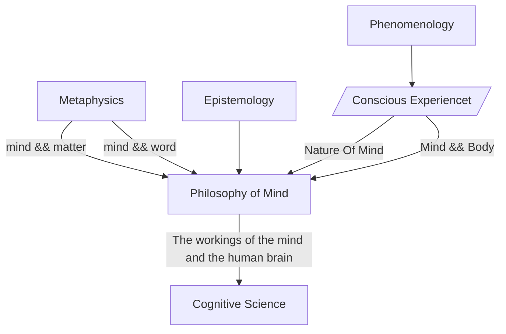

Social science >[[Psychology]] > Cognitive science
[[Phenomenology|phenomena]]

(-- `Outline of academic disciplines ` [wikipedia](https://en.wikipedia.org/wiki/Outline_of_academic_disciplines#Psychology))


Cognitive science 是对大脑(心智) 及其过程的跨学科科学研究，包括: 自语言学(linguistics)、心理学(psychology)、神经科学(neuroscience)、哲学(philosophy)、计算机科学(computer science)/人工智能和人类学(anthropology)

## Branch of Philosophy, From Mind, Body, World, and Matter 




Mind, Body, World, and Matter 被认为是认知科学的层面。认知科学是一个跨学科领域，研究nature of the mind 及其与world 的互动，寻求了解workings of the brain, cognition, and [[mental processes]]。它借鉴了各个领域，包括psychology, neuroscience, linguistics, computer science, and biology，使用scientific methods and simulations or modeling to explain human cognition.

[[Philosophy of Mind]] 在 [[Cognitive Science]] 中起着至关重要的作用，因为它专注于 nature of the mind, mental states, and consciousness.。[[Cognitive Science]] 在很大程度上依赖于[[Philosophy of Mind]]，而[[Philosophy of Mind]]又从[[Metaphysics]] 和 [[Epistemology]] 中汲取营养。[[Metaphysics]] 涉及nature of reality，并有助于解释mind and body之间的关系。[[Epistemology]]涉及对knowledge的研究以及如何获得knowledge。

[[Phenomenology]]与[[Philosophy of Mind]]和[[Cognitive Science]] 在研究conscious experience 和 the [[Philosophy of mind|nature of the mind]]方面都有交叉。[[Phenomenology]]专注于subjective perception，旨在从内部理解conscious experience。它以experience为导向，寻求与natural sciences 或 [[Cognitive Science]]相结合。然而，它的范围是有限的，因为它只研究experience本身，不提供进化(evolutionary)或因果的解释(causal explanations)。

总之，这些领域中的每一个都在我们对the mind, body, world, and matter的理解中发挥着独特的作用。
- [[Phenomenology]]关注subjective perception.
- [[Metaphysics]]解释nature of reality.
- [[Epistemology]] 处理knowledge的获得.
- [[Philosophy of Mind]] 关注nature of the mind.
- [[Cognitive Science]] 是一个跨学科领域，研究mind及其与world的互动。


###  [[Cognitive science]]与[[Philosophy of mind]]的区别

[[Cognitive science]] 是一个多学科的领域，它借鉴了哲学、认知心理学、计算机科学和神经科学的理论、实验和论证，目的是为了更深入地了解认知的本质 [1](https://www.cmu.edu/dietrich/philosophy/research/areas/science-methodology/cognitive-science.html)。它主要关注人工智能、语言处理、注意力、记忆、感知、行动、学习和发展[5](http://www.differencebetween.net/science/difference-between-cognitive-science-and-psychology/)。

另一方面， [[Philosophy of Mind]] 是研究[[Philosophy of mind|nature of the mind]], mental states, and [[mental processes]]的哲学分支。它关注的是对人类思维应该是什么的规范性思考，并不局限于一种独特的方法 [3](https://plato.stanford.edu/entries/cognitive-science/)。[[Philosophy of mind]] 也与 empirical neuroscience (经验神经学) 相互作用，尽管与其他人文(humanities)学科的相互作用研究较少[7](https://www.sciencedirect.com/topics/neuroscience/philosophy-of-mind)。

总之，Cognitive science旨在更深入地了解mind和brain的运作，而[[Philosophy of Mind]]则专注于研究[[Philosophy of mind|nature of the mind]] 和心理状态mental states，以及它们与physical world的关系。


Cognitive psychology 认知心理学 is [[Branches of psychology ]]


```query
Cognitive  OR "认知"
```
