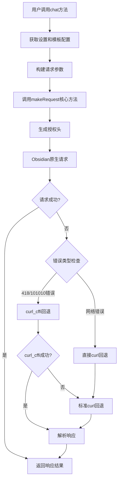

[[Maxai.js 源码]]


基于对MAXAIService.ts代码的深入分析，解释MaxAI请求的执行逻辑。

## MaxAI请求执行逻辑详细分析

### 1. 整体架构概览 

==可能回退没有如何作用==



### 2. 核心方法分析

#### 2.1 主入口：`chat` 方法
```typescript
public async chat(params: {
    conversationId: string;
    messageContent: Array<{ type: string; text?: string; image_url?: { url: string } }>;
}): Promise<AIResponse>
```

**执行流程：**
1. **配置获取**: 从`SettingsManager`获取当前设置
2. **模板解析**: 从`TEMPLATES.PROVIDER`中获取模型segment
3. **参数构建**: 合并基础参数、消息内容、模型名称和提示输入
4. **通知管理**: 创建`TemplateNotice`显示当前使用的配置
5. **请求发送**: 调用`makeRequest`发送实际请求
6. **错误处理**: 确保无论成功失败都隐藏通知

#### 2.2 核心引擎：`makeRequest` 方法

**三层回退机制：**

1. **第一层：Obsidian原生请求**
   - 使用`requestUrl` API
   - 完整的浏览器头部模拟
   - 包含复杂的`x-authorization`签名

2. **第二层：curl_cffi回退**
   - 当遇到418错误或特定101010错误码时触发
   - 使用Python的curl_cffi库模拟Chrome浏览器指纹
   - 通过`TerminalExecutor.curlCffiFetch`执行

3. **第三层：标准curl回退**
   - 当前两层都失败时的最后保障
   - 使用系统curl命令
   - 通过Node.js的`spawn`执行

### 3. 认证机制详解

#### 3.1 复杂的签名算法
```typescript
private async _generateAuthorization(api_url: string, referrerUrl: string): Promise<string>
```

**签名生成步骤：**
1. **时间戳获取**: 考虑服务器时差调整
2. **签名字符串构建**: `${APP_VERSION}:${timestamp}:${pathname}:${userId}`
3. **SHA1哈希**: 使用时间戳和密钥生成SHA1
4. **SM3加密**: 最终使用SM3算法生成签名
5. **AES加密**: 将授权数据用AES加密

#### 3.2 授权数据结构
```typescript
const authData = {
    "X-Client-Domain": this._getDomain(referrerUrl),
    "X-Client-Path": referrerUrl,
    "X-Random": Math.floor(1e5 + 9e5 * Math.random()).toString(),
    t: timestamp,
    p: final_sm3_sign,
    d: deviceId,
};
```

### 4. 错误处理与回退策略

#### 4.1 智能错误识别
- **418错误**: Origin请求来源错误，触发curl_cffi回退
- **101010系列错误**: 特定的MaxAI错误码
- **网络错误**: `ERR_BLOCKED_BY_CLIENT`、`CORS`等

#### 4.2 回退决策逻辑
```typescript
// 特定错误码回退
if (response.status === 418 || (response.status >= 400 && errorData.code && errorData.code.toString().startsWith('101010'))) {
    try {
        return await this._makeRequestWithCurlCffi(url_api, method, headers, data);
    } catch (_) {
        return await this._makeRequestWithCurl(url_api, method, headers, data);
    }
}
```

### 5. 响应处理机制

#### 5.1 文本提取算法
`_extractText`方法实现了智能的响应解析：

1. **Artifact格式检测**: 识别特殊的`maxai__artifact`格式
2. **多路径候选**: 检查多个可能的文本字段路径
3. **降级处理**: 最终返回JSON字符串作为备选

#### 5.2 Artifact内容解析
```typescript
const artifactMatch = raw.match(/```maxai__artifact([\s\S]*?)```/);
if (artifactMatch) {
    const titleMatch = artifactContent.match(/title: \|-\s*([^\n]+)/);
    const contentMatch = artifactContent.match(/content: \|-\s*([\s\S]+?)(?=\n\w|$)/);
    return `${title}${content}`;
}
```

### 6. 配置管理与扩展性

#### 6.1 分层配置系统
- **静态配置**: `CONFIG`对象中的常量
- **用户配置**: 通过`SettingsManager`管理
- **动态配置**: 支持maxai命名空间的嵌套配置

#### 6.2 模板系统集成
- 与`TEMPLATES`配置紧密集成
- 支持多种AI提供商的动态切换
- 智能的segment映射机制

### 7. 性能优化特性

1. **请求超时控制**: 999999ms的长超时设置
2. **连接复用**: AbortController管理
3. **内存管理**: cleanup方法确保资源释放
4. **缓存策略**: 设置管理器的单例模式

这个服务展现了一个高度复杂但设计精良的HTTP客户端，具备强大的容错能力和多层回退机制，确保在各种网络环境下都能稳定工作。