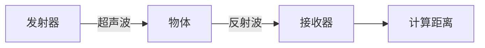

(Source: [youtube.com:  HC-SR04 Ultrasonic obstacle avoidance range finder with Arduino - YouTube](https://youtu.be/QI9541YQq7M?t=162))


---


## 与 Arduino 的完整使用指南

**最佳且最便宜的距离测量解决方案**

---

## 超声波传感器工作原理

### 核心组件
- **发射器** (Transmitter): 发送超声波信号
- **接收器** (Receiver): 接收反射回来的信号

---


### 工作频率
- **25-45 kHz**: 人耳无法听到的超声波频率
- **测量原理**: 发射→反射→接收→计算时间→确定距离



---

## 技术规格


---


### Arduino 连接图


---

## 软件库安装

### 步骤 1: 下载库文件
1. 访问 **https://github.com/livetronic/Arduino-NewPing**
2. 下载 **NewPing 库** (最新版本)
3. 保存到下载文件夹

---


### 步骤 2: 安装库
1. Arduino IDE → **Sketch** → **Include Library**
2. 选择 **Add .ZIP Library**
3. 找到下载的 `NewPing-1.9.x.zip`
4. 点击 **Open** 完成安装

---

## 基础代码实现


---


### 核心代码结构
```cpp
#include <NewPing.h>

#define TRIGGER_PIN  12
#define ECHO_PIN     11
#define MAX_DISTANCE 400

NewPing sonar(TRIGGER_PIN, ECHO_PIN, MAX_DISTANCE);

void setup() {
  Serial.begin(9600);
}

void loop() {
  delay(50);  // 不能低于29ms
  unsigned int distance = sonar.ping_cm();
  Serial.print("距离: ");
  Serial.print(distance);
  Serial.println(" cm");
}
```

---

## 重要参数说明

### 延时限制
- **最小延时**: 29毫秒
- **推荐延时**: 50毫秒
- **原因**: 确保超声波完全传播和接收

---


### 测量单位
- **厘米**: `sonar.ping_cm()`
- **英寸**: `sonar.ping_in()`
- **微秒**: `sonar.ping()`

---


### 数据类型
- 返回值为 **整数** (无小数点)
- 适合用于条件判断和控制

---

## 实际应用示例(1/2)

### 距离检测与报警
```cpp
void loop() {
  delay(50);
  int distance = sonar.ping_cm();
  
  Serial.print("距离: ");
  Serial.print(distance);
  Serial.println(" cm");
  
  if (distance <= 12 && distance > 0) {
    Serial.println("⚠️ 非常接近！");
    // 可以添加蜂鸣器或LED警告
  }
}
```


---

## 实际应用示例(2/2)
### 测量精度
- **短距离**: 3-10cm 精度很高
- **长距离**: 可达4-5米
- **最小距离**: 约3cm (低于此值无法准确测量)

---

## 使用注意事项

### 测量限制
- **最小距离**: 不能太近 (约3cm以下)
- **角度要求**: 传感器需**正对**目标物体
- **表面材质**: 光滑表面反射效果更好

---


### 常见问题
- **读数为0**: 距离太近或角度不对
- **读数不稳定**: 检查连线和电源
- **无读数**: 确认库安装和代码上传

---


### 优化建议
- 使用**变量存储**距离值进行进一步处理
- 结合**条件语句**实现智能控制
- 可配合**显示屏**或**LED**显示结果

---

## 扩展应用

### 可能的项目
- **避障机器人**
- **自动停车系统**
- **液位检测**
- **入侵检测**
- **距离显示器**


---


### 下一步学习
- 结合 **OLED显示屏** 显示距离
- 使用 **七段数码管** 显示
- 集成到 **机器人控制系统**

---

<!-- _class: lead -->

# 谢谢观看！

