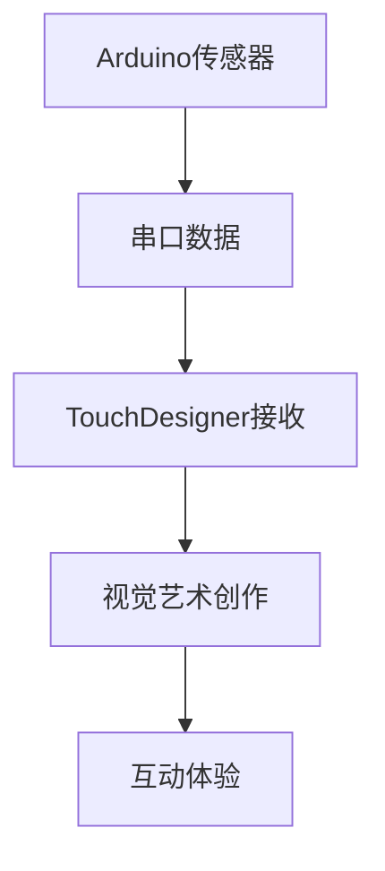

# HC-SR04 Ultrasonic(Pulse)


## Reference

(Source: [tutorialspoint.com: Arduino Ultrasonic Sensor](https://www.tutorialspoint.com/arduino/arduino_ultrasonic_sensor.htm))

MDtoQQ时需要自动识别其格式例如 **粗体**, _斜体_, ~~strickthrough~~,  并在QQtoMD时, 需要对这些格式进行正确还原为md 格式.

---

<!-- _class: lead -->
## 介绍


---


### 目标：

使用 ==Arduino 和 HC-SR04== 超声波传感器测量距离。
通过串口将距离数据发送到 TouchDesigner。
在 TouchDesigner 中接收并使用这些数据来控制视觉元素


---


### 所需材料：

1. Arduino 开发板 (例如 Arduino Uno, Nano)
2. HC-SR04 超声波传感器
3. 面包板 (可选，但推荐)
4. 杜邦线若干
5. USB 数据线 (连接 Arduino 到电脑)


---


## HC-SR04 超声波避障传感器

蝙蝠在黑夜中飞行
* 发出超声波 → **探索未知**
* 接收回声 → **感知距离**
* 处理信息 → **做出反应**


---


### 工作原理
- 发射：给 `TrigPin`  发送一个HIGH，传感器就会发射超声波。
- 接收：超声波遇到物体反射回来，`EchoPin`  接收到回波信号 。


---

### 性能参数

| 参数       | 数值                |
| -------- | ----------------- |
| **测量范围** | 4-5 米 (400-500cm) |
| **测量频率** | 20次/秒             |
| **响应时间** | 50毫秒              |
| **工作电压** | 5V                |


---

### 连接思路

```cpp
HC-SR04    →    Arduino
VCC        →    5V(电源) 
GND        →    GND(接地)
Trigger    →    Pin 2 (触发信号输入)
Echo       →    Pin 3 (回声信号输出)
```


---


### 距离计算

距离 = 声速 × 时间 ÷2 （超声波来回 ）
即 `dist = 340*t/2 `


---

```cpp
// Arduino超声波传感器代码
// 用于与TouchDesigner通信

const int trigPin = 2;    // 触发引脚
const int echoPin = 3;    // 回声引脚

long duration;
int distance;
int smoothDistance;
int lastDistance = 0;

void setup() {
  // 初始化串口通信
  Serial.begin(9600);
  
  // 设置引脚模式
  pinMode(trigPin, OUTPUT);
  pinMode(echoPin, INPUT);
  
  Serial.println("Arduino Ultrasonic Sensor Ready");
}

void loop() {
  // 清除触发引脚
  digitalWrite(trigPin, LOW);
  delayMicroseconds(2);
  
  // 发送10微秒的高电平脉冲
  digitalWrite(trigPin, HIGH);
  delayMicroseconds(10);
  digitalWrite(trigPin, LOW);
  
  // 读取回声引脚的脉冲持续时间
  duration = pulseIn(echoPin, HIGH);
  
  // 计算距离（厘米）
  distance = duration * 0.034 / 2;
  
  // 简单的平滑滤波
  smoothDistance = (distance + lastDistance) / 2;
  lastDistance = smoothDistance;
  
  // 限制距离范围（0-200cm）
  if (smoothDistance > 200) {
	smoothDistance = 200;
  }
  if (smoothDistance < 0) {
	smoothDistance = 0;
  }
  
  // 发送数据到TouchDesigner
  // 格式：distance,normalized_value
  float normalizedValue = smoothDistance / 200.0; // 归一化到0-1
  
  Serial.print(smoothDistance);
  Serial.print(",");
  Serial.println(normalizedValue, 3);
  
  // 延迟以控制数据发送频率
  delay(50); // 20Hz更新频率
}

```


---


## 代码的解读

### 定义引脚

```cpp
const int trigPin = 2;    // 触发引脚,发送信号
const int echoPin = 3;    // 回声引脚, 接收回声
```


---

## 变量：记忆的容器

```cpp
long duration;        // 时间记录
int distance;         // 距离计算
int smoothDistance;   // 温和的观察
int lastDistance = 0; // 过去的见证
```

**每个变量都有自己的使命**
* `duration` - *记录声音的旅程时间*
* `distance` - *将时间转化为空间*
* `smoothDistance` - *平息数据的波动*
* `lastDistance` - *保存记忆的痕迹*


---


性能考虑的两个整数数据类型: 

- `long`, 取值范围 - 2147483648 到 2147483647
- `int`,  取值范围 - 32768 到 32767


---

## Setup：舞台的搭建

```cpp
void setup() {
  Serial.begin(9600);           // 开启对话通道
  pinMode(trigPin, OUTPUT);     // 设定发送者
  pinMode(echoPin, INPUT);      // 设定收听者
  Serial.println("Arduino Ultrasonic Sensor Ready");
}
```


* 调试音响设备（`Serial.begin`）
* 分配演员角色（`pinMode`）


---

## Loop：永恒的循环


### 对话的循环节奏

```cpp
delay(50); // 20Hz更新频率
```

*平衡了响应速度和系统稳定性*
* 每50毫秒一次测量
* 每秒20次更新

---


###  发出声音 & 倾听回声

```cpp
digitalWrite(trigPin, LOW); // 捂住嘴巴,
delayMicroseconds(2); // 2 毫秒.
digitalWrite(trigPin, HIGH); // 向宇宙发问
delayMicroseconds(10); // 10 毫秒.
digitalWrite(trigPin, LOW); // 等待世界的回应
```


---

### 计算距离 

```cpp
duration = pulseIn(echoPin, HIGH); // 声音旅程的时长
distance = duration * 0.034 / 2;
```

**计算声音的旅程**


- 声音在空气中传播：0.034厘米/微秒
- 除2：因来回距离，需对半分

---

### 降噪

对浮躁的数据一个温柔的平滑（Filter滤波）

```cpp
smoothDistance = (distance + lastDistance) / 2;
lastDistance = smoothDistance;
```

* (当前Dist + 过去Dist )÷ 2 ,  平均值
* 让当前 的Dist 编程过去的Dist, 用于下个循环的运算


---

<!-- _class: lead -->

每一次测量，像是在黑夜中用“声音”触碰世界


---

##  设定Bound (边界) 

*在限制中的自由*

```cpp
if (smoothDistance > 200) {
  smoothDistance = 200;
} 
if (smoothDistance < 0) {
  smoothDistance = 0;
} 
```


---

## 第六节：数据的诗意转换

```cpp
float normalizedValue = smoothDistance / 200.0;

Serial.print(smoothDistance);
Serial.print(",");
Serial.println(normalizedValue, 3);
```

**两种语言的翻译**
* **原始距离** - 人类直观理解（厘米）
* **归一化值** - 计算机友好格式（0-1）

---

## 归一化：艺术的通用语言

| 距离 | 归一化值 | 艺术意义 |
|------|----------|----------|
| 0cm | 0.0 | **极近** - 亲密接触 |
| 50cm | 0.25 | **接近** - 个人空间 |
| 100cm | 0.5 | **中等** - 社交距离 |
| 200cm | 1.0 | **远离** - 公共空间 |


---

### 与TouchDesigner的对话




---


**数据格式：`距离,归一化值`**
* 例如：`85,0.425`
* 85厘米的距离，对应0.425的艺术参数


---


## 距离扩展人文思考

### 情感映射
* 距离 → 情感状态
* 亲密 → 温暖 → 疏离 → 冷漠


---

## 距离作为创作参数的创作思路


### 控制音量, 音调

Theremin

**以太发声器**（Etherophone）
最早的电子乐器之一
1920年由苏联物理学家里昂·特雷门先生Leon Theremin发明.


---


### 改变视觉效果

* **0-50cm** → *亲密色彩*（红色、橙色）
* **50-100cm** → *舒适色调*（绿色、蓝色）
* **100-200cm** → *冷静色彩*（蓝色、紫色）


---

### 触发动画序列


---

<!-- _class: lead -->
## TouchDesigner


---


### FBX Animation Clips(动画片段)

案例使用Maximo 下载
创建项目文件: `Ultrasonic3D`
FBX 素材: `./Ultrasonic3D/Geo/Sleeping Idle.fbx`


---


学会制作FBX 动画融合

 - **`Animation Clips`** (or **Animation Sequences**)动画单. _(如 "Idle", "Walk", "Run", "Jump_Start", "Jump_Loop")_
- **`State Machine`**: 用于管理和切换不同动画状态的逻辑系统
- `Parameters(Variables)` 驱动**State Machine**(状态机)


---


### 实验1 - 鼠标移动触发状态


提取鼠标X轴通道


---

假设 `-0.5` 触发时安全距离的临界点,  可实现选择其中一种方式实现:

`LogicCHOP` 设置关闭当超出 Bounds:-0.5~1
或者 
`ExpressionCHIOP` 的express输入 me.inputVal > -0.5


---

准备参数, 绑定 Animation Clip 的 Index 序列帧上


---

利用 FilterCHOP 能抑制不稳定信号的特性, 
在 0/1 切换之际, 制造平滑过度的插值动画.


---


根据`FBX` Frame Index 状态将0~1 映射到合理的范围


---
设置: 
Render ;
Light;
Camera;


---


### 与豆包讨论对白

`状态A:` "吵死了, 刚梦见赚钱"

`状态B:` "东方睡一睡, 财富排成队~"


---

对白切换


---

## SerialDAT 获取 Ultrasonic 数据


---

将 `,` 分隔为表格列


---

DataTo 将Data 转换为 Channel 


---

Rename Channel

- Centimeter(厘米)
- Normalizar(标准化, 归 一化, 0~1之间)


---


触发临界点, 同上(鼠标交互实验)


---

根据脚本判断以上描述是否属实, 并从根本上找到根本上的问题, 提出修改建议

**数据格式：** **`距离,归一化值`**