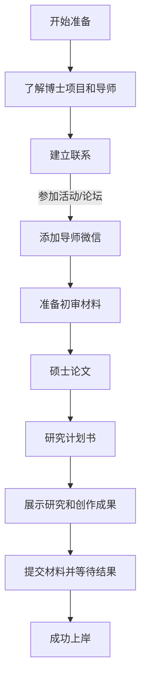

(-- `博士招生 - 招生办 - 中国美术学院` [caa](https://zb.caa.edu.cn/bszs/index.html))

## Henry Egg 博士上岸经验 
[Henry Egg](https://www.xiaohongshu.com/user/profile/5fe71a6b000000000101cc69)

🍠缘起：从去年到现在，大概有近10位认识或者朋友推荐的同学咨询我如何备战国美的设计学博士，甚至有同学想要我上一些课程。我何德何能呀！上课是上不了的，只能给大家分享一点经验。  
  
1、基本情况：一战上岸国美设计学博士。本科、硕士毕业于国美，工作三年后，一战上岸。注意：考博之前并不认识现在的导师。🎈  
  
2、联系导师：联系导师是非常有必要的。我知道一些同学没有联系导师，也通过自己的实力上岸了，但是，如果有机会，最好联系导师。我在国美待了7年，但是与现在的导师并不认识。工作之后，才对导师所在学科和专业产生兴趣。为了有机会联系上导师，我参加了导师策划的比赛和论坛，通过活动添加了导师的微信。所以，各位同学要为自己创造机会，增加导师对你的了解。🎉  
  
3、初审材料：初审材料非常关键，这决定你是否有机会进入复试。初审材料中的硕士论文、研究计划书、已有研究和创作成果，非常重要。这些材料如果非常出色，导师可能做梦都想将你纳入门下。  
  
3.1、硕士论文：硕士论文要好好写。如果你有考博的计划，导师比较明确，你在进行硕士论文选题的时候，就可以选择导师感兴趣的、在做的、关注的方向。我的硕士论文当时并没有这样去准备，但是非常巧合地属于导师的研究领域。这可能是我入围的一个原因。  
3.2：研究计划书：研究计划书就是假定你考上博士之后的研究选题和进度计划。理想的状态是这份计划书已经非常完备，考上之后按部就班的进行就可以了。选题最好和硕士论文有承接，和导师的研究有相关性。我当时用了三个月时间准备计划书，还算规范，起码在形式和逻辑上。我的选题也是有意识地靠近导师的期待。  
3.3：已有研究和创作成果：这个同样是证明自己具有可塑性、研究性的重要证据。所以，你有读博的计划，在硕士期间就要尽量发表高质量论文，获奖业内重要的比赛。我比较幸运地是，读硕期间参加了硕士导师的课题，作为2作出版了一本研究成果（中国美术学院出版社），有一篇文章收录在国美之路的文集中，有一本也是2作的书由商务印书馆出版，还有工作后主持的省级课题材料等。这都是对自己能够胜任博士研究的证明。

4、复试：如果有幸通过初审，该如何准备复试。  
  
🍠1、复试比例：国美的复试比列是1:4。通过复试就有25%的上岸机会了。  
  
🍠2、复试内容：英语、笔试（专业一和专业二）、面试。🎉  
2.1：英语：国美对考博英语还是比较人性化或者说要求低的。难度大概在四级或者四级不到。理论类专业要求最低分45分，实践类专业要求最低分40分，而且只要过线，成绩不计入最后的总分。🎉  
2.2：笔试的专业一和专业二：理论类专业的专一和专二，都考的是理论试题，基本上是写小论文，但也有几道题一起的那种简答题；实践类专业的专一是小论文，专二就是实践了，绘画或者设计作品。小论文的准备大概是需要时间的，很多同学缺少论文写作的长期积累，需要在考前多多进行论点、论据和论证逻辑的整理和分析。🎉  
2.3面试：面试就是，嗯%&……，有点玄学。不过一般有为啥选择这个导师，自我介绍，专业研究计划等常规内容。🎉  
  
🍠总之，如果没有，嗯 ……，是自己单枪匹马的战斗，我们只有打造自己的核心竞争力，准备好基本的物质保障（很豪的童鞋可以忽略），做好长时间冷板凳的准备，在生活和研究之间做好规划，才能在这纷繁的世界中，依靠学历和专业的提升，获得自己人生的进阶和平凡。