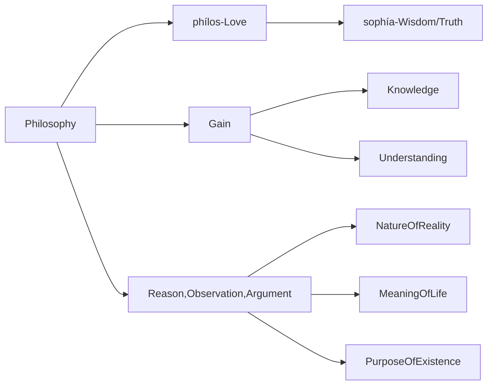

 “modern” age of philosophy, 7 philosophers stand out above the rest: Descartes, Leibniz, [[Baruch Spinoza|Spinoza]], Locke, Berkeley, Hume, and Kant.

# 哲学(philosophy)

[[Philosophy]] 是一门起源于古希腊的学术学科，后来随着时间的推移不断发展。[[Philosophy]] "这个词来自两个希腊词。"phílos"，意思是 "爱(love)"，而 "sophía"，意思是 "智慧(wisdom)"。从本质上讲，[[Philosophy]]可以被理解为对智慧的热爱 The Love Of Wisdom。

古希腊哲学家关心的是如何理解 Nature Of Reality、meaning of life 和 purpose of existence。他们试图通过使用理性(Reason)、观察(Observation)和论证(Argument)来获得知识和理解(knowledge && understanding)。这种对wisdom/truth的追求(phílos,love)一直以来都是哲学的标志(hallmark)。

今天，哲学是一个广泛的领域，包括许多分支学科，包括: 
[[Metaphysics]] -- 对 Reality 的研究.
[[Epistemology]](认识论) -- 对 Knowledge 的研究.
[[Ethics]](伦理学) -- 对 Morality 道德的研究.
[[Logic]] -- 对 Reasoning 推理的研究.
[[Aesthetics]] -- 对 Beauty && Art 的研究.
Axiology(价值论) 
[[Metaphysics]] , [[认识论(epistemology)]]、[[逻辑学(logic)]]和[[伦理学(ethics)]]一起被认为是[[Philosophy]]的四大主要分支.

哲学家们从事批判性思维、逻辑分析，并对广泛的主题进行反思，从nature of the self 到 meaning of life，再到 nature of existence itself 存在本身的性质。

总的来说，激励古希腊哲学家的对智慧的热爱`The Love Of Wisdom`，继续激励着今天的哲学家们。哲学仍然是一门重要的学科，它鼓励我们质疑我们的信仰，深入思考我们周围的世界，并努力加深对人类经验的理解。

