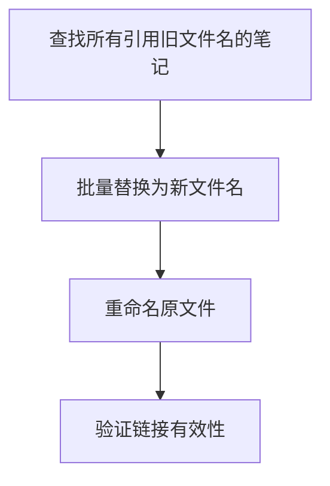

## Rename Method (Hold backlink)
如何更改 Obsidian 文件名并保留双向链接/引用的方法

在 Obsidian 中，直接重命名文件（如将 `OldNote.md` 改为 `ANOTE.md`）时，Obsidian 本身**不会自动更新所有笔记中的双向链接或 wiki 链接**（如 `[[OldNote]]` 或 `[[OldNote.md]]`）。为了确保所有引用和双向链接依然有效，需手动或批量完成以下步骤：

---

### 步骤与方法

#### 1. **查找所有引用旧文件名的笔记**
- 使用全文搜索或正则表达式（如 `\[\[OldNote\]\]` 或 `\[\[OldNote.md\]\]`）查找所有引用该文件的笔记。
- 你可以用 Obsidian 自带的搜索，也可以用命令行工具（如 `grep`）或第三方脚本。

#### 2. **批量替换为新文件名**
- 将所有 `[[OldNote]]` 和 `[[OldNote.md]]` 替换为 `[[ANOTE]]`。
- 替换时注意：Obsidian 的 wiki 链接语法允许省略 `.md` 后缀，建议统一为不带后缀的形式（如 `[[ANOTE]]`），这样更通用。
- 替换可用文本编辑器的批量替换功能，或用脚本自动化处理。

#### 3. **重命名原文件**
- 将 `OldNote.md` 文件重命名为 `ANOTE.md`。
- 可在文件管理器、Obsidian 或命令行中完成。

#### 4. **验证链接有效性**
- 在 Obsidian 中打开引用新文件名的笔记，检查链接是否跳转正常，确保双向链接（backlinks）面板中也能正确显示。

---

### 自动化与批量处理建议

- 对于大规模笔记库，推荐用正则批量替换工具（如 VSCode、Sublime Text、Notepad++、命令行 `sed`/`perl` 等）。
- 也可用 Obsidian 插件（如 [Obsidian Rename](https://github.com/Vinzent03/obsidian-rename) 或 [Advanced URI](https://github.com/Vinzent03/obsidian-advanced-uri)）实现更智能的批量重命名和链接修复。

---

### 方法优点

- **完全保留双向链接和引用关系**，不会出现“孤儿笔记”或失效链接。
- 适用于所有 wiki 链接、嵌入引用、Dataview 查询等场景。
- 可扩展到批量重命名和大规模笔记库维护。

---

### 总结流程图

---

**一句话总结**：  
只要在重命名文件的同时，批量替换所有笔记中的旧链接为新链接，就能在 Obsidian 中安全地更改文件名并保留所有双向链接和引用关系。