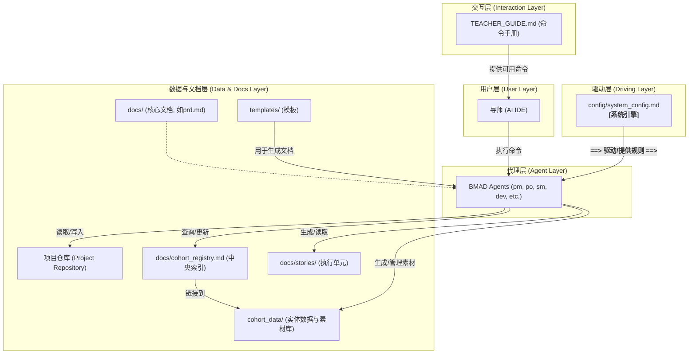

## 2. 高级架构 (High-Level Architecture)

### 2.1 技术摘要 (Technical Summary)

本系统采用一种创新的“**文档即数据库 (Docs-as-Database)**”架构。它是一个无传统后端、无数据库的服务模式，所有的数据和状态都通过AI代理直接读写项目仓库中的Markdown文件来维护。系统的核心是一个中央索引文件，它像数据库的索引一样工作，为AI代理提供所有数据实体的关系图谱。**整个系统的动态行为由一个外部配置文件 (`config/system_config.md`) 驱动，这是实现系统高度可复用性和易于维护性的关键机制。**

### 2.2 核心设计原则 (Core Design Principles)

本系统严格遵循以下四个核心设计原则，以满足PRD中定义的目标：

1. **配置驱动 (Configuration-Driven)**
    
2. **实体关系化 (Entity-Relationship Model)**
    
3. **中央索引 (Single Source of Truth)**
    
4. **命令驱动接口 (Command-Driven Interface)**
    

### 2.3 系统架构图 (System Architecture Diagram)

