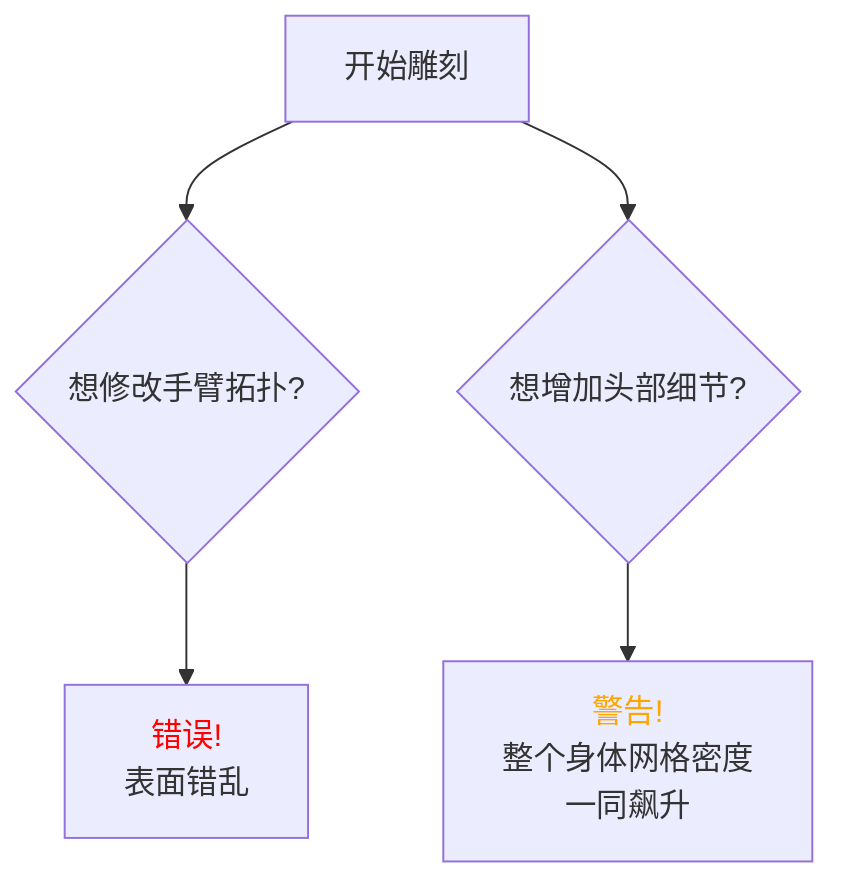

参考:
- [[Class 1.2 肖像与石膏临摹工具]]
- 2. Sculpting Tools & Settings

blender 可以作为雕刻工具
可以作为主力建模工具

---

## 入门雕刻界面

- 整体布局(outline)
- 支持多个 scenes 
- 过滤 layer 

---

- 属性版
- 模式切换
- tab

---

## 对象模式 

### 穿透选择

use `alt Z` / `shift Z`to switch to transparent/not transparent.

---

## 删除

x

---

## 雕刻模式

### 雕刻，为何需要三种截然不同的阶段？  
简单塑形 (Simple Shaping)   湿润稳定性弱的时候
多分辨率 (Multiresolution)  湿度整体可变
动态拓扑 (Dynamic Topology)  局部湿度可变

	

<!--  
[V] 一张视觉比喻图：一把用于宏观塑形的木锤，一把用于精细雕刻的刻刀，以及一块可以无限添加的黏土，分别代表三种方法。

[Opener] 大家好，欢迎来到 Blender 雕刻课程。在我们深入之前，首要问题是：面对一块数字“黏土”，我们应该从哪种工具开始？  
[Expansion] Blender 提供了三种核心方法。简单塑形就像是直接用手去捏现有模型。多分辨率则像是在一个精细模型上分层添加细节。而动态拓扑，也是我们课程的核心，它允许我们像神一样，无中生有地创造几何体。  
[Evidence] 这三种方法覆盖了从对现有模型进行快速修改，到完全无限制的自由创作的所有需求。  
[Action] [行动：预告] 接下来，我们将逐一探索它们的优缺点。

以上内容需要修改, 根据雕塑泥在雕刻过程不同阶段的雕刻划分, 根据泥的湿度可塑性来决定数字雕塑的不同阶段.

-->

---

[Page Type Suggestion]  
[理论概念页]
### 简单塑形 (Simple Shaping)  好处

[KP] 移动现有顶点  
[KP] 类似比例编辑  
[KP] 宏观形变  
[KP] 性能开销极低  

<!--  
[V] 一个低多边形的车门模型，通过笔刷被砸出一个明显的凹陷。凹陷处的网格线只是被推移，没有增加。

[SpeakerNote]  
[Opener] 让我们从最基础的方法——简单塑形开始。你可能会问，既然它无法增加细节，我们为什么还需要它？  
[Expansion] 它的本质就是移动模型已有的顶点，感觉上像是编辑模式下比例编辑的直观版本。它的核心价值在于“快”和“轻”。非常适合为低多边形模型快速添加大的形变，比如给游戏资产制造一些战损或凹陷。  
[Evidence] 它的最大局限在于，细节的上限完全被原始网格密度锁死。你无法创造出比网格本身更精细的细节。  
[Action] [行动：提问] “大家能想到除了车损，还有哪些场景适合用这种方法吗？”
-->

---

### 多分辨率 (Multiresolution)  

- 非破坏性工作流  
- 细节存储于层级  
- 绑定与UV友好  

> 但造型一旦有新的结构, 失去合理重布线的灵活性

<!--  
[SpeakerNote]  
[Opener] 那么，如果我们想要更精细的细节，又不想永久性地破坏我们干净的拓扑结构呢？这就是多分辨率修改器的用武之地。  
[Expansion] 它的核心是“非破坏性”。所有雕刻细节都像图层一样存在于不同的细分级别上。这意味着你可以随时回到低细分级别调整大的形体，或者直接禁用它，模型就会变回那个简洁、干净的基础网格。  
[Evidence] 这个特性对于后续的绑定、UV展开和纹理绘制流程至关重要，因为这些工作都需要一个干净的拓扑。  
[Action] [行动：强调] “记住，‘非破坏性’是专业流程中的一个关键概念。”

-->
---

**多分辨率修改器有哪些致命的限制？**  
限制一：全局细分  
限制二：拓扑锁定  

<!--  

[SpeakerNote]  
[Opener] 听起来很完美，但多分辨率修改器有两个需要时刻警惕的“陷阱”。  
[Expansion] 第一个是“全局细分”。你想给角色的鼻子增加亿点点细节？抱歉，你必须把整个身体的细分级别都提上去，这会导致性能压力剧增。第二个是“拓扑锁定”。一旦开始雕刻，就不能再修改基础网格，比如挤出一个新的肢体，否则所有高层级细节都会错乱。  
[Evidence] 这意味着你必须在建模阶段就规划好所有拓扑结构，之后只能在现有结构上进行雕刻。  
[Action] [行动：演示] “我会快速展示一下，当违反‘拓扑锁定’原则时，模型表面会发生怎样灾难性的扭曲。”
-->

---

[Page Type Suggestion]  
[工作流程讲解页]

[Presentation]  
[H] 如何结合高模的细节与低模的性能？  
[KP] 1. Dyntopo 自由创作 (高模)  
[KP] 2. Retopology (创建新低模)  
[KP] 3. Multires + Shrinkwrap (投影细节)  
[KP] 4. 获得最终模型  
[V] 一个清晰的四步流程图，展示一个粗糙的Dyntopo高模，如何通过Retopology、Shrinkwrap步骤，最终将细节转移到一个拓扑干净、可用于动画的最终模型上。

[SpeakerNote]  
[Opener] 刚刚我们看到了它的局限，但它在专业流程中，恰恰是解决最终问题的关键一环。这个流程能让我们兼得鱼和熊掌。  
[Expansion] 这是行业标准流程。第一步，我们用后面会讲的动态拓扑（Dyntopo）无拘无束地创作一个高精度模型。第二步，我们围绕这个高模，像裁缝做衣服一样，创建一个全新的、拓扑干净的低模，这个过程叫Retopology。第三步，也是最关键的，我们给新低模加上多分辨率修改器，然后用Shrinkwrap（收缩包裹）修改器，把所有高模的细节“吸附”并复刻过来。  
[Evidence] 最终，我们就得到了一个既有超高细节，又具备干净拓扑和低层级基础网格的完美模型，可以用于任何后续的动画和游戏流程。  
[Action] [行动：总结] “这个流程是连接自由创作与生产应用的核心桥梁。”

---

[Page Type Suggestion]  
[理论概念页]

[Presentation]  
[H] 如果能像玩真实黏土一样雕刻，会怎样？  
[KP] 动态增减几何体  
[KP] 彻底摆脱拓扑束缚  
[KP] 从简单球体开始  
[KP] 缺点：拓扑混乱  
[V] 一个简单的立方体，在一支笔刷的涂抹下，平滑地“长出”一个复杂的龙头的延时摄影风格的动画/图片序列。

[SpeakerNote]  
[Opener] 前面两种方法都受限于原始拓扑。那么，如果我们能彻底打破这个枷锁呢？这就是动态拓扑，Dyntopo 的魅力所在。  
[Expansion] 它的核心机制是：在你的笔刷所到之处，实时、动态地增加或减少三角形面片。这意味着你可以真正像处理一块无限的数字黏土一样，从一个最简单的球体或方块开始，创造出任何你能想象到的复杂形态。  
[Evidence] 它的力量在于绝对的创作自由。但这种自由的代价是，它会产生不适合直接用于动画的、混乱的三角面拓扑。  
[Action] [行动：关联] “还记得我们刚才讲的那个标准流程吗？Dyntopo创作的高模，正是那个流程的第一步。”

---

[Page Type Suggestion]  
[技术参数讲解页]

[Presentation]  
[H] 如何精确控制 Dyntopo 的“黏土颗粒”？  
[KP] 细节类型 → Constant Detail (推荐)  
[KP] 分辨率 → 数值越大，细节越精细  
[KP] 全局工具 → Detail Flood Fill (均匀化)  
[KP] 全局工具 → Symmetrize (修复对称)  
[V] 一个UI界面截图，高亮显示"Constant Detail"选项和"Resolution"滑块。旁边用一个简单的示意图解释：低分辨率=大三角面，高分辨率=小三角面。

[SpeakerNote]  
[Opener] 要驯服 Dyntopo 这匹野马，我们必须了解它的核心控制参数。  
[Expansion] 首先是“细节类型”，永远选择 Constant Detail。这能确保无论你的视图远近，生成的网格大小都保持一致，效果可预测。Relative Detail 则会根据屏幕远近变化，非常混乱。其次是“分辨率”，在 Constant 模式下，这个值越大，你创造的“黏土颗粒”就越细腻。  
[Evidence] 你甚至可以用吸管工具从模型的其他地方拾取细节级别，来保持整体风格的统一。  
[Action] [行动：演示] “我们来看一下，打开Blender，切换Relative和Constant Detail时，缩放视图对笔刷效果的巨大影响。”

---

[Page Type Suggestion]  
[技术参数讲解页]

[Presentation]  
[H] 除了大小和强度，画笔还有哪些“隐藏开关”？  
[KP] 方向: Ctrl = 反转 (凹陷)  
[KP] 平滑: Shift = 临时平滑笔刷  
[KP] 穿透: Front Faces Only (处理薄片)  
[KP] 累积: Accumulate (效果叠加)  
[V] 四个小图标配合简洁的文字说明：一个 +/- 符号代表方向；一个水滴符号代表平滑；一个盾牌挡住箭头的符号代表Front Faces Only；一个不断堆叠的方块代表Accumulate。

[SpeakerNote]  
[Opener] 掌握了Dyntopo，我们再来看几乎所有笔刷都通用的几个核心行为控制。  
[Expansion] 除了基本的半径和强度，最常用的快捷键是按住 Ctrl 临时反转笔刷效果，比如从凸起变为凹陷。按住 Shift 可以随时切换到平滑笔刷来修整表面。Accumulate 开启后，笔刷效果会不断累积，像喷枪一样，可以造出很强的效果，但要小心使用。  
[Evidence] 而 Front Faces Only 是一个必须记住的救命开关。在处理像耳朵、布料这样的薄片结构时，一定要开启它，否则笔刷会影响到模型的背面。  
[Action] [行动：强调] “请大家现在就记住 Ctrl 和 Shift 这两个组合键，它们会成为你们的肌肉记忆。”

---

[Page Type Suggestion]  
[技术参数讲解页]

[Presentation]  
[H] 笔刷的顶点，应该朝哪个方向移动？  
[KP] Area Plane (默认): 沿表面法线  
[KP] View Plane: 沿屏幕方向  
[KP] Lock Icon (锁定): 沿笔画起始点法线  
[V] 一个球体表面，用三个箭头清晰地展示三种模式下，顶点移动的方向差异。特别是Lock Icon模式，展示了如何用它来刮出一个平整的切面。

[SpeakerNote]  
[Opener] 这是一个经常被新手忽略，但却极其重要的概念：雕刻平面。它决定了笔刷“推”或“拉”顶点的方向。  
[Expansion] 默认的 Area Plane 是最自然的，顶点会沿着各自所在位置的法线方向移动。View Plane 则是所有顶点都朝着你的屏幕方向移动。而最强大的功能是那个小小的“锁”图标。  
[Evidence] 锁定雕刻平面后，你的整个笔画都会沿用你落笔那一瞬间的表面法线方向。这对于创建平整的机械表面、或者在生物模型上做出干净利落的切割平面来说，是无价之宝。  
[Action] [行动：演示] “我来演示一下如何用锁定功能，轻松地在一个曲面上刮出一个完美的平面。”

---

[Page Type Suggestion]  
[技术设置讲解页]

[Presentation]  
[H] 如何让笔刷画出缝线、直线或平滑曲线？  
[KP] Spacing: 调高 = 断续效果 (缝线)  
[KP] Smooth Stroke: 笔画稳定器 (防手抖)  
[KP] Line: 画直线笔触  
[KP] Curve: 画贝塞尔曲线笔触  
[V] 一条皮带的模型，上面有用Spacing画出的缝线效果，旁边还有一条用Smooth Stroke画出的极其平滑的装饰线。

[SpeakerNote]  
[Opener] 除了笔刷本身，笔刷的“行程”（Stroke）也极大地影响最终效果。  
[Expansion] “Spacing”控制笔尖的间距。默认值很低，形成连续线条。但如果你把它调高，就可以轻松创造出缝线、铆钉这类断续的效果。“Smooth Stroke”则是一个强大的稳定器，它能过滤掉你手部的微小抖动，让你画出如丝般顺滑的线条。  
[Evidence] 此外，还有专门的Line和Curve模式，可以让你画出绝对的直线，或沿着自定义的贝塞尔曲线进行雕刻。  
[Action] [行动：提问] “大家觉得除了缝线，调高Spacing还能用来制作什么有趣的效果？”

---

[技术设置讲解页]

[Presentation]  
[H] 如何用一张图，雕刻出万千细节？  
[KP] Brush Curve: 控制笔刷剖面  
[KP] Texture: 雕刻皮肤毛孔、岩石表面  
[KP] Mapping: Area Plane (常用)  
[KP] Mapping: Stencil (蒙版模式)  
[KP] Mapping: Rake (匹配笔画方向)  
[V] 一个分屏对比图：左边是普通笔刷画出的平滑凸起；右边是加载了岩石纹理的笔刷画出的、充满复杂细节的凸起。屏幕一角展示了Stencil模式的UI叠加效果。

[SpeakerNote]  
[Opener] 最后，我们来探索笔刷的终极力量源泉：形态与纹理。  
[Expansion] 首先，“笔刷衰减曲线”定义了笔刷从中心到边缘的强度变化，决定了笔触是尖锐还是柔和。更强大的是，我们可以加载一张黑白图片作为纹理，来雕刻出像皮肤毛孔、岩石裂纹、布料纹理等极其复杂的细节。  
[Evidence] 在纹理的映射模式中，Area Plane最常用。而Stencil模式会把纹理作为一层半透明的蒙版覆盖在屏幕上，你可以透过它来“喷绘”细节。Rake模式则至关重要，它能让纹理自动跟随你的笔画方向旋转，是雕刻头发、肌肉纤维的必备神器。  
[Action] [行动：演示] “我将用一张简单的噪点图，通过Stencil和Rake模式，分别演示如何制作皮肤质感和肌肉纤维。”

---

[Page Type Suggestion]  
[特定工具介绍页]

[Presentation]  
[H] Clay 和 Blob 笔刷，有何独门绝技？  
[KP] Clay Brush: 模拟黏土条，堆积形体  
[KP] Clay Brush: 优先填补凹陷  
[KP] Blob Brush: 创建饱满球状  
[KP] Blob Brush (Ctrl): 快速挖洞  
[V] 两个并排的动图：左边，Clay笔刷像抹腻子一样，快速将一个凹凸不平的表面填平并堆积起新的大型。右边，Blob笔刷在一个平面上轻松地“吹”出几个饱满的球体，然后按住Ctrl反向操作，挖出干净的圆形孔洞。

[SpeakerNote]  
[Opener] 了解了通用设置后，我们来看两个极具特色的笔刷。  
[Expansion] 首先是Clay笔刷，它完美模拟了添加一根根黏土条的感觉，是堆积和塑造大型的绝对主力。它的一个特性是倾向于先填平凹陷处，再向上构建。而Blob笔刷，顾名思义，就是用来创建饱满的、球状的形态。  
[Evidence] Blob笔刷在反转模式（按住Ctrl）下有一个妙用：它可以非常快速地挖掘出圆形的洞穴或孔洞，效果非常干净。  
[Action] [行动：总结] “课程结束后，请大家务必亲手体验这两个笔刷，感受它们截然不同的雕刻手感。”

---

### 合并 Merge

#### remesh R / CTRL R

---

#### Join 

对象模式

编辑模式

M 

### 分离 Separate

### blender 雕刻模式 切换对象 Alt+Q , 

## 临摹工作环境原理 - 同步视窗

右窗 ：👁️临摹对象
🧠 ：中转
左窗 ：👁️临摹稿件  

---

## 🚀 第一步：进入相机视角

### 📷 切换到相机视图

• 点击视窗右上角的相机图标 • 或使用快捷键 `Numpad 0`

⚠️ **关键操作**：缩放直到看不到相机边框线条

**目标**：让相机视图填满整个视窗

---

## 🔧 第二步：锁定相机视图

### 🔒 启用相机锁定

1. 按 `N` 键打开侧边栏
2. 切换到 **View** 标签页
3. 勾选 `Lock Camera to View`
4. 再次按 `N` 键关闭侧边栏

**验证**：缩放时相机不再跟随移动 ✅

---

## ✂️ 第三步：分割视窗

### 🖥️ 创建双视窗布局

• 移动鼠标到视窗**右上角**或**右下角** • 当光标变成十字形时，**拖拽**分割视窗 • 现在你有了两个同步的视窗！

**技巧**：选择你觉得舒适的分割角落

---

## 🎨 第四步：个性化设置

### 🎭 配置不同渲染模式

**左视窗**：`Solid` 模式 → 专注建模操作  
**右视窗**：`Material Preview` 模式 → 观察材质效果

双重视角，双倍效率！

---

## 🏆 完成！你的超级工作台

### 🎉 现在你拥有了：

✅ **同步视窗**：两个视角完美协调  
✅ **专业工作流**：建模 + 预览同时进行  
✅ **效率提升**：告别频繁切换模式  
✅ **艺术家体验**：如同拥有双眼视觉

🚀 **开始你的高效创作之旅吧！**
