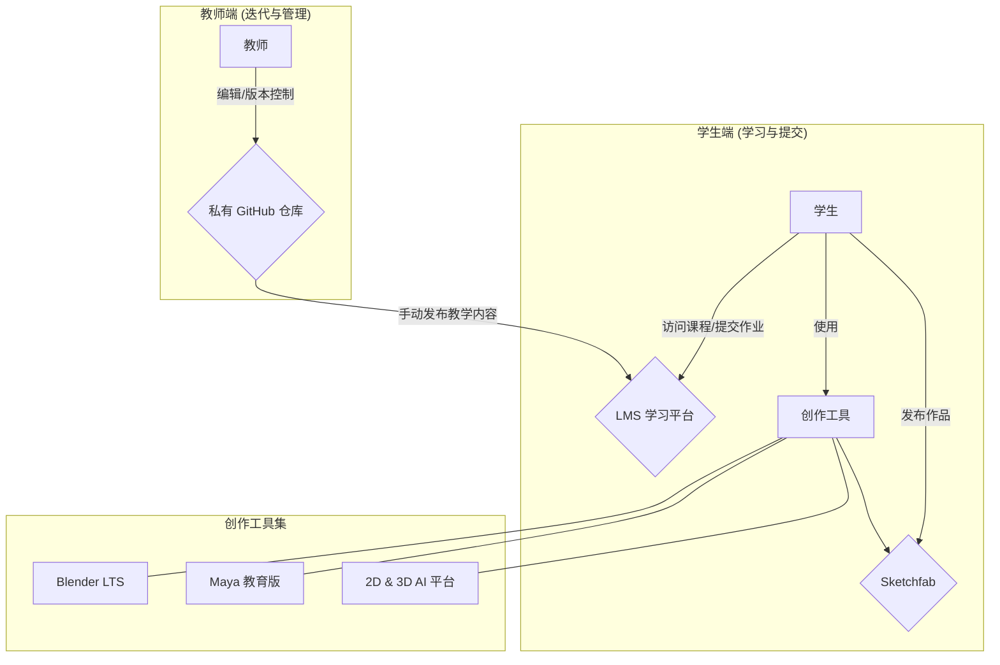

### **架构文档: 数字建模课程 v1.1**

#### **1. 高层级架构 (High Level Architecture)**

- 技术摘要 (Technical Summary)
    
    本课程的技术架构旨在为学生提供一个稳定、前沿且符合行业标准的创作环境。我们将精确指定核心创作软件（Blender/Maya）的版本以确保教学一致性，采用分层策略实施AI辅助教学，并为所有课程资源设计一个结构化的、源发分离的私有知识库。最终，通过明确Sketchfab的发布参数，确保学生的结课作品能以专业水准进行展示。
    
- **架构图 (High Level Project Diagram)**




#### **2. 技术栈 (Tech Stack)**

|   |   |   |   |
|---|---|---|---|
|**类别**|**技术/平台**|**版本/说明**|**目的与教学重点**|
|**核心雕刻软件**|Blender|**4.2 (LTS)**|核心造型能力训练，长期稳定的教学环境|
|**行业标准软件**|Maya|**2025 (教育版)**|行业流程体验，基础建模，为就业储备|
|**2D图像生成**|Midjourney, 百度文心一格等|最新版|**创意启发**：快速生成视觉参考，拓展想象力|
|**3D模型生成**|**Triple 3D**|实验性平台|**核心实验**：体验从概念到3D生成的完整流程|
|**现实扫描工具**|Polycam / KIRI Engine|手机App|**补充/实验**：获取现实素材，理解多元创作方法|
|**作品发布平台**|Sketchfab|N/A|结课作品的专业在线展示与发布|

#### **3. 知识库架构 (Knowledge Base Architecture)**

本课程的知识库将采用“**源发分离**”的架构，以确保教学内容的版本控制严谨性和学生访问的便捷性。

- **源 (Source of Truth)**: **私有 GitHub 仓库**
    
    - **用途**: 课程所有核心教学文档（`.md`文件）、项目文件、参考资料的**唯一存储和版本控制中心**。所有内容的修改、迭代和审核都在此进行。
        
    - **访问权限**: 仅限课程教师和管理员。
        
- **发 (Distribution)**: **LMS平台 (如学习通)**
    
    - **用途**: 作为面向学生的**只读发布渠道**和**作业提交通道**。教师将GitHub仓库中审核通过的、最终版的教学内容，手动摘录并发布到此平台。学生通过此平台提交作业。
        
    - **访问权限**: 所有注册学生。
        

#### **4. 组件 (Components)**

课程内容将划分为三个核心组件，周数分配已根据“造型能力优先”的原则进行优化：

- **组件 1: 造型基础与技术完备 (周数: 1-8 周)**
    
    - **职责**: 建立学生的核心造型“手感”和技术基础。延长基础训练时间，确保学生通过有计划的练习真正掌握雕刻和造型技能。
        
    - **内容重点**: Maya/Blender 基础操作、复杂形态解构、高强度速雕训练、同学头像雕刻、拓扑与基础渲染。
        
- **组件 2: 创意表达与AI辅助构思 (周数: 9-10 周)**
    
    - **职责**: 解放学生的创意思维，并掌握前沿的人机协作方法。此阶段节奏紧凑，以核心理论和高效方法演示为主。
        
    - **内容重点**: 表现主义及康定斯基理论核心讲解、AI辅助创意流程演示、情绪到造型快速实践、兵马俑中期考核。
        
    - **依赖**: **必须掌握基础速雕能力、Blender 操作熟练度和简单拓扑理解**，才能有效进行本阶段的创意表达。
        
- **组件 3: 结课考核：主题创作与专业发布 (周数: 11-15 周)**
    
    - **职责**: 综合运用所学知识，完成一个专业级的个人项目。
        
    - **内容重点**: 项目立项、资产制作、作品发布、答辩与展示。
        

#### **5. 知识库结构 (Knowledge Base Structure)**

私有GitHub仓库将采用以下兼顾规范化与灵活性的文件夹结构，以确保教师迭代和资料管理有序，同时完全兼容AI IDE的开发流程：

```
/digital-modeling-course-private/
|
|-- 00_Course_Admin/
|   |-- course_syllabus.md
|   |-- grading_criteria.md
|
|-- 01_Epic_Foundations/
|   |-- Week_01-Maya_Intro/
|   |   |-- week_01_notes.md
|   |   |-- week_01.marpit.md
|   |   |-- Assignments/ (可选)
|   |   |-- Examples/    (可选)
|   |-- Week_02-Blender_Workspace/
|   |-- Week_03-Shape_Deconstruction/
|   |-- Week_04-Speed_Sculpting_Props/
|   |-- Week_05-Speed_Sculpting_Busts/
|   |-- Week_06-Peer_Portraits/
|   |-- Week_07-Topology_and_UVs/
|   |-- Week_08-Lighting_and_Render/
|
|-- 02_Creative_Expression/
|   |-- Week_09-Art_Theory_and_AI_Workflow/
|   |-- Week_10-Midterm_Terracotta_Army/
|
|-- 03_Epic_Capstone_Project/
|   |-- Week_11-Proposal_Development/
|   |-- Week_12-Production_Time_1/
|   |-- Week_13-Production_Time_2/
|   |-- Week_14-Publishing_to_Sketchfab/
|   |-- Week_15-Final_Defense_Prep/
|
|-- Shared_Resources/
|   |-- software_guides/
|   |-- reference_images/
|   |-- tutorials/
|   |-- useful_links.md
|
|-- Student_Submissions_Backup/  # (可选) LMS作业备份

```

**结构说明**:

- **周目录为主线**: 保持 `Week_XX-Topic` 的命名规范，为版本控制和AI工具识别提供清晰的路径。
    
- **核心笔记文件**: 每周目录下，以 `week_XX_notes.md` 作为核心，用于汇总该周所有讲义、素材链接、理论框架和笔记草稿。
    
- **演示文稿生成**: `week_XX.marpit.md` 文件可由核心笔记文件生成，用于创建最终的PPT演示文稿（例如使用Marpit库），实现内容与形式的分离。
    
- **可选的子目录**: `Assignments/` 和 `Examples/` 文件夹为可选。仅在需要提供标准化的作业说明或代码示例时创建，避免了目录结构的过度碎片化。
    

#### **6. 课程节奏与工作流 (Course Rhythm & Workflow)**

- **作业与提交流程**:
    
    - 每周作业通过 **LMS 平台**提交，并按周归档。
        
    - 教师可在 GitHub 上维护标准示例和参考答案，保证教学资源的可参考性。
        
- **课程节奏提示**:
    
    - **组件 1 (1-8周)**: 以**高强度的动手练习**为主，尤其强调快速反应和形态转换训练。
        
    - **组件 2 (9-10周)**: 以**理论与方法演示**为主，节奏明快，旨在高效启发，避免等待 AI 生成的低效时间。
        
    - **组件 3 (11-15周)**: 以**综合项目产出和公开答辩**为核心，给予学生充分的创作和展示时间。
        

#### **7. 外部平台集成 (External Platform Integration)**

- **平台名称**: **Sketchfab**
    
- **技术参数要求**:
    
    - **模型格式**: `.glb` / `.gltf`
        
    - **文件大小**: < 50MB
        
    - **贴图**: < 2K, PBR工作流
        
    - **展示设置**: 必须在平台内设置合理的三点布光、背景和相机角度。


