[ 🌐 sketchfab 60's Office Props](https://sketchfab.com/3d-models/60s-office-props-dc00ea320cfa4aad90811080270672db)

[[w3-60s- office-props_Assets Breakdown]]

## 经典型

### 规范 Units

---
### Freezing 并检查实际尺寸

To display an object's actual size in Maya after freezing its transforms, ==use the Ctrl+T shortcut to activate the Universal Manipulator, which shows the Width, Height, and Depth values on its bounding box==.

---

### Scale along normals
To "scale along normals" in Maya, ==use the Move Tool's component manipulation feature by selecting components, activating the Move Tool (W), and then `Ctrl+middle-dragging` to push or pull components away from or into the surface==. This effectively scales the selection perpendicularly to its surface.

---

### Split and `G`

---

G Repeat last action

---

### Lattice

---

### 核心建模思路分析

1. **识别基本形状**：模型的核心是一个扁平的圆柱体。从边缘看，它是由12个边组成的多边形，所以我们应该从一个12边的圆柱体（Dodecagon）开始。
    
2. **利用对称性**：模型具有明显的**旋转对称性**。它有三个完全相同的“辐条”或凹槽，每隔120度重复一次。这是最高效建模的关键。我们**不需要**对整个模型进行建模，只需要制作其中的 **1/3** 部分，然后通过旋转复制来完成整体。
    
3. **分层建模**：采用“从整体到局部”的策略。先创建出大的外形（1/3的扇形），然后通过
4. **挤出（Extrude）**、**倒角（Bevel）**和**多切割（Multi-Cut）**等工具，逐步添加中心轮毂、凹槽和边缘细节。
    
4. **拓扑管理**：保持模型尽可能由**四边面（Quads）**构成，以获得平滑和可预测的形变。在模型的中心点，使用三角形（Tris）是完全可以接受的，因为这是一个“极点”（Pole），面在这里汇集。
    

---

### 在 Maya 中的详细建模步骤

#### 第1步：创建基础形状并分离对称部分

1. 创建一个圆柱体：Create > Polygon Primitives > Cylinder。
    
2. 在 Channel Box 或 Attribute Editor 中，将 Subdivisions Axis (轴向分段) 设置为 **12**。Subdivisions Caps (顶部/底部分段) 可以设为 1 或 2。Subdivisions Height (高度分段) 设为 1。
    
3. 切换到**顶视图**（Top View）。进入**面模式**（Face Mode）。
    
4. 因为模型是12边形，1/3 的部分正好是 **4** 个面。选择顶部的任意连续4个面。
    
5. 反选（Select > Inverse 或 Shift + 鼠标框选），然后删除所有其他面（包括侧面和底面）。现在你就得到了一个1/3的扇形平面。
    

(示意图：从12边圆柱体中分离出1/3的部分)

#### 第2步：制作主要结构（轮毂和辐条区域）

1. **创建轮毂基础**：
    
    - 进入**边模式**（Edge Mode），选择扇形内侧的弧形边。
        
    - 使用**挤出工具**（Edit Mesh > Extrude 或 Ctrl + E），向内拖动**缩放**手柄（或调整 Offset 值），创建一个向内的边环。这将定义出中心轮毂的边界。
        
2. **创建辐条形状**：
    
    - 使用**多切割工具**（Mesh Tools > Multi-Cut）。
        
    - 在中间的平面上，精确地切割出那个梯形的“辐条”形状。你可以打开**吸附到顶点/边**（Snap to Vertices/Edges）功能来确保切割精确。
        
3. **挤出轮毂和凹槽**：
    
    - **轮毂**：选择中心区域的面（刚才创建的轮毂基础内部的面），使用**挤出**（Ctrl + E），并沿着Z轴（蓝色的箭头）向上拉出，形成凸起的轮毂。
        
    - **凹槽**：选择刚刚切割出的梯形“辐条”面，再次使用**挤出**（Ctrl + E），这次沿着Z轴**向下**推入，形成凹槽。
        

(示意图：挤出轮毂和凹槽)

#### 第3步：赋予模型厚度

1. 回到**物体模式**（Object Mode），选择整个1/3扇形片。
    
2. 使用**挤出**（Ctrl + E），确保 Keep Faces Together 选项是**开启**的。
    
3. 沿着Z轴向后（负方向）拉动，给整个模型一个厚度。
    
4. 如果你想让凹槽贯穿模型（像图片中那样），可以在第2步挤出凹槽时，先向内挤出一点点，再向后挤出并穿透模型，最后删除形成空洞的面。
    

#### 第4步：添加倒角（Bevel）以增强细节

这是硬表面建模中至关重要的一步，它能让边缘接收光照，看起来更真实。

1. 进入**边模式**（Edge Mode）。
    
2. 选择所有需要硬朗过渡的边缘。这包括：
    
    - 模型最外圈的上下边缘。
        
    - 中心轮毂的上下边缘。
        
    - 凹槽的边缘。
        
3. 使用**倒角工具**（Edit Mesh > Bevel 或 Ctrl + B）。
    
4. 在弹出的工具设置中：
    
    - Fraction：控制倒角的宽度。
        
    - Segments：设置为 **2**。这会创建一个支撑边，使边缘在平滑后依然保持硬朗。
        
    - Depth：保持为1（或根据需要调整）。
        

#### 第5步：复制并合并

1. **设置轴心点**：选择你的1/3模型。按 D 键进入轴心点编辑模式，然后按住 X 键（吸附到网格），将轴心点拖动到世界的中心原点 (0, 0, 0)。
    
2. **旋转复制**：
    
    - 使用特殊复制：Edit > Duplicate Special (打开选项框 □)。
        
    - 设置 Rotate Y 为 **120**。
        
    - 设置 Number of copies 为 **2**。
        
    - 点击 Apply。你将得到两个完美的复制品，它们组合在一起构成了完整的模型。
        
3. **合并对象和顶点**：
    
    - 选择这三个独立的对象。
        
    - 使用 Mesh > Combine 将它们合并成一个物体。
        
    - 进入**顶点模式**（Vertex Mode），框选所有顶点。
        
    - 使用 Edit Mesh > Merge。工具设置中的 Threshold (阈值) 保持一个很小的值，这样只会合并在同一个位置的顶点。
        

#### 第6步：最终清理

1. 检查模型是否有问题，例如非流形几何体（Mesh > Cleanup）。
    
2. 删除历史记录（Edit > Delete by Type > History）。
    
3. 冻结变换（Modify > Freeze Transformations）。
    

### 总结

这种“**部分建模，整体组合**”的策略是处理任何对称性模型的标准和最高效的方法。它不仅节省了大量重复劳动，而且能确保最终模型的绝对对称和精确。通过熟练运用**挤出（Extrude）**、**多切割（Multi-Cut）**和**倒角（Bevel）**这几个核心工具，就可以高效地完成这类硬表面模型的创建。

---

## PBR 材质属性贴图
[ 🌐 adobe Adobe Learn - Learn Substance 3D Designer The PBR Guide - Part 1](@https://www.adobe.com/learn/substance-3d-designer/web/the-pbr-guide-part-1)
[ 🌐 adobe Adobe Learn - Learn Substance 3D Designer The PBR Guide - Part 2](@https://www.adobe.com/learn/substance-3d-designer/web/the-pbr-guide-part-2)

```mermaid
graph TD
    A["PBR 材质核心属性"] --> B["Base Color（基础颜色）"]
    A --> C["Metalness（金属度）"]
    A --> D["Roughness（粗糙度）"]
    A --> E["Opacity（不透明度）"]
    A --> F["Specular F0（镜面反射 F0）"]

    B --> B1["定义：又称漫反射贴图 Diffuse Map"]
    B --> B2["功能：定义原始/固有颜色，不含高光信息"]
    B --> B3["操作：导入错误时可手动分配"]

    C --> C1["定义：PBR Metallic-Roughness 核心组成"]
    C --> C2["功能：决定是否为金属表面"]
    C --> C3["导出：可单独导出或与其他贴图打包"]
    C --> C4["Sketchfab 支持多通道读取"]

    D --> D1["定义：控制表面光滑度与反射清晰度"]
    D --> D2["功能：高粗糙度=反射模糊，低粗糙度=锐利高光"]
    D --> D3["可与 Metallic、AO 贴图打包"]
    D --> D4["Sketchfab 可手动替换"]

    E --> E1["定义：控制透明度"]
    E --> E2["功能：实现玻璃、塑料等效果"]
    E --> E3["Sketchfab 中常见可调贴图类型"]

    F --> F1["资料无详细定义"]
    F --> F2["关联：反射效果主要由 Metallic+Roughness 控制"]
    F --> F3["增强：可用 Screen Space Reflection 提升金属表面反射"]

```

### Base Color（基础颜色）

又称 **漫反射贴图**（Diffuse Map），用于定义模型的原始或固有颜色。

---

### Metalness（金属度）

又称 **Metallic Map**，是 **PBR Metallic-Roughness 工作流程**的核心组成部分。
- 决定材质表面是否具有金属属性。
- 金属面会反射环境光，高光更强烈；非金属面则以漫反射为主。

Maya 导出时
- 在 Substance Painter 等工具中可单独导出。
- 可与 Roughness 与 Ambient Occlusion 等贴图打包到同一文件的不同通道中。

---

### Roughness（粗糙度）

又称 **Roughness Map**，同样是 **PBR Metallic-Roughness 工作流程**的重要组成部分。

- 控制表面光滑度或粗糙程度，影响反射的清晰度。
- 高粗糙度 → 漫反射强、反射模糊；低粗糙度 → 高光锐利、反射清晰。

Maya 导出时
- 在 Substance Painter 导出时，常与 Occlusion、Metallic 贴图打包到同一文件中。

---

### Opacity（不透明度）
又称 **Opacity Map**，用于控制材质的透明度。

- 可实现玻璃、透明塑料等半透明效果。
- 常见于表现部分透明的材质效果，如玻璃窗、塑料膜等。

---

### Specular F0（镜面反射 F0）

决定了**物体正对你时反光的强弱**，金属自己带“亮光”，非金属要靠这个参数才能闪起来。

> es 
> 当你 **正对着湖面** 往下看（水面和你眼睛是垂直的，0度角），你会看到一点点天空的反光，但更多的是**水下面的鱼** 🐟。
> 当你 **从侧面看湖面**（斜着看，接近 90 度），你几乎只能看到天空的反光，看不到水下的东西。

- 对大多数非金属（比如水、玻璃、木头漆面），这个比例大约是 **2% 到 5%**。
- 对金属，这个比例会很高，可能是 **50% 到 100%**，因为金属比水面反射得多得多。

参考[ 🌐 adobe Adobe Learn - Learn Substance 3D Designer The PBR Guide - Part 1](@https://www.adobe.com/learn/substance-3d-designer/web/the-pbr-guide-part-1)

---

还有其他

Scattering
Translucency
Alpha Masking