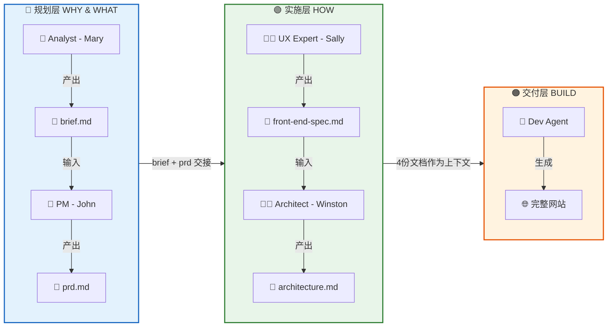
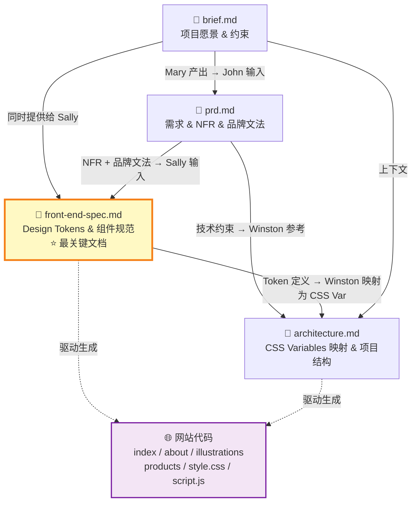
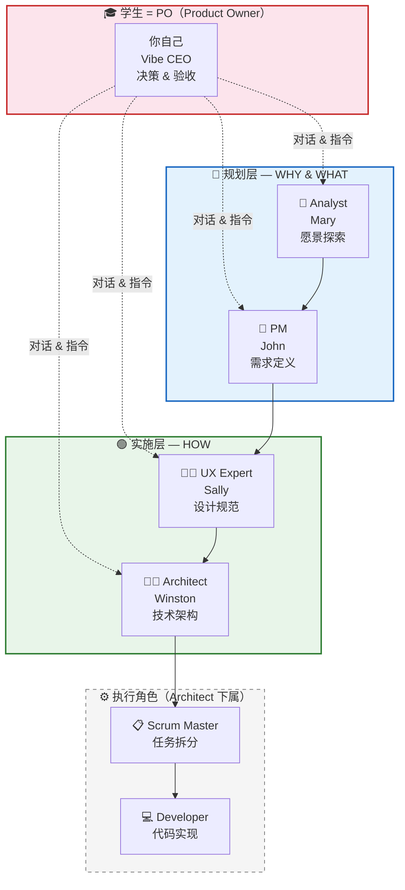
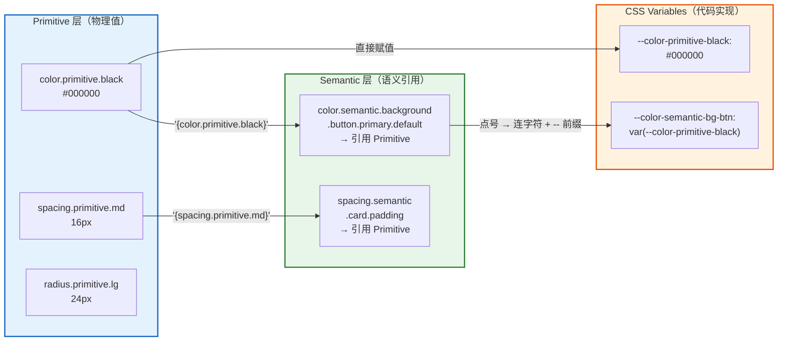

# 📊 教师用教学流程图

> 本文件包含多个 Mermaid 流程图，供教师在黑板讲解时使用。
> 每个图后附有讲解提示，帮助教师快速切入核心概念。

---

## 1. 全链路流程图：从规划到交付

> 🗣️ **教师讲解提示**：强调三层流水线的单向流动——每层产出的文档是下一层的**唯一输入**。学生作为 PO 贯穿全程，但不直接生产文档，而是**监督和验收**。

---

## 2. 文档依赖关系图

> 🗣️ **教师讲解提示**：请学生注意 `front-end-spec.md` 是**依赖最多、被依赖最多**的核心文档（黄色高亮）。它同时接收 brief 和 prd 的输入，又直接驱动 architecture 和最终代码生成。这就是为什么阶段 3 是**最关键**的。

---

## 3. 角色分层图

> 🗣️ **教师讲解提示**：重点说明两件事——① PO 就是学生自己，不需要额外操作，核心职责是「精准传达意图 + 质量验收」；② SM 和 Dev 是 Architect 的下属执行角色，在本实践中由 Vibe Coding Agent 统一承担，学生无需单独与他们交互。

---

## 4. 核心叙事线图（教学时序）

```mermaid
flowchart LR
    S1["1️⃣ 角色介绍<br/>4个AI角色<br/>+ PO=学生"]
    S2["2️⃣ JTBD 理论<br/>Jobs to be Done<br/>用户需求分析"]
    S3["3️⃣ Brief 阶段<br/>与 Mary 对话<br/>→ brief.md"]
    S4["4️⃣ 低保真案例<br/>展示参考网站<br/>激发想象"]
    S5["5️⃣ PRD 阶段<br/>与 John 对话<br/>→ prd.md"]
    S6["6️⃣ Design Tokens<br/>与 Sally 对话<br/>→ front-end-spec.md"]
    S7["7️⃣ Architecture<br/>与 Winston 对话<br/>→ architecture.md"]
    S8["8️⃣ Vibe Coding<br/>4份文档 → Agent<br/>→ 完整网站 🎉"]

    S1 --> S2 --> S3 --> S4 --> S5 --> S6 --> S7 --> S8

    style S1 fill:#e8eaf6,stroke:#283593
    style S2 fill:#e8eaf6,stroke:#283593
    style S3 fill:#e3f2fd,stroke:#1565c0
    style S4 fill:#fff8e1,stroke:#ff8f00
    style S5 fill:#e3f2fd,stroke:#1565c0
    style S6 fill:#fff9c4,stroke:#f57f17,stroke-width:3px
    style S7 fill:#e8f5e9,stroke:#2e7d32
    style S8 fill:#f3e5f5,stroke:#7b1fa2,stroke-width:2px
```

> 🗣️ **教师讲解提示**：这是一节完整课程的推荐教学节奏。步骤 4「低保真案例」是理论与实践之间的桥梁——在学生完成 brief 后、进入 PRD 前，展示一个参考网站帮助他们建立具象预期。步骤 6（Design Tokens，黄色高亮）是**技术难度最高**的环节，建议预留最多时间，并做现场演示。

---

## 5. 补充：Token 本体论映射速查图

> 🗣️ **教师讲解提示**：这是帮助学生理解「三层映射」的核心速查图——Primitive（原始值）→ Semantic（语义引用）→ CSS Variable（代码实现）。强调两个关键转换规则：① Semantic 用 `'{token.name}'` 引用 Primitive；② Token 名到 CSS Variable 的转换是「点号 → 连字符 + `--` 前缀」。
