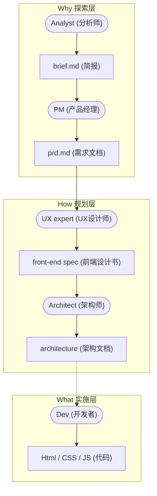

## 📋 课程基本信息

**课程名称**：从零到一：AI辅助的现代Web开发工作流（逆向工程版）  
**本周主题**：AI Agents 驱动快速实现（看到成果）  
**核心交付物**：可运行的网站初稿（HTML + CSS + JS）

---

## 🎯 本周学习目标

通过与不同角色的 AI Agents 对话，理解软件开发的完整流程，快速生成网站初稿，建立信心和兴趣。

### 核心能力
- 文件夹与项目结构管理
- Markdown 文档编写
- 与 AI Agent 的结构化对话
- 理解软件开发的完整工作流

---

## 📝 课前准备清单

**必需工具**：
- [x] 安装 VS Code（或任意代码编辑器）
- [x] 注册 AI 账号：
  1. 讨论型：DeepSeek (推荐ChatGPT, Gemini)
  2. 执行型：CodeGeeX 插件 (GLM5.1模型), 或其他 AI IDE（例如 Cursor, Windsurf 等）

**准备素材**：
- [ ] 下载本课程的**项目初始模板**压缩包，并解压（里面包含了我们需要的 `agents/` 指令文件夹）
- [ ] 素材, 个人网站可以准备 5-12 张个人作品图片, 视频等
- [ ] 思考个人品牌定位和简介,  准备个人 Logo 或品牌标识

**预习内容**（可选）：
- [ ] 了解什么是 Markdown
- [ ] 浏览优秀的个人网站，思考自己想要的风格

---

## 💡 核心概念：什么是 AI Agent？

- **普通AI**：像一个百科全书式的聊天机器人。
- **Agent (智能体)**：带有**角色设定**和**专业知识**的虚拟团队成员。
- **我们的团队**（在下载的 `agents/` 文件夹中）：
  - `analyst.txt`：分析师 Mary，负责需求挖掘和项目简报
  - `pm.txt`：产品经理，负责 PRD 文档
  - `ux-expert.txt`：UX 专家，负责前端规范
  - `architect.txt`：架构师，负责技术架构
  - `dev.txt`：前端开发者，负责写代码

⚠️ **关键约束**：在与所有 Agent 沟通时，**必须**严格限制技术栈为纯 HTML + CSS + JavaScript，不使用 React、Vue 等框架。这样生成的代码才易于初学者理解和调试。

---

## 🚀 实战演练：从零搭建你的个人网站

这是本周的核心任务！你需要通过与不同 AI Agent 对话，逐步生成完整的网站初稿。

### 🗺️ AI 辅助开发全流程示意图

以下是我们搭建个人网站的完整流程图解，涵盖了从探索需求到规划架构，最终实施代码的整个生命周期：



### 核心原则
1. **顺序执行**：按照 Analyst → PM → UX Expert → Architect → Dev 的顺序。
2. **文档传递**：每一步的输出是下一步的输入。
3. **反复强调**：在每次对话中都要提及"纯 HTML/CSS/JavaScript"限制。
4. **利用澄清机制**：在对话中加入"如果有不确定的地方请主动询问我"。
5. **先完成，再完美**：这是初稿，目标是快速跑通流程、看到成果！

---

### 任务1：与 Analyst Agent 对话 → 生成 `docs/brief.md`

**操作步骤**：

1. **准备工作**
   - 打开 DeepSeek / ChatGPT / Gemini（推荐使用深度思考模式）
   - 在对话框中上传或拖进 `agents/analyst.txt` 文件

2. **初始对话模板**
   ```markdown
   你好，Mary（分析师的名字）。
   
   我想为[你的身份，如：插画艺术家/摄影师/设计师]创建一个个人作品集网站。
   
   风格要求：[描述你喜欢的风格，如：极简主义/复古/现代科技感]
   
   页面需求：我需要 4 个页面
   - 首页（Home）：展示个人介绍和精选作品 + 代表作展示 + 导航
   - 关于页面（About）：艺术家简介和经历、创作理念、联系方式
   - 插画作品页（Illustration）：展示插画作品集, 12 张原创插画作品展示（按年份分类）
   - 产品设计页（Product）：展示产品设计作品集, 12 个衍生产品（与插画一一对应）

   技术限制：严格使用纯 HTML、CSS、JavaScript，
   不使用 React、Vue 等框架。
   
   如果有不确定的地方请你主动询问我。
   
   请帮我进行初步分析。
   ```

3. **多轮对话要点**
   - Analyst 会主动提问（关于目标受众、作品数量、色彩偏好等）。
   - 认真回答每个问题，提供具体信息。
   - ⚠️ 每次提到技术需求时，都要重申"纯 HTML/CSS/JavaScript"。


4. **最终生成指令**
   > "现在让我们创建项目简报文档 brief.md"

5. **验收标准**
   - `brief.md` 包含：项目概述、目标用户、页面结构说明、风格定位、技术约束、设计方向。在你的项目文件夹的 `docs/` 目录下创建并保存这个文件。


---

### 任务2：与 PM Agent 对话 → 生成 `docs/prd.md`

**操作步骤**：

1. **准备工作**
   - 上传或引用 `agents/pm.txt`
   - 准备好上一步生成的 `brief.md`

2. **初始对话模板**
   ```markdown
   你好，我们现在需要生成产品需求文档 `prd.md`。
   
   我已经和分析师讨论过项目，生成了 `brief.md`（见附件）。
   
   请基于这份简报，帮我制定详细的产品需求文档。
   
   明确需求：
   - 网站需要 4 个页面：首页、关于页、插画作品页、产品设计页
   - 请为每个页面定义具体功能和交互逻辑
   
   技术限制：纯 HTML、CSS、JavaScript。
   ```

3. **交互要点**
   - 明确告诉 PM 需要 **4个页面** 的具体功能设计。
   - 当 PM 提出生成"Epic列表"（史诗列表）时，可以直接要求："现在直接生成完整的 prd.md"。


4. **验收标准**
   - `prd.md` 包含：4个页面的详细功能说明、用户故事、页面间导航逻辑、交互规范。将它保存在 `docs/` 目录下。

---

### 任务3：与 UX Expert Agent 对话 → 生成 `docs/front-end-spec.md`（初稿）

**操作步骤**：

1. **准备工作**
   - 上传或引用 `agents/ux-expert.txt`
   - 准备 `brief.md` 和 `prd.md`（作为附件发给 AI）

2. **初始对话模板**
   ```markdown
   你好，我已经完成了项目简报（brief.md）和产品需求文档（prd.md）。
   
   请基于这些文档，帮我制定前端设计规范(front-end-spec.md)。
   
   补充说明：
   - 我们的设计仅支持电脑端浏览器（桌面端）
   - 技术限制：纯 HTML、CSS、JavaScript
   ```

3. **交互要点**
   - 重点关注颜色系统、字体、间距、组件规范。
   - 如果 Agent 建议复杂的设计工具，可以要求简化。


4. **验收标准**
   - 包含：Design Tokens（设计令牌颜色, 包括字体、间距）、组件规范、布局系统。将它保存在 `docs/` 目录下。

---

### 任务4：准备素材 → 创建 `assets/README.md`

**为什么先准备素材？**  
先准备好实际素材，让架构师能基于真实情况设计最简单的数据结构！你的 `assets/README.md` 是给 AI 的"设计说明书"。描述越具体、关系越清晰，AI 生成的数据结构就越精准。

**操作步骤**：

1. **收集素材文件**
   将插画作品放入 `assets/illustration/`，产品摄影放入 `assets/products/`。

2. **创建素材描述文档**
   在 `assets/README.md` 中用自然语言描述素材及其关系，参考以下示例：

   ```markdown
   # 作品素材库
   
   ## 作品系列 #1：阅读之光
   
   ### 插画作品
   - 文件名：`01-reading-light-illustration.jpg`
   - 创作概念：书页间流淌的光，温柔地照亮每一个深夜的梦想
   
   ### 衍生产品
   - 文件名：`01-cat-lamp-product.jpg`
   - 产品名称：阅读之光猫咪台灯
   - 产品参数：陶瓷底座，LED光源，定价¥268
   - 灵感关联：将插画中的"光与书"元素实体化，台灯设计成猫咪形态守护阅读时光
   
   ## 数据结构提示（给 AI 架构师的指令）
   在后续设计 `data.js` 时，请确保：
   1. 对应关系清晰：使用相同的 `id` 关联插画与产品
   2. 共享语义：插画的 `alt` 文本应与产品的 `alt` 一致
   3. 法务合规：所有素材标注 `legalTier: 'BASELINE'`
   ```

**💡 学习贴士**：
- **AI 需要上下文**：不是简单的图片列表，而是带有关系和意图的描述。
- **自然语言的力量**：用你讲故事的方式描述，AI 会理解并转化为代码。

---

### 任务5：与 Architect Agent 对话 → 生成 `docs/architecture.md`

跟架构师的沟通其实非常简单，没有那么复杂，主要是将我们前面生成的文档和素材情况“交接”给它。

**操作步骤**：

1. **输入上下文**
   - 在 DeepSeek（或你使用的讨论型 AI）对话框中，上传或应用 `agents/architect.txt`。
   - 将前面生成的所有核心文档（`brief.md`, `prd.md`, `front-end-spec.md`）一并拖进对话框。

2. **下达极简指令（并指明素材）**
   - 给它发送一句非常简单的指令，最多只需要在里面补充说明一下素材的位置：
   ```markdown
   请基于我上传的这些文档，帮我制定 architecture.md（技术架构）。
   
   另外提醒一下：网站要用到的实际图片存放在 `assets/` 文件夹下，关于素材的详细说明我已经写在了 `assets/README.md` 里（见附件）。请务必参考它来为我们设计最简单的数据结构。
   ```

3. **验收标准**
   - `architecture.md` 包含：项目文件结构、基于你实际素材的简单数据组织方案。将生成的内容保存在你的 `docs/` 目录下。


---

### 任务6：与 Dev Agent 协作 → 自动生成网站代码

⚠️ **核心思路转变**：在此步骤中，我们使用的是**执行型（动手型）Agent**（如 Cursor 或 CodeGeeX），这与前面负责“讨论和策划”的 Agent 完全不同。面对执行型 Agent，我们的对话逻辑非常简单直接，不需要反复探讨，只需“给资料 -> 下指令 -> 等结果”。

**操作步骤**：

1. **输入上下文文档**
   - 在 AI IDE（如 Cursor 或装了 CodeGeeX 的 VS Code）中，打开你存放了所有文件（包括 `docs/` 和 `assets/`）的整个项目文件夹。
   - 这一步是为了让代码编辑器读取到全部上下文。在 AI 对话框中，将 `docs/` 文件夹里所有已生成的文档（简报、PRD、前端设计规范、架构文档等），以及记录了图片信息的 `assets/README.md`，统统通过引用功能（如输入 `@` 符号）添加进去，作为 AI 编程的依据。

2. **下达简单指令**
   - 附上 `agents/dev.txt` 里的开发者设定，然后给出一个极其简单的最终指令：
   ```markdown
   请仔细阅读我提供的这些文档，并严格按照技术要求，直接帮我生成这个插画师个人网站的全部代码文件。
   ```

3. **等待自动生成与测试**
   - 下达指令后，至于它具体怎么创建 CSS 文件、JavaScript 文件以及各个页面的 HTML 文件，那是它的自由和专业范畴，完全由它自己决定，过程没有那么复杂，我们无需操心。
   - 等代码全部自动生成后，你只需在本地文件夹里找到生成的网页文件（如 `index.html`），双击它在浏览器中打开看看效果即可。如果哪里排版错了，直接告诉它“哪里显示不对”让它修复。


---

## ✅ 阶段性成果验收

在你准备展示成果之前，请核对以下清单：
- [ ] 所有文档齐全（`brief.md`, `prd.md`, `front-end-spec.md`, `architecture.md`）
- [ ] 素材准备完毕（`assets/README.md` + 至少5张作品图片）
- [ ] 4个HTML页面都已创建并能正常通过浏览器打开跳转
- [ ] 基本样式和交互正常工作
- [ ] 整个项目可以作为压缩包提交

**常见问题处理**：
- 如果 AI 建议使用框架：立即制止，重申技术限制。
- 如果生成内容过于复杂：要求简化为初学者可理解的版本。重申"纯 HTML/CSS/JavaScript"，这是初学者掌握原理的关键。
- 如果某个 Agent 卡住：不要钻牛角尖，可以先跳过或重开一轮对话。

