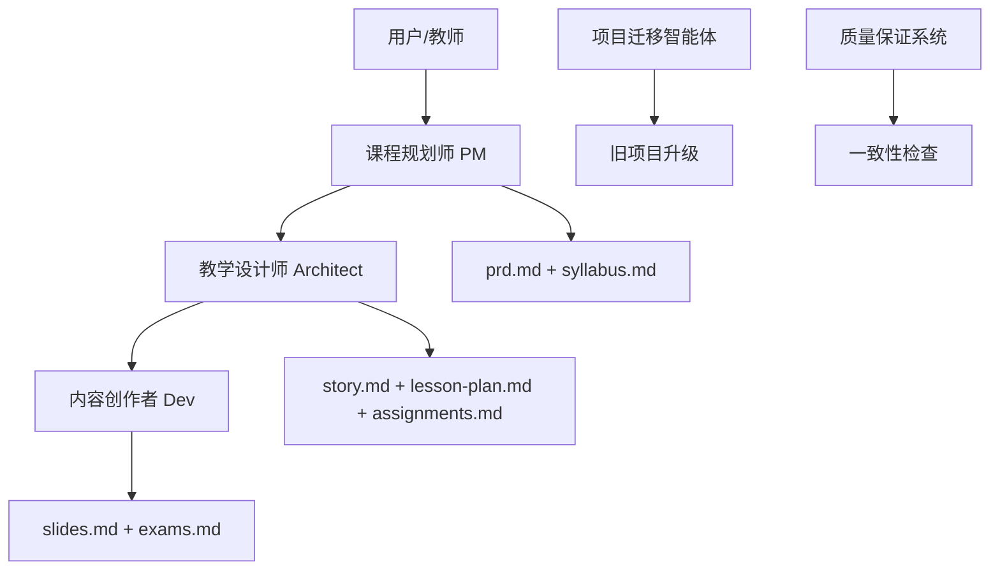

# 教育家工具箱 (Educator's Toolkit)
# 🎓 Educator's Toolkit

[](https://github.com/b-mad/educators-toolkit)
[](LICENSE)
[](cli/package.json)

## 📖 项目简介

教育家工具箱是一个基于 **B-mad 框架** 的智能化教育扩展包，通过定义模块化的智能体 (`agents`)、可执行的任务 (`tasks`)、标准化的模板 (`templates`) 和质量保证的检查清单 (`checklists`)，构建一个专为教育场景设计的智能化教学辅助系统。

### 🎯 核心目标

- **解放教师生产力**：让教师将更多精力投入到教学创新和与学生的互动中
- **确保教学质量**：基于成熟教育理论，确保每一份教学产出都逻辑严密、目标明确
- **简化工作流程**：自动化处理从课程规划到教学评估的全流程
- **促进标准化**：建立统一的课程开发标准和最佳实践

## 🏗️ 系统架构

### 核心智能体团队



#### 1. 课程规划师 (Course Planner - PM角色)
- **理论基础**：成果导向教育 (OBE) + 布鲁姆认知目标分类学
- **核心职责**：课程顶层设计和整体规划
- **主要产出**：`prd.md` (项目需求文档) + `syllabus.md` (教学大纲)
- **关键命令**：`*create-prd`, `*create-syllabus`

#### 2. 教学设计师 (Instructional Designer - Architect角色)
- **理论基础**：加涅九段教学法 + 建构主义学习理论
- **核心职责**：具体教学流程设计和评估方案制定
- **主要产出**：`story.md` (教学任务) + `lesson-plan.md` (详细教案) + `assignments.md` (作业规范)
- **关键命令**：`*create-stories`, `*create-lesson-plan`, `*design-assignment`

#### 3. 内容创作者 (Content Creator - Dev角色)
- **理论基础**：多媒体学习的认知理论
- **核心职责**：具体教学内容生成和执行
- **主要产出**：`slides.md` (Marpit幻灯片) + `exams.md` (试卷)
- **关键命令**：`*create-slides`, `*create-exam-papers`

### 标准化项目结构

```
课程名称/
├── docs/              # 核心规划与设计文档 (顶层设计)
│   ├── brief.md       # (用户输入) 课程简介与原始需求
│   ├── prd.md         # (PM 输出) 课程规划，包含Epics和高层级Stories
│   ├── syllabus.md    # (PM 输出) 面向学生的教学大纲
│   └── architecture.md# (Architect 输出) 整体教学设计蓝图
│
├── lessons/           # 每周/每单元的教学内容 (战术执行)
│   └── week-01/
│       ├── story.md     # (Architect/用户维护) 本周教学任务与目标
│       ├── lesson-plan.md # (Architect 维护) 详细教案
│       └── slides.md      # (Dev 输出) Marpit 幻灯片
│
├── assignments/       # 作业产出物
│   ├── homework-01.md
│   └── rubrics-01.md
│
├── exams/             # 试卷产出物
│   ├── midterm-a.md
│   └── final-b.md
│
└── assets/            # (用户输入) 教师提供的原始素材
    └── week-01/
        ├── video-transcript.txt
        └── reference-images/
```

## 🚀 快速开始

### 环境要求

- **Node.js**: >= 14.0.0
- **VS Code**: >= 1.70.0 (用于扩展版本)
- **Git**: 用于版本控制

### 安装方式

#### CLI 版本 (推荐)
```bash
# 全局安装
npm install -g educators-toolkit-cli

# 或者使用 npx
npx educators-toolkit-cli init 我的课程项目
```

#### VS Code 扩展版本
1. 打开 VS Code
2. 进入扩展市场 (Ctrl+Shift+X)
3. 搜索 "教育家工具箱"
4. 点击安装

### 基本使用流程

#### 1. 初始化项目
```bash
# CLI 版本
educators-toolkit init 数字媒体设计基础

# VS Code 版本
# 使用命令面板: "教育家工具箱: 初始化新课程项目"
```

#### 2. 完善课程简介
编辑 `docs/brief.md` 文件，填写课程的基本信息、目标用户、核心痛点等。

#### 3. 生成课程规划
```bash
# 生成项目需求文档 (PRD)
educators-toolkit create-prd

# 生成教学大纲
educators-toolkit create-syllabus
```

#### 4. 创建教学任务
```bash
# 创建16周的教学任务
educators-toolkit create-stories --weeks 16
```

#### 5. 设计详细教案
```bash
# 为第1周生成详细教案
educators-toolkit create-lesson-plan --week 1
```

#### 6. 生成教学内容
```bash
# 生成Marpit幻灯片
educators-toolkit create-slides --week 1
```

## 🎓 教育理论框架

### 1. 成果导向教育 (Outcome-Based Education, OBE)
- **清晰定义学习成果**：每个学习目标必须具体、可衡量
- **反向设计**：从期望的学习成果出发设计课程
- **持续改进**：基于成果达成度不断优化课程设计

### 2. 布鲁姆认知目标分类学 (Bloom's Taxonomy)
- **记忆** → **理解** → **应用** → **分析** → **评价** → **创造**
- 为不同认知层次设计相应的教学活动和评估方法

### 3. 加涅九段教学法 (Gagné's Nine Events)
1. 引起注意 → 2. 告知目标 → 3. 回忆先决知识
4. 呈现刺激材料 → 5. 提供学习指导 → 6. 诱发行为
7. 提供反馈 → 8. 评估行为 → 9. 增强保持和迁移

### 4. 建构主义学习理论 (Constructivism)
- **以学生为中心**：学习者是主动的知识建构者
- **真实情境**：学习应发生在真实或模拟的真实情境中
- **社会互动**：协作和交流促进深度学习

### 5. 多媒体学习的认知理论 (Cognitive Theory of Multimedia Learning)
- **减少外在认知负荷**：去除无关信息，简化设计
- **管理必要认知负荷**：分块呈现，提供学习支架
- **促进生成性认知处理**：鼓励主动学习，提供互动机会

## 🛠️ 核心功能特性

### 智能体协同工作流
- **主动沟通**：每个智能体在执行任务前后都与用户交流
- **明确任务交接**：完成任务后清晰指引下一步操作
- **防御性信息索取**：信息不足时主动请求补充材料
- **冲突检测**：发现潜在冲突时及时提醒用户

### 可扩展评估设计
针对复杂作业类型（影像、游戏、设计稿）提供"降维提交"方案：
- **影像作业**：关键帧截图 + 精华片段 + 创作说明
- **游戏作业**：演示视频 + 设计文档 + 关键代码
- **设计作业**：最终作品 + 过程记录 + 设计反思

### 质量保证机制
- **自动一致性检查**：确保教学设计符合教育理论
- **内容完整性验证**：检查所有必要文档和素材
- **格式标准化**：确保输出符合学术和教学标准

### 旧项目升级支持
- **智能项目识别**：自动检测非标准项目结构
- **安全迁移策略**：完整备份，支持回滚
- **内容无损转换**：保持原有教学内容完整性

## 📋 命令参考

### 项目初始化
| 命令 | 描述 | 适用场景 |
|------|------|----------|
| `init [项目名称]` | 初始化新课程项目 | 开始新课程开发 |
| `upgrade` | 升级旧项目到标准 | 现有项目标准化 |

### 课程规划 (PM)
| 命令 | 描述 | 前置条件 |
|------|------|----------|
| `create-prd` | 生成项目需求文档 | 存在 `docs/brief.md` |
| `create-syllabus` | 生成教学大纲 | 存在 `docs/prd.md` |

### 教学设计 (Architect)
| 命令 | 描述 | 参数选项 |
|------|------|----------|
| `create-stories` | 创建教学任务 | `--weeks <数量>` |
| `create-lesson-plan` | 生成详细教案 | `--week <周次>` |
| `design-assignment` | 设计作业和评分标准 | `--week <周次>` |

### 内容创作 (Dev)
| 命令 | 描述 | 参数选项 |
|------|------|----------|
| `create-slides` | 生成Marpit幻灯片 | `--week <周次>` |
| `create-exam-papers` | 生成A/B试卷 | `--week <周次>` |

## 🔧 开发指南

### 项目结构
```
educators-toolkit/
├── docs/                    # 项目文档
├── agents/                  # 智能体定义
│   ├── course-planner.md
│   ├── instructional-designer.md
│   ├── content-creator.md
│   └── project-migrator.md
├── agents/tasks/           # 任务定义
├── vscode-extension/       # VS Code扩展
│   ├── src/               # 源代码
│   ├── package.json
│   └── tsconfig.json
├── cli/                    # 命令行工具
│   ├── educators-toolkit.js
│   └── package.json
├── team-education.yaml     # 团队配置
└── consistency-check.yaml  # 质量检查清单
```

### 扩展开发
1. **添加新智能体**：在 `edu_agents` 目录创建智能体定义文件
2. **添加新命令**：在CLI或扩展中注册新命令
3. **自定义模板**：修改 `templates/` 目录下的模板文件
4. **配置检查项**：编辑 `consistency-check.yaml` 文件

### 贡献指南
1. Fork 项目仓库
2. 创建功能分支 (`git checkout -b feature/amazing-feature`)
3. 提交更改 (`git commit -m 'Add some amazing feature'`)
4. 推送到分支 (`git push origin feature/amazing-feature`)
5. 创建 Pull Request

## 🧪 测试与验证

### 功能测试
```bash
# 测试项目初始化
educators-toolkit init test-project

# 测试完整工作流
cd test-project
educators-toolkit create-prd
educators-toolkit create-syllabus
educators-toolkit create-stories --weeks 4
educators-toolkit create-lesson-plan --week 1
educators-toolkit create-slides --week 1
```

### 质量检查
- **文档完整性**：确保所有必要文档都已生成
- **格式正确性**：验证Markdown格式和Marpit语法
- **内容一致性**：检查教学目标与活动内容的一致性
- **理论符合性**：验证教育理论的正确应用

## 📊 性能指标

### 处理速度
- **项目初始化**：< 30秒
- **PRD生成**：< 2分钟
- **教案创建**：< 1分钟
- **幻灯片生成**：< 3分钟（20页）

### 质量标准
- **文档准确率**：> 95%
- **格式合规率**：100%
- **理论应用正确性**：> 90%
- **用户满意度**：> 85%

## 🤝 社区支持

### 获取帮助
- **GitHub Issues**：报告bug和请求功能
- **Discussions**：社区讨论和最佳实践分享
- **Wiki**：详细文档和使用指南
- **邮件支持**：b-mad-education@example.com

### 参与贡献
- **代码贡献**：提交Pull Request
- **文档改进**：完善使用文档和示例
- **翻译支持**：帮助国际化翻译
- **用户反馈**：分享使用体验和建议

## 📄 许可证

本项目基于 [MIT 许可证](LICENSE) 开源，详见许可证文件。

## 🙏 致谢

感谢所有为教育家工具箱项目做出贡献的开发者和教育工作者。特别感谢：

- **B-mad 框架团队** 提供核心架构支持
- **教育理论专家** 提供专业指导
- **一线教师** 提供实际需求和反馈
- **开源社区** 提供技术支持和贡献

---

## 📞 联系我们

- **项目主页**：[https://github.com/b-mad/educators-toolkit](https://github.com/b-mad/educators-toolkit)
- **问题反馈**：[GitHub Issues](https://github.com/b-mad/educators-toolkit/issues)
- **邮件联系**：b-mad-education@example.com

---

**让教育更智能，让教学更高效！** 🚀