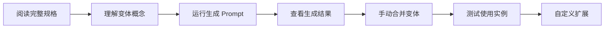

# Figma 按钮变体系统生成器 - 完整文档

## 📚 文档索引

本目录包含完整的 Figma 按钮变体系统自动生成方案，适用于教学和快速原型开发。

### 📄 文件清单

| 文件 | 用途 | 适用场景 |
|------|------|---------|
| `figma-button-variants-generator.md` | **完整详细规格文档** | 深度学习、定制化需求 |
| `figma-quick-prompt.md` | **快速启动 Prompt** | 快速生成、日常使用 |
| `figma-button-config.json` | **JSON 配置文件** | 程序化调用、参数查询 |
| `README-FIGMA-BUTTONS.md` | **本文件** | 导航和概览 |

---

## 🚀 快速开始

### 5 秒启动

1. 复制 `figma-quick-prompt.md` 中的 prompt
2. 粘贴到支持 TalkToFigma 的 AI 助手
3. 等待生成完成（约 5-10 分钟）
4. 在 Figma 中选中按钮 → 右键 → "合并为变体"

### 完整学习流程



---

## 📊 生成内容概览

### 核心组件（20 个按钮）

```
Button/Primary/Large/Default/no-icon       ✅
Button/Primary/Large/Hover/no-icon         ✅
Button/Primary/Large/Pressed/no-icon       ✅
Button/Primary/Large/Disabled/no-icon      ✅
Button/Primary/Large/Default/with-icon     ✅
Button/Primary/Large/Hover/with-icon       ✅
Button/Primary/Large/Pressed/with-icon     ✅
Button/Primary/Large/Disabled/with-icon    ✅

Button/Primary/Medium/Default/no-icon      ✅
Button/Primary/Medium/Hover/no-icon        ✅
Button/Primary/Medium/Pressed/no-icon      ✅
Button/Primary/Medium/Disabled/no-icon     ✅

Button/Secondary/Large/Default/no-icon     ✅
Button/Secondary/Large/Hover/no-icon       ✅
Button/Secondary/Large/Pressed/no-icon     ✅
Button/Secondary/Large/Disabled/no-icon    ✅

Button/Destructive/Large/Default/no-icon   ✅
Button/Destructive/Large/Hover/no-icon     ✅
Button/Destructive/Large/Pressed/no-icon   ✅
Button/Destructive/Large/Disabled/no-icon  ✅
```

### 教学辅助组件（8 个）

1. 🎯 页面标题横幅
2. 📚 合并为变体步骤说明
3. 🎨 颜色样式参考指南
4. 💡 变体系统核心优势
5. 🎨 实际应用示例（对话框）
6. 📖 教学总结与下一步
7. ⚠️ 重要注意事项
8. 📊 项目统计与成果

---

## 🎨 设计系统规范

### 颜色系统

#### Primary（紫色系）
```css
--primary-default:  #7B61FF  rgb(123, 97, 255)
--primary-hover:    #6B52E6  rgb(107, 82, 230)
--primary-pressed:  #594099  rgb(89, 64, 153)
--primary-disabled: #C7C7C7  rgb(199, 199, 199)
```

#### Secondary（白色 + 描边）
```css
--secondary-bg:     #FFFFFF  rgb(255, 255, 255)
--secondary-hover:  #F2EEFF  rgb(242, 238, 255)
--secondary-stroke: #7B61FF  2px
```

#### Destructive（红色系）
```css
--danger-default:   #E64242  rgb(230, 66, 66)
--danger-hover:     #CC3333  rgb(204, 51, 51)
--danger-pressed:   #B32626  rgb(179, 38, 38)
```

### 尺寸规范（8 点网格）

| 属性 | Large | Medium | Small |
|------|-------|--------|-------|
| 高度 | 48px | 40px | 32px |
| 内边距（X） | 24px | 16px | 16px |
| 内边距（Y） | 12px | 10px | 6px |
| 字号 | 16pt | 14pt | 12pt |
| 图标 | 20×20 | 18×18 | 16×16 |
| 圆角 | 8px | 8px | 8px |

---

## 🔧 技术规格

### 变体矩阵

```yaml
Total Variants: 72
Calculation: 3 Type × 3 Size × 4 State × 2 Icon = 72

Properties:
  Type: [Primary, Secondary, Destructive]
  Size: [Large, Medium, Small]
  State: [Default, Hover, Pressed, Disabled]
  Icon: [no-icon, with-icon]
```

### 命名规范

**格式**: `Component/Property1/Property2/.../PropertyN`

**示例**:
- ✅ 正确: `Button/Primary/Large/Default/no-icon`
- ❌ 错误: `Button-Primary-Large-Default-no-icon`
- ❌ 错误: `ButtonPrimaryLargeDefault`

**原因**: Figma 通过斜杠自动识别层级结构

---

## 📖 使用场景

### 1️⃣ 教学场景

**适用课程**:
- UI/UX 设计基础
- Figma 高级技巧
- 设计系统构建
- 前端设计协作

**教学要点**:
- 组件库管理最佳实践
- 变体系统的组织优势
- 设计令牌（Design Tokens）
- 8 点网格系统
- 团队协作流程

### 2️⃣ 实战场景

**适用项目**:
- 快速原型开发
- 设计系统初始化
- 组件库标准化
- 跨团队协作规范

**价值体现**:
- 节省 80% 组件创建时间
- 统一视觉语言
- 降低维护成本
- 提高迭代效率

### 3️⃣ 学习场景

**适合人群**:
- 设计专业学生
- 转行 UI 设计师
- 前端开发工程师
- 产品经理

**学习路径**:
1. 理解变体概念
2. 运行生成脚本
3. 手动合并操作
4. 创建组件实例
5. 自定义扩展

---

## 🎓 教学建议

### 课堂演示流程（45 分钟）

#### 第一阶段：理论讲解（10 分钟）
1. 传统组件管理的痛点
2. 变体系统的核心概念
3. 斜杠命名法的原理
4. 8 点网格系统

#### 第二阶段：生成演示（15 分钟）
1. 展示 Prompt 运行过程
2. 讲解每个按钮的创建
3. 说明颜色和尺寸规范
4. 强调 Auto Layout 的重要性

#### 第三阶段：合并操作（10 分钟）
1. 选中所有 20 个按钮
2. 右键 → "合并为变体"
3. 重命名属性名称
4. 测试属性切换

#### 第四阶段：实战练习（10 分钟）
1. 创建组件实例
2. 在设计中使用
3. 通过属性面板切换
4. 设置原型交互

---

## 🔄 自定义方案

### 更改主题色

```markdown
请创建按钮系统，使用蓝色主题：
- Primary: #2563EB (蓝色)
- Hover: #1D4ED8
- Pressed: #1E40AF
```

### 扩展尺寸

```markdown
请添加 Small 尺寸：
- 高度: 32px
- 内边距: 16px (左右), 6px (上下)
- 字号: 12pt
```

### 创建完整版本

```markdown
请创建全部 72 个变体：
- 3 Type × 3 Size × 4 State × 2 Icon
- 包括 Small 尺寸
- 所有类型都包含 with-icon 版本
```

### 品牌定制

```markdown
请根据我的品牌色创建：
- Primary: #FF6B6B (珊瑚红)
- Secondary: #4ECDC4 (青绿色)
- 圆角改为 12px
- 字体使用 Poppins
```

---

## 🐛 常见问题

### Q1: 颜色不准确怎么办？

**A**: Figma API 使用 0-1 范围的 RGB 值，需要转换：

```javascript
// HEX 转 Figma RGB
function hexToFigmaRgb(hex) {
  const r = parseInt(hex.slice(1, 3), 16) / 255;
  const g = parseInt(hex.slice(3, 5), 16) / 255;
  const b = parseInt(hex.slice(5, 7), 16) / 255;
  return { r, g, b };
}

// 示例
#7B61FF → {r: 0.482, g: 0.38, b: 1}
```

### Q2: 无法合并为变体？

**A**: 检查以下几点：
1. ✅ 命名是否使用斜杠分隔
2. ✅ 所有组件是否都是 Frame
3. ✅ 是否选中了正确的图层
4. ✅ 组件是否在同一页面

### Q3: Auto Layout 不生效？

**A**: 确保：
1. ✅ Frame 的 layoutMode 设置为 HORIZONTAL 或 VERTICAL
2. ✅ 设置了正确的 padding 值
3. ✅ 子元素已添加到 Frame 内部

### Q4: 如何导出给开发使用？

**A**: 
1. 选中组件集 → 右键 → Export
2. 使用 Figma Dev Mode 查看代码
3. 使用 Figma Tokens 插件生成 JSON
4. 集成 Figma API 自动同步

### Q5: 如何维护组件库？

**A**:
1. 使用 Figma Libraries 发布
2. 设置版本控制
3. 编写更新日志
4. 通知团队成员更新

---

## 📚 延伸学习

### 推荐资源

**官方文档**:
- [Figma Variants Guide](https://help.figma.com/hc/en-us/articles/360056440594)
- [Component Properties](https://help.figma.com/hc/en-us/articles/5579474826519)
- [Auto Layout](https://help.figma.com/hc/en-us/articles/360040451373)

**视频教程**:
- [Creating Component Variants](https://www.youtube.com/watch?v=y29Xwt9dET0)
- [Design Systems in Figma](https://www.youtube.com/watch?v=EK-pHkc5EL4)

**进阶主题**:
- Design Tokens 系统
- Figma Plugins 开发
- API 自动化
- 设计系统文档化

---

## 🛠️ 工具集成

### Figma Plugins

**推荐插件**:
1. **Figma Tokens** - 设计令牌管理
2. **Component Inspector** - 组件分析
3. **Style Organizer** - 样式整理
4. **Auto Flow** - 自动连线

### API 集成

```javascript
// 使用 Figma API 获取组件
const component = await figma.getNodeById('component_id');

// 创建实例
const instance = component.createInstance();

// 设置属性
instance.setProperties({
  'Type': 'Primary',
  'Size': 'Large',
  'State': 'Hover'
});
```

### CI/CD 集成

```yaml
# GitHub Actions 示例
name: Sync Figma Design Tokens
on:
  schedule:
    - cron: '0 0 * * *'
jobs:
  sync:
    runs-on: ubuntu-latest
    steps:
      - uses: actions/checkout@v2
      - name: Sync Tokens
        run: npx figma-tokens sync
```

---

## 📊 性能优化

### 大规模组件库

**问题**: 72 个变体会导致文件臃肿

**解决方案**:
1. 分离核心组件和扩展组件
2. 使用 Figma Libraries 模块化
3. 定期清理未使用的变体
4. 考虑使用 Code Components

### 渲染性能

**优化建议**:
1. 避免过度使用阴影和模糊
2. 合理使用矢量网络
3. 压缩图标资源
4. 使用组件实例而非复制

---

## 🤝 贡献指南

欢迎改进和扩展此方案！

**改进方向**:
- [ ] 添加更多按钮类型（Ghost, Link, etc.）
- [ ] 支持深色模式变体
- [ ] 添加加载状态
- [ ] 集成图标库
- [ ] 添加动画规范

**提交方式**:
1. Fork 项目
2. 创建特性分支
3. 提交改进
4. 发起 Pull Request

---

## 📝 更新日志

### v1.0 (2025-01-07)
- ✅ 初始版本
- ✅ 20 个核心按钮组件
- ✅ 8 个教学辅助框架
- ✅ 完整文档和配置
- ✅ JSON 配置文件

### 未来计划
- [ ] v1.1: 添加深色模式支持
- [ ] v1.2: 集成 Figma Tokens
- [ ] v2.0: 完整的 72 变体版本
- [ ] v2.1: 添加动画规范

---

## 📄 许可证

本项目采用 MIT 许可证，可自由用于教学、商业和个人项目。

---

## 👥 致谢

感谢以下资源的启发：
- Figma 官方设计系统
- Material Design 规范
- Ant Design 组件库
- Radix UI 设计系统

---

## 📧 联系方式

**问题反馈**: 请通过 GitHub Issues 提交
**功能建议**: 欢迎通过 Pull Request 贡献
**教学合作**: 欢迎教育机构联系合作

---

**🎉 开始创建您的专业按钮组件系统吧！**

