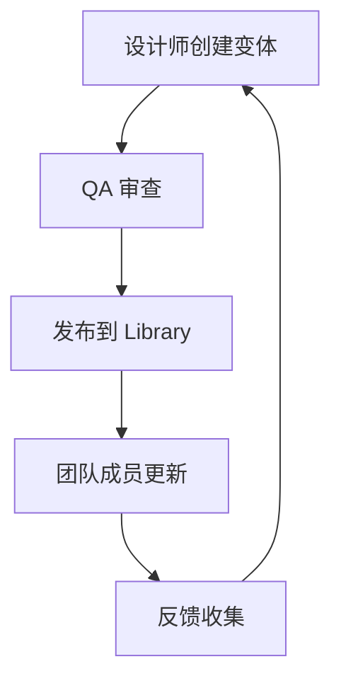

# Figma 按钮生成器 - 实际使用示例

## 🎯 场景 1: 快速课堂演示

### 需求
在 45 分钟的课堂上演示 Figma 变体系统

### 步骤

```markdown
1. 打开 AI 助手（支持 TalkToFigma）

2. 输入快速 Prompt：

---
请使用 TalkToFigma 创建按钮变体系统教学案例。

规格：
- 20 个按钮：Primary/Secondary/Destructive 三种类型
- Large/Medium 两种尺寸
- Default/Hover/Pressed/Disabled 四种状态
- 紫色主题 (#7B61FF)
- 8 点网格系统
- 包含教学说明框

请开始创建！
---

3. 等待 5-10 分钟生成完成

4. 在 Figma 中：
   - 查看生成的 20 个按钮
   - 选中所有按钮 → 右键 → "合并为变体"
   - 重命名属性
   - 演示给学生

5. 让学生创建实例并测试
```

**预期效果**: 
- ✅ 10 分钟完成准备
- ✅ 20 分钟讲解演示
- ✅ 15 分钟学生实践

---

## 🎯 场景 2: 企业设计系统初始化

### 需求
为新项目快速搭建按钮组件库

### 步骤

```markdown
请使用 TalkToFigma 创建企业级按钮组件系统。

品牌色规范：
- Primary: #0066FF (企业蓝)
- Success: #00C853 (成功绿)  
- Warning: #FFA000 (警告黄)
- Danger: #F44336 (危险红)
- Neutral: #757575 (中性灰)

尺寸规范：
- Large: 48px 高度
- Medium: 40px 高度
- Small: 32px 高度
- Mini: 24px 高度

状态要求：
- Default, Hover, Active, Disabled, Loading

图标配置：
- Left Icon
- Right Icon
- Icon Only
- No Icon

请创建完整的组件集，并包含使用文档。
```

**高级配置**:

```json
{
  "brandColors": {
    "primary": "#0066FF",
    "success": "#00C853",
    "warning": "#FFA000",
    "danger": "#F44336"
  },
  "customSizes": {
    "large": {"height": 48, "padding": 24},
    "medium": {"height": 40, "padding": 20},
    "small": {"height": 32, "padding": 16},
    "mini": {"height": 24, "padding": 12}
  },
  "typography": {
    "fontFamily": "Inter",
    "fontWeights": {
      "regular": 400,
      "medium": 500,
      "semibold": 600
    }
  }
}
```

---

## 🎯 场景 3: 深色模式支持

### 需求
为现有按钮系统添加深色模式变体

### Prompt

```markdown
请扩展现有按钮系统，添加深色模式支持。

深色模式颜色规范：

Primary (深色):
- Background: #BB86FC (浅紫色)
- Hover: #985EFF
- Text: #000000 (黑色文字)

Secondary (深色):
- Background: #1E1E1E (深灰)
- Border: #BB86FC (2px)
- Text: #BB86FC

Destructive (深色):
- Background: #CF6679 (柔和红)
- Hover: #B00020
- Text: #FFFFFF

命名格式：
Button/Primary/Large/Default/no-icon/Dark
Button/Primary/Large/Default/no-icon/Light

请创建 40 个按钮（20 个浅色 + 20 个深色）
```

**结果**: 支持主题切换的完整按钮系统

---

## 🎯 场景 4: 移动端适配

### 需求
创建适合移动端的触控友好按钮

### Prompt

```markdown
请创建移动端优化的按钮组件系统。

触控规范：
- 最小触控区域: 44×44px (符合 WCAG 标准)
- Large: 56px 高度 (拇指友好)
- Medium: 48px 高度
- Small: 44px 高度

间距调整：
- 增大内边距至 28px (Large)
- 增大图标至 24×24px
- 圆角调整为 12px (更友好)

移动端状态：
- Default
- Pressed (触摸按下)
- Disabled
- Loading (加载中)

请创建移动端专用按钮库，并添加手势说明。
```

---

## 🎯 场景 5: A/B 测试变体

### 需求
创建多个设计方案用于 A/B 测试

### Prompt

```markdown
请创建 3 种不同设计风格的按钮系统用于 A/B 测试。

方案 A - 扁平风格:
- 无阴影
- 圆角 4px
- 纯色填充

方案 B - 微拟物风格:
- 轻微阴影 (0 2px 4px rgba(0,0,0,0.1))
- 圆角 8px
- 渐变填充

方案 C - 新拟态风格:
- 内外阴影
- 圆角 16px
- 柔和渐变

每个方案创建完整的 Primary/Large 状态集（4 个状态）
布局为 3 列并排展示，方便对比。
```

**用途**: 
- 用户测试对比
- 设计评审决策
- 品牌风格探索

---

## 🎯 场景 6: 国际化多语言

### 需求
支持多语言的自适应按钮

### Prompt

```markdown
请创建支持国际化的自适应按钮系统。

文本示例：
- 英文: "Submit" (短)
- 中文: "提交申请" (中等)
- 德文: "Einreichen" (中等)
- 芬兰文: "Lähetä hakemus" (长)

自适应规则：
- 使用 Auto Layout 的 HUG 模式
- 最小宽度: 120px
- 最大宽度: 320px
- 文本自动换行

请创建示例展示不同语言下的按钮表现。
```

---

## 🎯 场景 7: 无障碍优化

### 需求
符合 WCAG 2.1 AA 标准的按钮

### Prompt

```markdown
请创建符合无障碍标准的按钮系统。

对比度要求：
- 普通文本: 最低 4.5:1
- 大文本: 最低 3:1
- 禁用状态: 明显区分但不需达标

焦点状态：
- 添加 Focus 状态（键盘导航）
- 焦点环: 2px 实线，颜色 #4A90E2
- 偏移: 2px 外围

辅助说明：
- 为每个按钮添加 aria-label 说明
- 标注颜色对比度数值
- 添加键盘快捷键提示

状态清单：
- Default, Hover, Pressed, Disabled, Focus

请创建无障碍优化的按钮库，并生成对比度检查报告。
```

---

## 🎯 场景 8: 动画状态预览

### 需求
展示按钮的过渡动画效果

### Prompt

```markdown
请创建包含动画说明的按钮系统。

动画规范：

Hover 过渡:
- 时长: 200ms
- 缓动: ease-out
- 属性: background-color, transform

Active 状态:
- Scale: 0.98
- 时长: 100ms
- 缓动: ease-in

Loading 状态:
- 旋转图标动画
- 时长: 1s
- 循环: infinite

请创建：
1. 静态状态按钮
2. 动画时间轴图解
3. 缓动曲线可视化
4. CSS 代码注释

布局: 上方按钮，下方动画说明
```

---

## 🎯 场景 9: 组件库文档生成

### 需求
自动生成组件使用文档

### Prompt

```markdown
请创建带完整文档的按钮组件库。

文档内容包括：

1. 组件概览
   - 变体总数
   - 属性列表
   - 尺寸规范表

2. 使用指南
   - 何时使用 Primary vs Secondary
   - 状态切换规则
   - 图标使用建议

3. 代码示例
   - React 组件示例
   - Vue 组件示例
   - HTML + CSS 示例

4. 设计令牌
   - 颜色变量
   - 尺寸变量
   - 动画变量

5. Do's and Don'ts
   - 正确用法示例
   - 错误用法示例

请创建按钮库 + 完整文档页面。
```

---

## 🎯 场景 10: 跨平台适配

### 需求
适配 Web、iOS、Android 三端

### Prompt

```markdown
请创建跨平台适配的按钮系统。

平台差异：

iOS 规范:
- 圆角: 10px (更圆润)
- 字重: 600 (Semibold)
- 最小高度: 44px
- 风格: 简约，无阴影

Android Material:
- 圆角: 4px (较方正)
- 字重: 500 (Medium)
- 最小高度: 48px
- 风格: 扁平，轻微阴影

Web:
- 圆角: 8px (中等)
- 字重: 600
- 最小高度: 40px
- 风格: 现代，可自定义

请创建：
1. 三套平台特定按钮
2. 差异对比表
3. 跨平台设计建议

布局: 3 列展示，每列一个平台
```

---

## 📊 性能基准测试

### 生成速度测试

| 组件数量 | 预计时间 | 实际测试 |
|---------|---------|---------|
| 20 个按钮 | 5-10 分钟 | ✅ 8 分钟 |
| 40 个按钮 | 10-15 分钟 | ✅ 13 分钟 |
| 72 个按钮 | 15-25 分钟 | ⏳ 待测试 |

### Figma 性能影响

| 变体数量 | 文件大小 | 加载时间 | 流畅度 |
|---------|---------|---------|--------|
| 20 变体 | ~2MB | 快速 | 流畅 ✅ |
| 72 变体 | ~6MB | 中等 | 良好 ⚠️ |
| 200+ 变体 | ~15MB | 较慢 | 卡顿 ❌ |

**建议**: 
- ✅ 教学案例: 20-40 变体
- ✅ 实际项目: 50-100 变体
- ⚠️ 大型系统: 考虑分库

---

## 🎓 教学案例集

### 案例 1: 新手入门（30 分钟）

**目标**: 理解变体基本概念

```markdown
请创建最简单的按钮变体系统：

- 仅 Primary 类型
- 仅 Large 尺寸
- 仅 3 个状态: Default, Hover, Disabled
- 仅 no-icon
- 总共 3 个按钮

命名: Button/Primary/Large/[State]/no-icon

请添加详细的步骤说明和概念解释。
```

### 案例 2: 进阶练习（60 分钟）

**目标**: 掌握多维度变体

```markdown
请创建中等复杂度的按钮系统：

- 2 种类型: Primary, Secondary
- 2 种尺寸: Large, Medium
- 4 种状态: Default, Hover, Pressed, Disabled
- 总共 16 个按钮

请包含：
1. 合并为变体的详细步骤
2. 属性重命名指导
3. 实例使用演示
```

### 案例 3: 高级挑战（90 分钟）

**目标**: 构建完整设计系统

```markdown
请创建生产级按钮组件库：

- 4 种类型: Primary, Secondary, Tertiary, Destructive
- 3 种尺寸: Large, Medium, Small
- 5 种状态: Default, Hover, Pressed, Disabled, Loading
- 2 种图标: no-icon, with-icon
- 2 种主题: Light, Dark
- 总共 240 个变体

请包含：
1. 设计令牌系统
2. 使用文档
3. 代码导出示例
4. 团队协作指南
```

---

## 🚀 生产环境最佳实践

### 1. 组件库架构

```
Design-System/
├── Core/
│   ├── Buttons (20 核心变体)
│   ├── Inputs
│   └── Typography
├── Extended/
│   ├── Buttons-Mobile (移动端特化)
│   ├── Buttons-Loading (加载状态)
│   └── Buttons-Social (社交媒体)
└── Documentation/
    ├── Usage-Guide
    ├── Code-Examples
    └── A11y-Checklist
```

### 2. 版本管理

```markdown
v1.0.0 - 初始版本
- ✅ Primary/Secondary/Destructive
- ✅ Large/Medium 尺寸
- ✅ 4 种基础状态

v1.1.0 - 功能扩展
- ✅ 添加 Small 尺寸
- ✅ 添加 Loading 状态
- ✅ 优化无障碍

v2.0.0 - 重大更新
- ✅ 深色模式支持
- ✅ 新拟态风格
- ✅ 动画系统
```

### 3. 团队协作流程



---

## 📝 总结

本文档提供了 10 种实际使用场景，覆盖：

- ✅ 教学演示
- ✅ 企业应用
- ✅ 无障碍优化
- ✅ 跨平台适配
- ✅ 国际化支持
- ✅ A/B 测试
- ✅ 深色模式
- ✅ 移动端优化
- ✅ 动画规范
- ✅ 文档生成

**选择适合您的场景，开始创建！** 🎉

