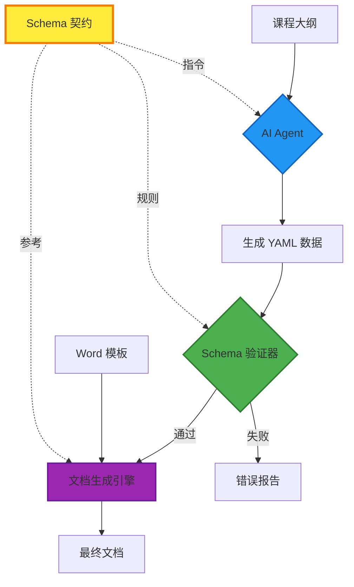

# 6. Schema-Driven Architecture (模式驱动架构)

**版本**: v1.4.0+  
**更新日期**: 2025-10-04  
**状态**: 🔥 Active Development

---

## 6.1 概述 (Overview)

从 v1.4.0 开始，Docu-Weaver 引入了 **Schema-Driven Architecture**（模式驱动架构），将数据契约（Data Contract）提升为系统的第一级架构组件。这一设计理念确保了从 AI 数据生成、数据验证到文档合成的全流程一致性和可靠性。

---

## 6.2 架构演进 (Architectural Evolution)

### v1.0-v1.3: 工具化阶段 (Tool-Centric)

```
[手动编写的 YAML] → [模板] → [生成脚本] → [输出文档]
```

**特点**：
- ✅ 功能完整，满足基本需求
- ⚠️ 数据结构隐式定义（仅存在于模板占位符中）
- ⚠️ 缺少数据标准，易出错
- ⚠️ AI 集成困难

---

### v1.4+: Schema 驱动阶段 (Schema-Driven)

```
                    ┌─────────────────┐
                    │   Schema 契约    │  ← 架构基石
                    │ (数据规范定义)    │
                    └────────┬────────┘
                             │
           ┌─────────────────┼─────────────────┐
           │                 │                 │
           ▼                 ▼                 ▼
    ┌──────────┐      ┌──────────┐     ┌──────────┐
    │ AI Agent │      │ 数据验证  │     │ 文档生成  │
    │ 数据生成  │      │  引擎    │     │  引擎    │
    └──────────┘      └──────────┘     └──────────┘
```

**特点**：
- ✅ Schema 作为"单一事实来源" (Single Source of Truth)
- ✅ AI 输出结构化、规范化
- ✅ 自动化数据验证
- ✅ 完整的架构可追溯性

---

## 6.3 Schema 在架构中的位置 (Schema Placement)

### 目录结构设计

```
nfu-docu-weaver/
│
├── 📂 schemas/                    # 🏛️ 架构层 - 数据契约
│   ├── README.md                 # Schema 使用指南
│   └── lesson_data_schema.yml    # 课程教案 Schema (v2)
│
├── 📂 templates/                  # 📄 表现层 - 文档模板
│   └── 教案参考模板.docx
│
├── 📂 data_source/               # 📊 数据层 - 业务数据
│   ├── lesson_01.yml             # (由 AI 或人工生成)
│   └── ...
│
├── 📂 output/                    # 📁 输出层 - 最终文档
│
├── 📂 prompts/                   # 🤖 指令层 - AI 提示词
│   └── lesson_generator.md      # (v2.0 引入)
│
└── 📜 generate_documents.py      # 🔧 执行层 - 核心引擎
```

**设计原则**：
1. **关注点分离** (Separation of Concerns)：每个目录职责单一、清晰
2. **稳定性分层**：schemas 和 templates 稳定，data_source 动态变化
3. **可扩展性**：便于添加新的 schema 和模板类型

---

## 6.4 Schema 的三大核心作用 (Three Core Roles)

### 作用 1: AI Agent 指令核心

**场景**: 使用 AI (GPT-4/Claude) 根据大纲生成教案数据

**工作流程**:
```
[课程大纲] 
    ↓
[Prompt 模板 + Schema 嵌入]
    ↓
[AI Agent 处理]
    ↓
[符合 Schema 的 YAML 数据]
```

**Prompt 示例**:
```markdown
你是课程设计专家。请严格遵循以下 YAML Schema 生成数据：

```yaml
# [嵌入完整的 lesson_data_schema.yml]
```

现在，请为"第三章 字体识别"生成对应的教案数据。
```

**效果**:
- 🎯 结构化输出，无需人工整理
- 🎯 字段完整性自动保证
- 🎯 减少 80%+ 的人工校正工作

---

### 作用 2: 数据验证标准

**场景**: 在文档生成前自动验证数据完整性

**验证架构**:
```python
class SchemaValidator:
    """基于 Schema 的验证器"""
    
    def load_schema(self, schema_path: Path) -> dict:
        """加载 Schema 定义"""
        
    def extract_rules(self, schema: dict) -> ValidationRules:
        """提取验证规则：
        - 必需字段列表
        - 数据类型定义
        - 嵌套结构规则
        - 格式约束
        """
        
    def validate(self, data_path: Path) -> ValidationResult:
        """执行验证，返回详细结果"""
```

**验证流程**:
```
1. 加载 Schema → 提取规则
2. 解析数据文件 → 检查语法
3. 对比 Schema → 验证完整性
4. 生成报告 → 通过/失败/警告
```

**验证项目**:
- ✅ YAML 语法正确性
- ✅ 必需字段存在性（基于 Schema）
- ✅ 数据类型匹配（string/int/list/object）
- ✅ 嵌套结构完整性（如 `class_hours.total`）
- ⚠️ 额外字段警告（可能的拼写错误）

---

### 作用 3: 文档生成参考

**场景**: 开发和维护阶段的参考手册

**用途**:
- 📖 理解模板占位符 `{{key}}` 的含义
- 📖 了解数据的完整结构和层级
- 📖 作为用户的数据填写指南
- 📖 作为开发者的 API 文档

---

## 6.5 架构流程图 (Architecture Flow)

### 完整数据流



**关键观察**:
- 🟡 **Schema** 是连接三个环节的中心节点
- 🟢 **验证器** 是质量保障的关键门控
- 🔵 **AI Agent** 实现自动化内容生成
- 🟣 **生成引擎** 完成最终文档合成

---

## 6.6 Schema 版本管理 (Schema Versioning)

### 版本策略

**命名规范**:
```
schemas/
├── lesson_data_schema.yml        # 指向当前版本（符号链接或副本）
├── lesson_data_schema_v1.yml     # 历史版本
├── lesson_data_schema_v2.yml     # 当前版本
└── lesson_data_schema_v3.yml     # 未来版本（开发中）
```

**兼容性原则**:
1. **向后兼容变更** (Minor Version)
   - 新增可选字段 ✅
   - 新增注释说明 ✅
   - 示例数据更新 ✅

2. **破坏性变更** (Major Version)
   - 必需字段删除 ⚠️
   - 字段重命名 ⚠️
   - 结构层级变更 ⚠️
   - 需创建新版本文件并更新验证器

**版本升级流程**:
```
1. 评估变更影响
2. 创建新版本 Schema
3. 更新验证器支持多版本
4. 提供迁移脚本（如需要）
5. 更新文档和示例
6. 渐进式废弃旧版本
```

---

## 6.7 设计模式 (Design Patterns)

### 1. Contract-First Design (契约优先设计)

**原则**: Schema 先于实现定义

**流程**:
```
1. 定义 Schema (数据契约)
2. 评审和批准 Schema
3. 基于 Schema 开发验证器
4. 基于 Schema 开发生成器
5. 基于 Schema 生成数据
```

---

### 2. Single Source of Truth (SSOT)

**原则**: Schema 是数据结构的唯一权威来源

**实践**:
- ❌ 不在代码中硬编码字段列表
- ❌ 不依赖模板推断结构
- ✅ 所有组件从 Schema 读取规则
- ✅ Schema 变更自动传播到所有组件

---

### 3. Fail-Fast Validation (快速失败验证)

**原则**: 在流程早期发现并阻止错误数据

**实践**:
```python
def generate_document_pipeline(data_path, template_path):
    # 1. 首先验证 (Fail Fast)
    validation_result = schema_validator.validate(data_path)
    if not validation_result.is_valid:
        raise ValidationError(validation_result.errors)
    
    # 2. 验证通过后再生成
    return document_generator.generate(data_path, template_path)
```

---

## 6.8 技术实现路线图 (Technical Roadmap)

### Phase 1: Schema 基础设施 (v1.4.0) 🔥
- [x] 创建 schemas/ 目录
- [x] 定义 lesson_data_schema.yml v2
- [ ] 实现 SchemaValidator 类
- [ ] 集成到 validate 命令
- [ ] 完整的单元测试

### Phase 2: AI 工作流集成 (v2.0.0)
- [ ] 创建 prompts/ 目录
- [ ] 开发 AI Prompt 模板
- [ ] Schema 自动嵌入机制
- [ ] AI 输出自动验证
- [ ] 交互式工作流

### Phase 3: 高级特性 (v2.x)
- [ ] 多 Schema 支持
- [ ] Schema 继承和组合
- [ ] JSON Schema 标准兼容
- [ ] Schema 可视化编辑器
- [ ] Schema 自动生成工具

---

## 6.9 最佳实践 (Best Practices)

### ✅ DO (推荐做法)

1. **Schema 优先开发**
   - 新功能先定义 Schema
   - Schema 变更需评审批准

2. **Schema 即文档**
   - 添加详细的注释说明
   - 提供示例数据
   - 说明字段用途和格式

3. **Schema 版本控制**
   - 重大变更创建新版本
   - 保持向后兼容性
   - 提供升级路径

4. **自动化验证**
   - 生成前必须验证
   - CI/CD 集成验证检查
   - 验证失败快速反馈

---

### ❌ DON'T (避免做法)

1. **绕过 Schema**
   - 不要直接修改数据绕过验证
   - 不要在代码中硬编码结构

2. **Schema 与实现不同步**
   - 修改代码后必须更新 Schema
   - Schema 是权威定义

3. **过度复杂的 Schema**
   - 避免过深的嵌套（>4 层）
   - 保持结构清晰易懂

---

## 6.10 相关文档 (Related Documents)

- [Schema 使用指南](../../schemas/README.md)
- [数据验证功能](../prd.md#story-24-数据验证)
- [Sprint 4 计划](../SPRINT_PROGRESS.md#sprint-4)
- [CHANGELOG - Schema 集成](../../CHANGELOG.md)

---

**最后更新**: 2025-10-04  
**作者**: Architect + Product Owner  
**状态**: 🔥 Active Development

