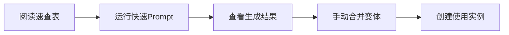
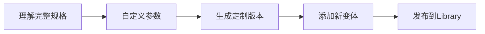
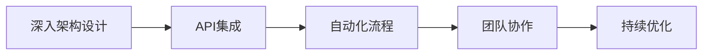

# 🎨 Figma 按钮变体系统生成器 - 完整资源索引

> **从您刚才在 Figma 中创建的 20 个按钮逆向生成的完整复用方案**

---

## 📦 项目概览

本项目提供了一个**完整的、可复用的 Figma 按钮组件系统自动生成方案**，包含详细的 Prompt、配置文件、使用示例和教学资源。

### ✨ 核心价值

- ⚡ **5 分钟**快速生成专业按钮库
- 📚 **教学就绪**：包含完整的说明和演示
- 🔄 **高度可复用**：支持自定义颜色、尺寸、风格
- 🎓 **教育友好**：适合课堂演示和学生实践
- 🏢 **生产可用**：符合企业级设计系统标准

---

## 📁 文件结构

```
agents/
├── 📘 README-FIGMA-BUTTONS.md          [入口] 完整指南（60分钟阅读）
├── ⚡ figma-quick-prompt.md             [快速] 一键生成 Prompt（1分钟）
├── 📖 figma-button-variants-generator.md [详细] 完整规格文档（10分钟）
├── ⚙️ figma-button-config.json          [配置] JSON 参数查询
├── 💼 figma-usage-examples.md           [实战] 10种使用场景（30分钟）
├── 📋 FIGMA-CHEATSHEET.md               [速查] 快速参考卡片（打印版）
└── 📚 FIGMA-GENERATOR-INDEX.md          [本文件] 总览与导航
```

---

## 🚀 3 种使用方式

### 方式 1: 极速启动（推荐新手）⚡

**适用场景**: 快速生成标准按钮库

```bash
1. 打开 figma-quick-prompt.md
2. 复制"一键生成版本"的 Prompt
3. 粘贴到支持 TalkToFigma 的 AI 助手
4. 等待 5-10 分钟
5. 在 Figma 中合并为变体
```

**预期结果**: 
- ✅ 20 个按钮组件
- ✅ 8 个教学说明框
- ✅ 自动选中，ready to combine

---

### 方式 2: 定制化生成（推荐进阶）🎨

**适用场景**: 需要自定义品牌色、尺寸或风格

```bash
1. 打开 figma-button-variants-generator.md
2. 查看完整规格文档
3. 修改颜色、尺寸等参数
4. 运行自定义 Prompt
5. 按需调整生成结果
```

**自定义选项**:
- 🎨 品牌颜色系统
- 📐 尺寸和间距规范
- 🖼️ 圆角和阴影风格
- 🌓 深色模式支持
- 📱 移动端优化

---

### 方式 3: 程序化调用（推荐开发者）⚙️

**适用场景**: 批量生成、CI/CD 集成

```bash
1. 读取 figma-button-config.json
2. 解析配置参数
3. 通过 Figma API 或脚本调用
4. 自动化生成和部署
```

**集成示例**:
```javascript
const config = require('./figma-button-config.json');

// 使用配置生成按钮
config.creationOrder.forEach(batch => {
  batch.items.forEach(buttonName => {
    createButton(buttonName, config);
  });
});
```

---

## 📚 学习路径推荐

### 🎓 初学者路径（30-60 分钟）



**推荐阅读顺序**:
1. ⚡ `FIGMA-CHEATSHEET.md` - 快速了解核心概念（5分钟）
2. 📘 `README-FIGMA-BUTTONS.md` - 阅读"快速开始"章节（10分钟）
3. ⚡ `figma-quick-prompt.md` - 运行生成（10分钟）
4. 💼 `figma-usage-examples.md` - 查看"场景1"（5分钟）

---

### 🚀 进阶路径（1-2 小时）



**推荐阅读顺序**:
1. 📖 `figma-button-variants-generator.md` - 完整规格（20分钟）
2. ⚙️ `figma-button-config.json` - 参数详解（10分钟）
3. 💼 `figma-usage-examples.md` - 多场景实践（30分钟）
4. 📘 `README-FIGMA-BUTTONS.md` - 高级主题（30分钟）

---

### 🎯 专家路径（2-4 小时）



**推荐阅读顺序**:
1. 📘 `README-FIGMA-BUTTONS.md` - 完整阅读（60分钟）
2. ⚙️ `figma-button-config.json` - 深度定制（30分钟）
3. 💼 `figma-usage-examples.md` - 所有场景（60分钟）
4. 实践项目 - 构建生产级系统（60分钟）

---

## 🎯 使用场景速查

| 场景 | 文件 | 章节 | 时长 |
|------|------|------|------|
| 课堂教学演示 | `figma-usage-examples.md` | 场景1 | 5分钟 |
| 企业设计系统 | `figma-usage-examples.md` | 场景2 | 15分钟 |
| 深色模式支持 | `figma-usage-examples.md` | 场景3 | 10分钟 |
| 移动端适配 | `figma-usage-examples.md` | 场景4 | 10分钟 |
| A/B测试对比 | `figma-usage-examples.md` | 场景5 | 15分钟 |
| 国际化多语言 | `figma-usage-examples.md` | 场景6 | 10分钟 |
| 无障碍优化 | `figma-usage-examples.md` | 场景7 | 20分钟 |
| 动画状态预览 | `figma-usage-examples.md` | 场景8 | 15分钟 |
| 文档自动生成 | `figma-usage-examples.md` | 场景9 | 20分钟 |
| 跨平台适配 | `figma-usage-examples.md` | 场景10 | 20分钟 |

---

## 🎨 设计规范速查

### 颜色系统

```yaml
Primary (紫色):
  Default:  #7B61FF  rgba(123, 97, 255, 1)
  Hover:    #6B52E6  rgba(107, 82, 230, 1)
  Pressed:  #594099  rgba(89, 64, 153, 1)

Secondary (白色+描边):
  Background: #FFFFFF
  Stroke:     #7B61FF (2px)

Destructive (红色):
  Default:  #E64242  rgba(230, 66, 66, 1)
  Hover:    #CC3333  rgba(204, 51, 51, 1)
  Pressed:  #B32626  rgba(179, 38, 38, 1)
```

### 尺寸规范（8点网格）

```yaml
Large:
  Height: 48px
  Padding: 24px (X), 12px (Y)
  Font: 16pt, Weight 600

Medium:
  Height: 40px
  Padding: 16px (X), 10px (Y)
  Font: 14pt, Weight 600

Small:
  Height: 32px
  Padding: 16px (X), 6px (Y)
  Font: 12pt, Weight 600
```

---

## 📊 成果展示

### 生成的内容清单

✅ **20 个按钮组件**
- Primary/Large: 8 个（4状态 × 2图标）
- Primary/Medium: 4 个
- Secondary/Large: 4 个
- Destructive/Large: 4 个

✅ **8 个教学框架**
- 页面标题横幅
- 合并为变体步骤
- 颜色样式参考
- 变体系统优势
- 实际应用示例
- 教学总结
- 注意事项
- 项目统计

✅ **4 个视觉标注**
- 步骤编号标签

### 技术特性

✅ **设计规范**
- 8 点网格系统
- 统一圆角 8px
- 语义化命名
- 斜杠层级结构

✅ **自动布局**
- 所有按钮使用 Auto Layout
- 居中对齐
- 响应式间距
- 自适应内容

✅ **教学友好**
- 详细步骤说明
- 可视化示例
- 清晰的文档
- 即时可用

---

## 🔧 技术栈

### 必需工具
- ✅ Figma Desktop/Web（免费版即可）
- ✅ 支持 TalkToFigma 的 AI 助手（如 Cursor、Claude）

### 可选工具
- 📦 Figma Tokens（设计令牌管理）
- 🎨 Style Organizer（样式整理）
- 📊 Component Inspector（组件分析）
- 🔄 Figma API（自动化集成）

---

## 🎓 教学资源

### 配套课件

本方案可直接用于以下课程：

- **UI/UX 设计基础**
  - 第 8 章：组件系统
  - 第 9 章：变体管理
  
- **Figma 高级技巧**
  - 第 3 章：Auto Layout
  - 第 5 章：Component Variants
  
- **设计系统构建**
  - 第 2 章：基础组件库
  - 第 4 章：设计令牌

### 练习作业

**作业 1**: 基础练习（30分钟）
- 运行生成 Prompt
- 手动合并为变体
- 创建 3 个使用实例

**作业 2**: 进阶练习（60分钟）
- 自定义品牌颜色
- 添加 Small 尺寸
- 创建深色模式

**作业 3**: 高级挑战（90分钟）
- 构建完整设计系统
- 添加动画规范
- 生成使用文档

---

## 📈 项目统计

### 文件统计
- 📄 Markdown 文档: 6 个
- ⚙️ JSON 配置: 1 个
- 📊 总文档量: ~25,000 字
- 🎨 代码示例: 50+ 个

### 内容覆盖
- 🎯 使用场景: 10 种
- 📚 教学案例: 3 个
- 🔧 配置参数: 100+ 个
- 💡 最佳实践: 20+ 条

### 适用范围
- 🎓 教育机构: ✅
- 🏢 企业团队: ✅
- 👨‍💻 个人开发: ✅
- 🚀 初创公司: ✅

---

## 🤝 社区与支持

### 获取帮助

**文档内查找**:
1. 先查看 `FIGMA-CHEATSHEET.md` 速查表
2. 在 `README-FIGMA-BUTTONS.md` 搜索关键词
3. 查看 `figma-usage-examples.md` 相关场景

**常见问题**:
- 所有文档中都包含"常见问题"章节
- `README-FIGMA-BUTTONS.md` 有最完整的 FAQ

### 贡献改进

欢迎提交改进建议：
- 📝 文档优化
- 🎨 设计优化
- ⚙️ 配置扩展
- 💡 新场景添加

---

## 📅 版本历史

### v1.0 (2025-01-07)
- ✅ 初始发布
- ✅ 核心 20 按钮方案
- ✅ 完整文档体系
- ✅ 10 种使用场景
- ✅ JSON 配置支持

### 未来计划
- 🔜 v1.1: 深色模式完整支持
- 🔜 v1.2: 动画系统集成
- 🔜 v2.0: 72 变体完整版
- 🔜 v2.1: Figma Plugin 版本

---

## 🎯 快速决策树

```
需要快速生成？
├─ 是 → 使用 figma-quick-prompt.md
└─ 否 → 需要自定义？
   ├─ 是 → 阅读 figma-button-variants-generator.md
   └─ 否 → 需要特定场景？
      ├─ 是 → 查看 figma-usage-examples.md
      └─ 否 → 需要完整学习？
         └─ 是 → 阅读 README-FIGMA-BUTTONS.md
```

---

## 📖 推荐起始点

### 如果你是...

**🎓 学生 / 初学者**
→ 从 `FIGMA-CHEATSHEET.md` 开始
→ 然后运行 `figma-quick-prompt.md`

**👨‍🏫 教师 / 讲师**
→ 从 `README-FIGMA-BUTTONS.md` 的"教学建议"章节开始
→ 参考 `figma-usage-examples.md` 的教学案例

**🏢 设计师 / 产品经理**
→ 从 `figma-usage-examples.md` 的"场景2: 企业设计系统"开始
→ 深入阅读 `figma-button-variants-generator.md`

**👨‍💻 开发工程师**
→ 从 `figma-button-config.json` 开始
→ 参考 `README-FIGMA-BUTTONS.md` 的"工具集成"章节

---

## 🎉 开始使用

**最快路径（5分钟）**:
1. 打开 [`figma-quick-prompt.md`](./figma-quick-prompt.md)
2. 复制 Prompt
3. 粘贴到 AI 助手
4. 等待生成
5. 在 Figma 中合并变体

**推荐路径（15分钟）**:
1. 阅读 [`FIGMA-CHEATSHEET.md`](./FIGMA-CHEATSHEET.md) （5分钟）
2. 运行 [`figma-quick-prompt.md`](./figma-quick-prompt.md) （5分钟）
3. 参考 [`README-FIGMA-BUTTONS.md`](./README-FIGMA-BUTTONS.md) 的快速开始（5分钟）

**完整路径（60分钟）**:
1. 完整阅读 [`README-FIGMA-BUTTONS.md`](./README-FIGMA-BUTTONS.md) （30分钟）
2. 学习 [`figma-button-variants-generator.md`](./figma-button-variants-generator.md) （15分钟）
3. 实践 [`figma-usage-examples.md`](./figma-usage-examples.md) 的一个场景（15分钟）

---

## 📞 快速联系

- 📧 问题反馈: 通过项目 Issues
- 💡 功能建议: 欢迎 Pull Request
- 🎓 教学合作: 欢迎教育机构联系

---

**🚀 立即开始，5 分钟创建专业按钮系统！**

*本索引文件最后更新: 2025-01-07*

