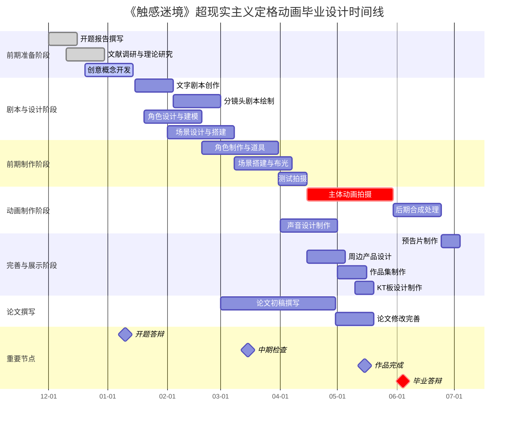

# 卓越技术路径图编写指南：从战略原则到 Markdown 实现

## 第一部分：技术路径图的战略基础

本部分旨在建立概念性框架，定义现代技术路径图的内涵及其有效性的核心原则。它将超越简单的定义，论证路径图是实现战略对齐的动态系统。

### 第一章：定义现代技术路径图：从静态计划到活性文档

#### 路径图作为沟通工具的核心概念

技术路径图并非仅仅是一份项目计划，而是一种战略性的沟通工具 1。其核心目标是描绘组织技术工作的愿景、方向和进展，从而确保技术项目和投资与核心业务目标紧密对齐 1。它系统性地概述了IT目标，有效地促进了技术与非技术利益相关者之间的沟通，通过提升透明度，帮助管理者监控进展并做出明智的战略决策 1。一份成功的路径图本质上是技术路径的可视化呈现，清晰地标示出关键的转折点、依赖关系和资源需求 1。

选择何种路径图方法论和工具，并不仅仅是技术层面的决策，它深刻地反映了一个组织的文化。一个静态、锁定、自上而下发布的路径图，往往暗示着一种命令与控制式的管理文化。相反，一个动态、透明、版本化管理的路径图，则象征着一种鼓励协作、敏捷和分布式所有权的文化。研究表明，成功的路径图依赖于利益相关者的持续参与、反馈和迭代 4。Git等版本控制系统及其托管平台（如GitHub）的核心正是围绕开放协作、同行评审（通过拉取请求）和透明历史记录等原则构建的 6。当一个组织采用这些工具来管理其路径图时，它实际上也在拥抱这些文化价值观。路径图的创建和更新过程，从一项指令性任务转变为一种协作性实践。因此，转向“路径图即代码”（Roadmap-as-Code）的方法，不仅是技术流程的优化，更是推动组织文化变革的催化剂。路径图不再是领导层“下发”的文档，而是由整个团队共同“提交”和维护的共享资产。

#### 从静态到动态的演进

传统的路径图模式通常是在演示软件中创建的静态文档，这种模式很快就会过时，无法适应快速变化的环境。与之相对，现代的、敏捷的方法将路径图视为一份灵活、可适应的活性文档，它能随着技术格局和业务优先级的变化而不断演进 2。这种主动的方法使组织能够保持敏捷性、响应能力和竞争力 1。

#### 有效路径图的关键功能

一个设计精良的技术路径图能发挥多项关键功能，共同推动组织的战略发展。

- **对齐技术与业务战略**：确保==每一项技术举措都直接服务于公司的整体业务目标==，例如市场扩张、提升客户满意度或提高运营效率 1。路径图必须回答一个核心问题：“这项技术如何帮助我们实现使命？” 4。
    
- **促进战略规划与决策**：通过清晰阐明各项技术投资的影响、所需==工作量和优先级==，帮助企业做出明智的决策。它还能主动识别潜在的风险和挑战，使组织能够提前准备，规避障碍 1。
    
- **优化资源分配**：为预算、人力资源和基础设施的战略性分配提供明确指导，从而最大化==投资回报率==，并避免在过时或非必需的技术上产生不必要的开支 1。
    
- **驱动技术创新**：推动组织有策略地采纳和利用人工智能、云计算、自动化和区块链等==前沿技术==，而不是被动地追随技术潮流 1。这有助于企业在==竞争力==中保持领先地位。
    

### 第二章：有效路径图制定的核心原则

为了构建一份真正有效的技术路径图，必须遵循一系列经过验证的核心原则。这些原则共同构成了一个框架，确保==路径图不仅是一个计划，更是一个能够驱动成功的战略工具==。

#### 原则一：与业务战略对齐

技术路径图必须与组织的整体业务战略、愿景和使命紧密相连，这是其存在的根本前提 2。每一项技术举措都必须有一个清晰的“为什么”，并且这个“为什么”能够追溯到一个明确的业务目标 8。在制定路径图时，必须首先深入理解公司的短期和长期目标，并明确技术在实现这些目标中所扮演的角色 4。

#### 原则二：持续的利益相关者参与

路径图的制定是一个协作过程，而非闭门造车 2。从项目启动之初，就必须识别并邀请所有关键的利益相关者参与进来，包括高层管理人员、部门经理和最终用户 4。通过组织研讨会或会议，收集他们对于技术需求、优先级和限制因素的宝贵意见 2。此外，必须明确路径图的受众，以便根据不同受众的需求调整其内容和呈现方式，确保信息传递的有效性 1。

#### 原则三：数据驱动的优先级排序

技术举措的优先级排序应基于客观标准，而非个人直觉或偏好。这要求使用系统性的评估框架，例如“价值 vs. 投入矩阵”或“成本效益分析” 10。在评估时，需要综合考虑每个项目的战略价值、技术可行性、资源依赖性以及相关的风险 2。这种数据驱动的方法确保了有限的资源能够被投入到最具影响力的领域。

#### 原则四：固有的灵活性与适应性

技术世界瞬息万变，新的趋势和创新层出不穷 2。因此，一份成功的技术路径图绝不能是僵化不变的。它必须是一个动态的框架，能够灵活地适应业务优先级的变化、新兴技术的出现或未预见到的挑战 2。这意味着路径图需要被定期审查和更新，以反映行业、市场和内部能力的变化，从而确保持续的相关性和有效性 4。

#### 原则五：彻底的透明度与清晰的沟通

路径图必须作为组织技术战略的“单一事实来源”，并以清晰、一致的方式进行沟通 2。使用简洁的视觉元素和易于理解的语言至关重要，这有助于在技术团队和非技术团队之间建立共识和信任 1。透明的沟通能够让所有利益相关者了解技术战略、里程碑和进展，从而有效地协同工作，共同实现技术目标 2。

## 第二部分：构建卓越的路径图架构

本部分将详细阐述构建路径图的“内容”与“方法”，提供一个层次化的结构和一个分阶段的开发流程。

### 第三章：基本构成要素：愿景、目标、主题与举措

#### 路径图的层级结构

构建现代技术路径图需要一个清晰且一致的词汇体系，它由不同层级的元素构成，从宏观到微观，逐层递进。

- **愿景 (Vision)**：这是最高层次的、长期的愿景和期望。它如同指引整个路径图的“北极星”，描述了组织通过技术路线希望达成的最终状态 11。
    
- **战略目标 (Strategic Objectives)**：这些是路径图旨在实现的关键、可衡量的业务目标。它们应当是具体的、可衡量的、可实现的、相关的和有时限的（SMART）10。例如，“在未来两年内，通过技术手段将运营成本降低15%”。
    
- **主题 (Themes)**：主题是用于组织相关举措的广泛焦点领域，例如“提升系统可扩展性”或“增强数据安全性” 3。主题提供了战略背景，而无需承诺具体的功能或严格的时间表，从而在战略规划和敏捷执行之间架起了一座桥梁。
    
- **举措/史诗 (Initiatives/Epics)**：这些是为实现某个主题下的目标而开展的大型项目或相关任务的集合（在敏捷开发中常被称为史诗）3。例如，“迁移核心系统至云端基础设施”或“实施新的客户关系管理（CRM）系统” 10。
    
- **时间范围 (Time Horizons)**：用灵活的时间范围（如“当前/短期”、“下一步/中期”、“未来/长期”）取代僵化的截止日期，这既能提供方向感，又能保持敏捷性，以适应不断变化的环境 3。
    

在敏捷路径图的制定中，“主题”是一个至关重要但常被忽视的组成部分。它作为一个关键的抽象层，将高层战略与易变的实施细节解耦，从而同时满足了高管层的对齐需求和工程团队的灵活性需求。高管和非技术利益相关者关心的是战略目标（“我们为什么要做这个？”），而不是具体的任务细节 1。他们需要看到技术举措与业务目标的明确对齐。另一方面，工程团队需要灵活性来应对技术挑战、需求变更和新的机遇。在一个敏捷环境中，承诺一个固定的功能列表和时间表是导致失败的常见原因 2。“主题” 3 完美地解决了这一矛盾。例如，“优化客户引导体验”是一个各方都能达成共识的战略承诺。这个主题赋予了产品和工程团队自主权，他们可以决定如何最好地实现这一成果——无论是通过全新的用户界面、更完善的教程，还是自动化的设置向导。具体的“举措”可以随情况变化，但战略性的“主题”保持稳定。因此，主题是连接长期规划和敏捷执行的枢纽，它使得路径图既能作为领导层的高层战略文件，又能作为开发团队的灵活指南。

### 第四章：分阶段的开发方法：从探索到执行与监控

制定技术路径图是一个系统性的过程，可以分为四个明确的阶段，确保从构思到最终实现的每一步都经过深思熟虑。

#### 阶段一：探索与目标设定

- **定义业务目标与愿景**：这是基础步骤，要求深入理解并清晰阐述公司的短期和长期业务目标 1。
    
- **评估当前技术现状**：对现有的IT基础设施、软件和流程进行一次彻底的审计，以识别优势、劣势、瓶颈和技术债务 1。
    
- **收集利益相关者意见**：主动与所有相关方进行沟通，了解他们的需求、痛点和优先事项，这是确保路径图具有相关性和可行性的关键 1。
    

#### 阶段二：规划与优先级排序

- **识别技术举措**：基于第一阶段的发现，构思并定义能够弥合现状与未来目标之间差距的具体技术举措 10。
    
- **排序与优先级划分**：根据影响力、投入、依赖关系和风险对所有举措进行排序。在这一步，可以应用各种优先级框架来辅助决策 1。
    
- **分配资源与风险管理**：制定详细的预算和人员分配计划。同时，对可能影响项目实施的内外部风险进行全面评估，并制定应对策略 1。
    

#### 阶段三：执行与沟通

- **制定执行计划**：将大型举措分解为更小、更易于管理的任务，并为之设定明确的里程碑和时间表 1。
    
- **分享路径图**：向所有利益相关者传达最终的路径图计划。在沟通时，应使用清晰的视觉化工具，并侧重于阐述计划将带来的业务收益，而非过多的技术细节 1。
    

#### 阶段四：监控与调整

- **建立关键绩效指标 (KPIs)**：为每个技术举措定义可衡量的KPI，以便跟踪进展并评估其最终影响 1。
    
- **定期审查与调整**：路径图并非一成不变。必须建立一个定期的审查机制（例如每季度一次），以对照KPIs跟踪进展，重新评估优先级，并根据需要对计划进行调整 2。
    

## 第三部分：使用 Markdown 实现：一份实用指南

本部分是报告的实践核心，旨在将前述的战略概念转化为具体的 Markdown 实现方法。

### 第五章：在 Markdown 中构建路径图的结构

#### 纯文本的力量

Markdown 是创建活性路径图的理想格式。它的纯文本特性使其具有极高的简洁性、可移植性和版本控制友好性，让作者能够专注于内容本身，而非复杂的格式调整 6。

#### 构建层级结构

一个结构清晰的 Markdown 路径图应遵循以下层级规范：

- **一级标题 (H1) 用于路径图总标题**：使用单个 `#` 定义文档的主标题，例如：`# 2025年技术路径图`。
- **二级标题 (H2) 用于主题**：使用 `##` 定义高层级的主题，例如：`## 主题：核心基础设施现代化`。
- **三级标题 (H3) 用于举措/史诗**：使用 `###` 定义每个主题下的具体举措，例如：`### 举措：云迁移`。
- **无序列表用于详细信息**：使用 `*` 或 `-` 创建无序列表，以提供每个举措的描述、目标和关键细节。

#### 创建可操作、可跟踪的项目

- **GitHub Flavored Markdown (GFM) 任务列表**：使用任务列表语法 (`- [ ]` 表示未完成，`- [x]` 表示已完成）来表示单个任务或里程碑。这使得路径图在 GitHub 等平台上具有交互性，可以直接跟踪进度 15。
- **示例**：
```
### 举措：启动新的分析仪表盘
- **目标:** 为领导团队提供实时的业务洞察。
- **KPI:** 将获取洞察的时间缩短50%。
- **任务:**
	- [x] 研究并选择数据可视化库
	- [ ] 开发后端API端点
	- [ ] 设计并构建前端组件
	- [ ] 与利益相关者进行用户验收测试 (UAT)
```

### 第六章：高级可视化：使用 Mermaid.js 制作时间线和图表

#### 超越文本：可视化的必要性

尽管文本对于详尽描述至关重要，但对于向利益相关者传达时间线和依赖关系而言，视觉化摘要是不可或-缺的 1。Mermaid.js 是一个完美的解决方案，因为它允许直接在 Markdown 中通过代码生成图表，实现了“图表即代码” 17。

#### 深入解析：用于时间线和依赖关系的甘特图

- **目的**：甘特图是可视化项目进度、时间范围、里程碑和依赖关系的理想工具 19。
    
- **语法详解**：下面详细介绍 Mermaid 甘特图的核心语法：
    
    - **基本结构**：以 `gantt` 关键字开始，可定义 `dateFormat` 和 `title`。
        
    - **定义区域 (Sections)**：使用 `section` 关键字为不同的主题或阶段划分区域，如 `section 主题一`。
        
    - **定义任务与时长**：`任务名称 : 2025-01-01, 30d` 表示任务从指定日期开始，持续30天。
        
    - **定义依赖关系**：`另一个任务 : after task1, 20d` 表示该任务在 `task1` 结束后开始。
        
    - **标记状态与关键性**：`已完成任务 : done, crit,...` 使用 `done`, `active`, `crit` 标签来标记任务状态。
        
    - **创建里程碑**：`产品发布 : milestone, 2025-03-15, 0d` 表示在特定日期的一个关键节点。
        
- **实用示例**：
    
    代码段
```
gantt
    title 《触感迷境》超现实主义定格动画毕业设计时间线
    dateFormat YYYY-MM-DD
    axisFormat %m-%d
    
    section 前期准备阶段
    开题报告撰写        :done, prep1, 2024-12-01, 15d
    文献调研与理论研究   :done, prep2, 2024-12-10, 20d
    创意概念开发        :active, prep3, 2024-12-20, 25d
    
    section 剧本与设计阶段
    文字剧本创作        :script1, 2025-01-15, 20d
    分镜头剧本绘制      :script2, after script1, 25d
    角色设计与建模      :design1, 2025-01-20, 30d
    场景设计与搭建      :design2, 2025-02-01, 35d
    
    section 前期制作阶段
    角色制作与道具     :prod1, after design1, 40d
    场景搭建与布光     :prod2, after design2, 30d
    测试拍摄          :prod3, after prod1, 15d
    
    section 动画制作阶段
    主体动画拍摄      :crit, anim1, after prod3, 45d
    后期合成处理      :anim2, after anim1, 25d
    声音设计制作      :anim3, 2025-04-01, 30d
    
    section 完善与展示阶段
    预告片制作        :final1, after anim2, 10d
    周边产品设计      :final2, 2025-04-15, 20d
    作品集制作        :final3, 2025-05-01, 15d
    KT板设计制作      :final4, 2025-05-10, 10d
    
    section 论文撰写
    论文初稿撰写      :paper1, 2025-03-01, 60d
    论文修改完善      :paper2, after paper1, 20d
    
    section 重要节点
    开题答辩          :milestone, 2025-01-10, 0d
    中期检查          :milestone, 2025-03-15, 0d
    作品完成          :milestone, 2025-05-15, 0d
    毕业答辩          :crit, milestone, 2025-06-04, 0d

```




为了方便用户快速上手，下表汇总了 Mermaid.js 甘特图的核心语法，这是一个实用的速查表，整合了多个来源的信息 19。

#### 表 1：Mermaid.js 甘特图核心语法参考

|功能|Mermaid 语法|示例|备注|
|---|---|---|---|
|**图表标题**|`title [标题文本]`|`title 项目时间线`|定义图表的整体标题。|
|**日期格式**|`dateFormat [格式]`|`dateFormat YYYY-MM-DD`|定义输入任务时使用的日期格式。|
|**区域/分组**|`section [区域名称]`|`section 核心开发`|将任务分组，对应路径图中的主题。|
|**基本任务**|`[任务名] : [开始日期], [时长/结束日期]`|`任务A : 2025-01-01, 30d`|定义一个任务及其时间范围。|
|**带ID的任务**|`[任务名] :, [开始日期], [时长]`|`任务B : task_b, 2025-02-01, 15d`|为任务分配一个ID，用于依赖引用。|
|**依赖关系**|`[任务名] : after,`|`任务C : after task_b, 20d`|使任务C在任务B完成后开始。|
|**任务状态**|`[任务名] : [状态],...`|`已完成任务 : done,...`|`done`, `active`, `crit` 分别表示完成、进行中、关键任务。|
|**里程碑**|`[里程碑名] : milestone, [日期], 0d`|`版本发布 : milestone, 2025-03-15, 0d`|表示一个时间点上的重要事件。|
|**注释**|`%% [注释内容]`|`%% 这是一个注释`|注释不会被渲染。|

#### 深入解析：用于流程和依赖关系的流程图

- **目的**：流程图非常适合用来描绘跨团队或跨系统之间的复杂依赖关系，或用于规划一个具体的技术采纳流程。
    
- **语法详解**：介绍 Mermaid 流程图的基本语法，以 `graph TD` (Top-Down) 或 `graph LR` (Left-Right) 开始，包括定义不同形状的节点（如 `A[矩形]`, `B(圆形)`, `C{菱形}`）以及带文本的连接线（`A-- 链接文本 -->B`）22。
    

### 第七章：完整的 Markdown 路径图模板及实践指南

#### 综合所有元素

本章将提供一个全面、可直接复制粘贴的 Markdown 路径图模板。该模板融合了第五章的结构化元素和第六章的可视化技术，形成一个完整的解决方案。

#### 模板结构

# [公司/项目名称] 技术路径图 - [年份]

最后更新时间: YYYY-MM-DD

所有者: [团队/个人名称]

贡献指南:

## 1. 愿景与战略目标

### 1.1 愿景

_在此处用一到两句话清晰地描述我们的长期技术愿景。_

### 1.2 战略目标

- **目标1:** [在此处描述第一个与业务对齐的、可衡量的战略目标]。
    
- **目标2:** [在此处描述第二个战略目标]。
    
- **目标3:** [在此处描述第三个战略目标]。
    

## 2. 总体时间线 (High-Level Timeline)mermaid

gantt

title 总体时间线与主题

dateFormat YYYY-MM

axisFormat %Y年%m月

```
section 主题一：[主题名称]
关键举措A      :2025-01, 3w
关键举措B      :after 关键举措A, 4w

section 主题二：[主题名称]
关键举措C      :2025-02, 6w

section 主题三：[主题名称]
关键举措D      :2025-04, 5w
```

```

## 3. 路径图详情

### 主题一：[主题名称]
*高级别描述这个主题的意义和目标。*

#### 举措 1.1: [举措名称]
- **目标:** [该举措要达成的具体目标]。
- **KPIs:** [衡量成功的关键指标]。
- **利益相关者:** [产品经理、工程团队、市场部等]。
- **状态:** [进行中/计划中/已完成]。
- **主要任务:**
  - [ ] 任务1：[描述第一个关键任务]。
  - [ ] 任务2：[描述第二个关键任务]。
  - [x] 任务3：[描述一个已完成的任务]。

#### 举措 1.2: [举措名称]
- **目标:**...
- **KPIs:**...
-...

### 主题二：[主题名称]
*高级别描述这个主题的意义和目标。*

#### 举措 2.1: [举措名称]
- **目标:**...
- **KPIs:**...
-...

---

*（根据需要继续添加更多主题和举措）*
```

#### 模板的调整与应用

此通用模板可以根据具体场景进行调整。例如：

- **IT基础设施路径图**：将侧重于系统升级、数据迁移、硬件更换和日常维护等举措 1。主题可能包括“网络安全强化”、“云服务采纳”和“数据管理优化”。
    
- **网络安全路径图**：将聚焦于风险评估、安全增强措施和合规性流程 1。主题可能包括“漏洞管理程序”、“身份与访问控制（IAM）升级”和“GDPR合规性审计”。
    
- **产品技术路径图**：将围绕新功能开发、技术债务偿还和开发者体验提升等方面展开 9。主题可能包括“重构支付模块”、“提升API性能”和“引入持续交付流水线”。
    

许多优秀的开源项目和公司已经在使用类似的方法来管理其公共路径图，例如 GitHub 自己的公共路径图 24、dwyl 的产品路径图 25 以及 Overtone 的项目规划 26，这些都是宝贵的参考案例。

## 第四部分：路径图的“文档即代码”生态系统

本部分将 Markdown 路径图置于一个专业的协作工作流中，涵盖了版本控制、发布和维护所需的工具与流程。

### 第八章：使用 Git 工作流进行版本控制与协作

#### Git 的必要性

将路径图视为代码意味着将其存储在 Git 仓库中。这样做可以提供完整的版本历史、明确的责任归属，并支持强大的协作工作流，让每一次变更都有据可查 6。

#### 拉取请求 (Pull Request) 的力量

在路径图管理中，拉取请求（或合并请求）成为了提议、审查和讨论路径图变更的核心平台。无论是增加一项新举措，还是更新时间线，都可以通过一个拉取请求来完成。这创建了一个透明、可审计的决策过程，所有讨论和决策都被永久记录下来 7。

#### 分支策略分析

选择合适的 Git 分支策略对于确保协作效率至关重要。

- **主干开发 (Trunk-Based Development)**：这是一种最简单的模式，所有变更直接提交到 `main` 分支。它适合小型团队或进行微小、无争议的更新 7。
    
- **GitHub Flow**：这是大多数团队推荐的标准流程。每一个提议的变更（例如，增加一个新举措）都在一个单独的特性分支中创建，然后通过拉取请求合并到 `main` 分支。这种方式为审查、讨论和自动化检查（如链接检查、格式检查）提供了机会 7。
    
- **版本化分支 (Versioned Branches)**：适用于需要为不同产品版本（如 `v1.0`, `v2.0`）维护独立路径图的复杂场景。变更在各自的版本分支上进行，必要时可以通过 `git cherry-pick` 在不同版本之间同步特定修改 7。
    

下表对这些策略进行了清晰的比较，帮助团队根据自身规模、技能水平和项目复杂性选择最合适的工作流 7。

#### 表 2：文档项目的 Git 分支策略比较

|策略|描述|适用场景|优点|缺点|
|---|---|---|---|---|
|**主干开发**|所有贡献者直接向 `main` 分支提交变更。|个人项目或信任度极高的小型团队。|流程简单，快速高效，没有合并延迟。|缺乏审查环节，容易引入错误，`main` 分支可能不稳定。|
|**GitHub Flow**|每个变更都在独立分支上进行，通过拉取请求合并到 `main` 分支。|大多数技术文档和路径图项目的推荐标准。|强制代码审查，可集成自动化检查，`main` 分支始终可发布。|相比主干开发，流程稍显复杂，需要团队成员具备基本的分支和PR操作能力。|
|**版本化分支**|为每个需要维护的产品版本创建一个长期存在的分支（如 `v1`, `v2`）。|需要同时维护多个产品版本文档的项目。|清晰隔离不同版本的变更，便于为旧版本发布补丁。|维护成本高，跨版本同步变更（cherry-pick）容易出错，流程复杂。|

### 第九章：使用 VS Code 优化编写体验

#### VS Code 作为事实上的 IDE

Visual Studio Code (VS Code) 是基于 Markdown 的工作流的理想编辑器，因为它提供了卓越的内置支持、强大的扩展生态系统以及与 Git 的无缝集成 29。

#### 核心内置功能

VS Code 自带许多有助于提升 Markdown 编写效率的功能，例如：

- **并排预览**：通过快捷键 `Ctrl+K V` (在macOS上为 `Cmd+K V`) 可以打开一个实时预览窗口，所见即所得 29。
    
- **智能选择**：可以快速扩展和收缩选区，以选中整个块级元素（如代码块或列表）29。
    
- **路径补全**：在插入图片或文件链接时，VS Code 会自动提示和补全路径 29。
    

#### 精选扩展插件列表

通过安装以下精选扩展，可以将 VS Code 打造成一个“超级” Markdown 编写环境：

- **`Markdown All in One`**：提供快捷键、自动生成目录、格式化表格等一系列实用功能，是 Markdown 编写的必备工具 30。
    
- **`markdownlint`**：根据预设规则检查 Markdown 语法，帮助保持风格一致性并捕获常见错误 31。
    
- **`Markdown Preview Mermaid Support`**：在 VS Code 的预览窗格中实时渲染 Mermaid 图表，对于可视化路径图至关重要 17。
    
- **`GitLens`**：极大地增强了 VS Code 的 Git 功能，可以直接在编辑器中查看每一行代码的提交历史和作者信息，便于追溯路径图的变更历史。
    
- **`:emojisense:`**：方便地在文档中插入表情符号，增加视觉提示和可读性 31。
    

下表为一个快速启动指南，帮助用户配置最佳的编写环境，节省了从海量插件市场中筛选的时间 30。

#### 表 3：推荐的 VS Code Markdown 编写扩展

|扩展名称|发布者|核心功能|对路径图编写的益处|
|---|---|---|---|
|**Markdown All in One**|Yu Zhang|快捷键、目录生成、自动格式化|极大地提升了创建和维护结构化路径图文档的效率。|
|**markdownlint**|David Anson|Markdown 风格和语法检查|确保所有贡献者遵循统一的格式规范，保持文档的一致性。|
|**Markdown Preview Mermaid Support**|bierner|在预览中渲染 Mermaid 图表|可以在编写时实时预览甘特图和流程图，实现真正的“图表即代码”。|
|**GitLens**|GitKraken|增强的 Git 可视化和追溯功能|方便地查看路径图每一项变更的历史和背景，理解决策过程。|
|**:emojisense:**|Matt Bierner|智能提示和插入表情符号|通过表情符号（如 🟢, 🟡, 🔴）为任务状态提供直观的视觉标记。|

### 第十章：发布与分享：利用静态网站生成器

#### 从 `.md` 到 `https://`

为了让路径图能够以清晰、专业且易于导航的方式呈现给所有利益相关者，需要将其发布为一个网站。静态网站生成器 (Static Site Generators, SSGs) 是完成这项任务的完美工具，它们能将 Markdown 文件转换为快速、安全的静态 HTML 网站 27。

#### 三大主流工具对比：MkDocs, Jekyll, Docusaurus

- **MkDocs 与 Material 主题**：这是技术文档领域的首选推荐。它以简洁、专注于文档、出色的搜索功能以及功能强大的 Material 主题而备受赞誉 33。MkDocs 基于 Python，配置简单，非常适合技术团队。
    
- **Jekyll**：经典的、基于 Ruby 的 SSG，是 GitHub Pages 的原生支持工具。它简单且成熟，但在本地设置上可能比 MkDocs 更复杂，且开箱即用的 Markdown 功能相对较弱 35。
    
- **Docusaurus**：由 Facebook 推出的现代、基于 React 的 SSG。功能非常强大且可定制性高，但学习曲线较陡峭，更适合已经在使用 JavaScript/React 生态系统的团队 37。
    

MkDocs 与 Material 主题的组合不仅仅是发布路径图的一个选项，而是理想的选择，因为它的功能集几乎完美地满足了现代“文档即代码”路径图的需求。一个优秀的路径图需要清晰的导航、强大的搜索功能和专业的外观 36，而 Material for MkDocs 在这三方面都表现出色，它能自动生成目录、提供卓越的客户端搜索，并拥有简洁现代的用户界面 35。路径图通常需要高级 Markdown 功能，如警告框（用于注释或警告）、内容选项卡（用于展示不同场景）和图表 16，Material for MkDocs 通过 PyMdown 扩展库原生支持所有这些功能。此外，整个流程对技术团队来说非常简单。MkDocs 仅需一个 YAML 文件 (

`mkdocs.yml`) 进行配置，并且使用 Python 编写，这是技术组织中非常普及的语言 34。因此，MkDocs 的简洁性与 Material 主题丰富的、专为文档设计的功能集相结合，创建了一个能够直接解决技术路径图呈现核心挑战（清晰性、可搜索性、高级内容格式化）的发布流程，同时对目标受众来说入门门槛很低。

#### 表 4：静态网站生成器功能比较

|功能|MkDocs + Material|Jekyll|Docusaurus|
|---|---|---|---|
|**主要语言**|Python|Ruby|JavaScript (React)|
|**设置简易度**|非常高|中等|中等|
|**技术文档特性**|极佳（内置搜索、导航、警告框等）|基础（可通过插件扩展）|优秀（版本化、i18n支持）|
|**搜索功能**|优秀（客户端全文搜索）|有限（需第三方集成）|优秀（集成 Algolia）|
|**可定制性**|高|高|非常高|
|**学习曲线**|低|中等|高|
|**最适用场景**|项目文档、知识库、技术路径图|博客、简单的项目网站|大型开源项目、React生态系统中的文档|

## 第五部分：活性路径图的治理与最佳实践

最后一部分关注路径图的长期健康，确保它始终是一个可信赖且有价值的资产。

### 第十一章：维护文档的完整性与一致性

- **建立风格指南**：定义并记录格式、语气和词汇的标准，以确保所有贡献的一致性。这可以是一个简单的 `STYLE_GUIDE.md` 文件，存放在仓库中 32。
    
- **使用 Linter 自动化一致性检查**：在每个拉取请求中，使用 `markdownlint` 等工具自动检查风格违规，强制执行风格指南，减少审查过程中的摩擦 32。
    
- **逻辑化的文件和目录结构**：合理组织路径图文件。例如，可以有一个主 `ROADMAP.md` 文件，并将不同主题或已归档的举措放在一个 `/roadmap` 目录下的独立文件中 32。
    
- **遵循可访问性最佳实践**：编写可访问的文档，为图片使用描述性的 `alt` 文本，为链接使用有意义的文本，确保路径图对所有人可用 39。
    

### 第十二章：演进路径图：一个持续改进的框架

- **将路径图视为产品**：将路径图本身视为一个内部产品。这意味着需要主动向其“用户”（即利益相关者）征求关于其清晰度和实用性的反馈 39。
    
- **定期的审查会议**：建立一个固定的节奏（例如，每季度一次）来进行高层级的路径图审查和调整。这确保了路径图始终与变化的业务优先级保持一致。
    
- **将文档更新纳入“完成的定义”**：对于任何重大的举措，将更新路径图作为其“完成的定义 (Definition of Done)”的一部分。当一个项目完成或其范围发生变化时，必须同步更新路径图 39。
    
- **归档而非删除**：当举措完成或被取消优先级时，应将其移动到一个 `ARCHIVE.md` 文件中，而不是直接删除。Git 的历史记录虽然保存了变更，但归档文件能更直观地保留历史背景和决策记录，从而为组织积累宝贵的知识财富。
    

## 结论与建议

技术路径图已经从一份静态的、孤立的规划文件，演变为一个动态的、协作的战略沟通系统。它的成功不再仅仅取决于内容的准确性，更在于其创建、分享和维护的过程是否能够适应现代技术组织的敏捷性和协作文化。

本报告的分析表明，采用“路径图即代码” (Roadmap-as-Code) 的方法是实现这一目标的最佳途径。该方法论的核心在于将路径图作为纯文本文档（优先选择 Markdown），通过版本控制系统（如 Git）进行管理，并利用自动化工具链进行发布和维护。

**核心建议如下：**

1. **战略上，将路径图视为一个活的系统**：路径图的核心价值在于沟通和对齐。它必须与业务战略紧密绑定，并通过持续的利益相关者参与和定期的审查来保持其活性和相关性。采用主题 (Themes) 作为连接战略与执行的桥梁，可以有效平衡长期规划的稳定性与敏捷开发的灵活性。
    
2. **实践中，全面拥抱 Markdown 和 Mermaid.js**：Markdown 的简洁性和通用性使其成为编写路径图的理想选择。通过 GFM 任务列表可以创建可跟踪的行动项。更重要的是，集成 Mermaid.js 可以在文档中直接嵌入甘特图和流程图等可视化元素，极大地提升了路径图的沟通效率和清晰度。
    
3. **工作流上，采用“文档即代码”的生态系统**：
    
    - **版本控制**：使用 Git 和 GitHub/GitLab 进行协作。采用 GitHub Flow 作为标准分支策略，通过拉取请求来审查和讨论对路径图的每一次变更，从而建立一个透明、可追溯的决策过程。
        
    - **编写环境**：以 VS Code 为中心，配置 `Markdown All in One`、`markdownlint` 和 `Mermaid` 预览等关键插件，打造一个高效、一致的编写环境。
        
    - **发布**：强烈推荐使用 **MkDocs 及 Material for MkDocs 主题** 作为发布工具。其专为技术文档设计的特性，如出色的搜索、自动导航、丰富的 Markdown 扩展和简单的配置，使其成为发布专业、易用路径图网站的最佳选择。
        

最终，从传统的演示文稿转向一个基于 Markdown 和 Git 的、由静态网站生成器发布的活性路径图，不仅仅是一次工具的升级。这是一次深刻的文化转型，它将敏捷、透明和协作的原则注入到组织战略规划的核心，最终赋能团队更快速、更一致地将技术愿景转化为商业价值。