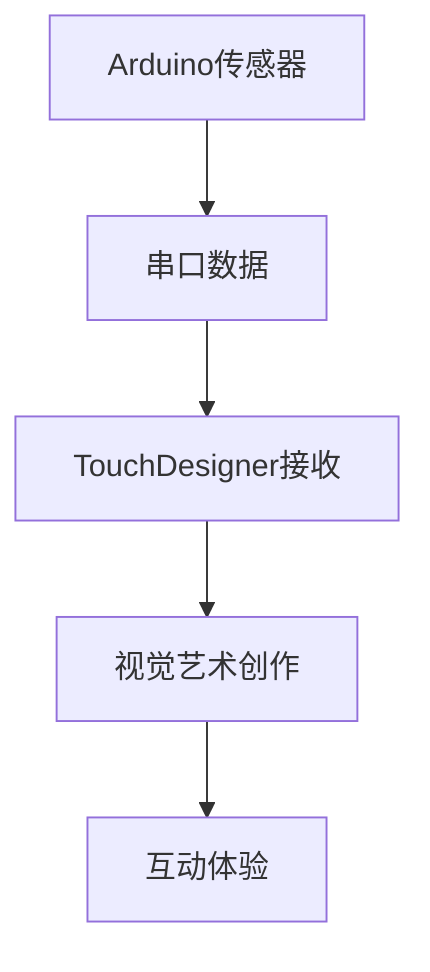

## Golconda 


是印度安得拉邦的一座荒废城市.

财富之矿, 财富宝库
14 s ~ 17 s，是两个王国的首都
是该地区负有盛名的钻石产业的中心。


命名 Magritte 本人直接想出，而是由他的一位诗人朋友 Louis Scutenaire 提供的。有趣的是，Magritte 还将斯库特内尔的肖像画在了画中，作为右侧靠近烟囱的那个较大的男人。


---
## Tripo3D

- ImageTO3D
- TextTo3D


---

### 方式 1: ImageTO3D


"""根据提供图像, 生成这个男人的多角度全身图像。"""


---

 分别将不同角度图片上传 Trip3D 
 


 
---

### 方式 2: TextTO3D

- 直接生成 Prompt(著名画作模型已经掌握画面细节)
- 上传图像, 让模型生成 prompt 

>[info] 生成一个 英文 prompt 作为 tripod3d 这样的文生模型生成 3D 模型, 让 tripod3d 将玛格丽特的The Son of Man, 中的男士形象生成全身 3D 模型 , 注意: 该男士双手插口袋和立正双脚紧贴立正姿态，确保生成建模面数和贴图都要简单, 模仿原作的油画风格而不是写实的作品风格.


---
### TextTo3D - 英文 Prompt

Generate a stylized 3D model of a male figure inspired by René Magritte's painting 'Golconda,'. The model should capture the essential characteristics of Magritte's painting in a simplified, non-photorealistic style. The figure should be dressed in a dark, knee-length overcoat (similar to a suit coat), a simple white collared shirt, and a subtly patterned red tie. He should be wearing a black bowler hat. The hands should be suggested subtly inside the pockets of the overcoat, indicating a relaxed yet composed posture. The figure's stance must be upright and formal, with his heels directly touching each other, with absolutely no visible gap between his feet at the heels. The shoes should be simple, flat, black dress shoes (such as Oxfords or similar), without any heel or platform. Model the shoes as a single. Key Stylization Elements: Geometric Simplification: Redu


---

### TextTo3D - 英文 Prompt(中文)

_生成一个受勒内·马格利特的画作《戈尔孔达》启发的风格化的男性人物 3D 模型。该模型应在简化的、非写实风格中捕捉马格利特画作的基本特征。人物应身着**深色及膝大衣**（类似西装外套）、简单的白色有领衬衫和带有微妙图案的红色领带。他应戴着一顶**黑色圆顶硬礼帽**。双手应巧妙地暗示在大衣口袋内，呈现出放松而又沉着的姿势。人物的站姿必须笔直而正式，脚跟直接相触，双脚脚跟之间绝对没有可见的间隙。鞋子应为简单的平底黑色正装鞋（如**牛津鞋或类似款式**），没有任何鞋跟或增高底。将鞋子与腿部建模为一个单独的合并单元，以简化打印过程。关键风格化元素：几何简化：减少。_


---

### Trip3D  生成角色模型


---

### Trip3D  生成角色模型


提示：生成一幅勒内·马格利特画作《戈尔孔达》中突出呈现的建筑的低多边形3D模型。重点捕捉其基本建筑形式：一座多层结构建筑，墙壁为米色/浅棕褐色，有独特的红色瓦片屋顶，带老虎窗和烟囱。纳入多个白色窗框的简化呈现。该模型必须具备。 

---

# 2.4 Particle Effect 粒子效果


## 本章目标

* 学习 **Particle SOP** 元件。
* 掌握粒子特效在三维场景中的 **渲染** 和 **使用**。

---


## 实战案例: 制作飘逸的粒子效果


*图 2-4-01: 最终效果预览*

---

## 什么是粒子效果?

1. 由 Emitter(粒子发射器) 发射一系列点状物。

2. 具有 *物理模拟* 特性 
* 虚拟空间中的 *力* (如引力、旋转力) 控制飞行方向。
* 常用于制作水、火、烟雾、发光轨迹等 *抽象视觉效果*。


---


## Step 1: 项目设置

1.  新建 TouchDesigner 工程文件, 删除默认元件。
2.  新建 **Container COMP** `container1`。
3.  进入 `container1` 内部进行制作。

    * **Container COMP**: 一个容器元件，用于组织项目、构建界面和交互逻辑 (详见后页)。


*图 2-4-02: 新建 Container COMP*

---

## Step 2: 创建粒子发射源

1.  在 `container1` 中新建 **Sphere SOP** `sphere1`。
    * **SOP**: Surface Operator, 用于创建和修改几何体。
2.  设置几何细节:
    * Detail 参数页 -> Rows: `$40$`
    * Detail 参数页 -> Columns:  `$40$`


*图 2-4-03: 新建 Sphere SOP*

---

## TIPS: 查看 SOP 参数

* 右击 SOP 元件 -> **Display Options**
* 在 Guides & Markers 窗口中勾选需要显示的参数 (如顶点 Points, 法线 Normals)。
* 勾选黄框选项可显示 *顶点序号* (Point Numbers)。


---

## Step 3: 添加噪波变形

1.  在 `sphere1` 后添加 **Noise SOP** `noise1`。
    * **Noise SOP**: 对几何体属性 (位置、颜色等) 添加噪波效果。
2.  效果: 几何形态开始随时间 *不规则形变*。


*图 2-4-04: 添加 Noise SOP*

---

## Step 4: 添加旋转动画

1.  在 `noise1` 后添加 **Transform SOP** `transform1`。
    * **Transform SOP**: 对几何体进行移动、旋转、缩放。
2.  设置旋转:
    * Transform 页 -> Rotate `rx`: `absTime.seconds`
    * Transform 页 -> Rotate `ry`: `absTime.seconds`
    * *效果*: 几何体 (粒子发射源) 将围绕 $x$ 轴、$y$ 轴持续旋转。


*图 2-4-05: 添加 Transform SOP*

---

## Noise SOP 参数


* **Attribute**: 作用的几何属性 (Position, Normal, Color, Alpha, Texture UV)。
* **Type**: 六种随机噪波类型。
* **Harmonics**: 谐波，数值越高，噪声越复杂。
* **Roughness**: 粗糙度，控制高频噪声影响。
* **Exponent**: 指数，控制噪波最大/小值间过渡平滑度。
* **Amplitude**: 振幅，定义噪波值幅度。

---

## Step 5: 随机化发射顺序 (Why?)

* **问题**: 粒子默认按 *顶点序号* 发射。球体顶点排列规则，导致发射形态 *规则*。
* **目标**: 让粒子发射更 *自然、随机*。
* **方法**: 打乱顶点顺序。


*默认顶点顺序*


*(左) Sort SOP 前 (右) Sort SOP 后 (Random)*

---

## Step 5: 随机化发射顺序 (How?)

1.  在 `transform1` 后添加 **Sort SOP** `sort1`。
    * **Sort SOP**: 用于重新排序点、顶点、图元。
2.  设置参数:
    * Point Sort -> **Random**
    * *效果*: 所有顶点顺序被 *随机重置*，粒子发射顺序被打乱。


图 2-4-06: 使用 Sort SOP 重置顶点序号*

---

## Step 6: 创建粒子系统

1.  在 `sort1` 后添加 **Particle SOP** `particle1`。
    * **Particle SOP**: 模拟动态粒子系统的核心元件。
2.  效果: `particle1` 以 `sort1` 输出的几何体顶点为发射源，开始发射粒子 (默认设置)。


*图 2-4-07: 添加 Particle SOP*

---

## Step 7: 调整粒子参数

定制理想的粒子动态效果。

---


### Forces 页 
* `Wind`: $(x, y, z)$ 方向的风力。
* `Turbulence`: 扰动强度。
* `Turb Period`: 扰动力的周期。

---


### Particles 页
* `Mass`: 粒子质量 (影响受力)。
* `Drag`: 阻力。
* `Birth`: 每秒产生数量。
* `Life Expect`: 生存周期 (秒)。
* `Life Variance`: 生存周期差异。


*图 2-4-08: 调整粒子参数 (仅显示变化参数)*

---

## Deep Dive: Particle SOP - Forces & State


* **External Force**: (Input) 可连接外部力场。
* **Wind**: 施加持续风力。
* **Turbulence**: 添加随机扰动力。
* **Turb Period**: 扰动力的变化周期。
* **(State Page - Not shown)**:
    * `Time Inc`: 时间增量 (通常保持默认)。

---

## Deep Dive: Particle SOP - Particles & Attributes

 

* **Add Particle ID**: 为每个粒子添加唯一 ID。
* **Add Mass Attribute**: 按 `Mass` 参数计算粒子质量 (需勾选)。
* **Drag**: 添加空气阻力效果。
* **Birth**: 每秒诞生粒子数。
* **Life Expect**: 平均生存时间 (秒)。
* **Life Variance(方差；偏差)**: 生存时间随机范围 (秒)。
* **Alpha Speed**: 速度越快，透明度越高 (需配合材质)。
* **(Input 2 - Collision)**: 可连接碰撞几何体。

---

## Step 8: 准备渲染 - Null SOP

1.  在 `particle1` 后添加 **Null SOP** `null1`。
    * **Null SOP**: 用作流程的 *终点* 或 *输出点*，方便引用和管理。
    * 此时 `null1` 传递`particle1`的几何信息。

---

## Step 9: 设置渲染器

1.  右键 `null1` 输出端 -> 选择 **Geometry COMP** `geo1`。
    * **Geometry COMP**: 容纳几何体 (SOP) 并准备渲染。
2.  添加渲染基础元件:
    * **Light COMP** `light1` (光源)
    * **Camera COMP** `cam1` (摄像机)
    * **Render TOP** `render1` (渲染器)
    * **TOP**: Texture Operator, 处理图像。
3.  连接: `geo1`, `light1`, `cam1` 连接到 `render1`。
    * *效果*: `render1` 开始渲染图像 (此时为默认白色粒子)。


*图 2-4-09: 基础渲染设置*

---

## Step 10: 添加材质

1.  新建 **Constant MAT** `constant1`。
    * **MAT**: Material, 定义物体表面外观。
    * **Constant MAT**: 基础材质，不受光照影响，颜色恒定。
2.  将 `constant1` 拖拽到 `geo1` 的 `Material` 参数上。
3.  设置 `constant1` 颜色为 *白色* (或稍后调整为灰色)。
    * *效果*: 粒子显示为指定颜色。


*图 2-4-10: 为 geo1 添加材质*

---

## Step 11: 构建 Feedback Loop (拖尾效果)

1.  新建以下 **TOP** 元件:
    * **Feedback TOP** `feedback1`
    * **Level TOP** `level1`
    * **Composite TOP** `comp1`
2.  连接:
    * `render1` -> `comp1` (Input 1)
    * `comp1` -> `level1` -> `feedback1` -> `comp1` (Input 2)
3.  设置:
    * `feedback1` -> Target TOP: `comp1`
    * `comp1` -> Operation: **Add**
    * *原理*: 将上一帧图像叠加到当前帧，产生拖尾。


*图 2-4-11: 构建 Feedback Loop*

---

## Step 12: 调整 Feedback 效果

1.  选中 `level1`。
2.  调整 **Post** 参数页:
    * `Opacity`: 减小至约 **0.965**。
    * *效果*: 每次叠加时，上一帧图像稍微变暗，使拖尾 *逐渐消失* 而不是无限叠加。


*图 2-4-12: 调节 Level Opacity*

---

## Step 13: 调整视角与构图

1.  调整 **Camera COMP** `cam1` 的 **Translate** 参数 (`tx`, `ty`, `tz`) 来改变视角。
2.  **技巧**:
    * 分割窗格 (Split Left/Right)。
    * 一个窗格设为 **Geometry Viewer** (Alt+3 或右键菜单)，可直观看到 `geo1`, `light1`, `cam1` 的相对位置。


*图 2-4-13: 使用 Geometry Viewer 辅助调整*

---

## Step 14: 画面微调

1.  **降低粒子亮度**:
    * 设置 `constant1` 材质的 `Color` 为 *深灰色*。
    * 
    * *图 2-4-14: 调节材质颜色*
2.  **增强背景纯净度**:
    * 在 `comp1` 后添加 **Level TOP** `level2`。
    * 调整 **Pre** 参数页 -> `In Low`: 设为约 **0.046**。
    * *效果*: 低于此亮度的像素变为纯黑。
    * 
    * *图 2-4-15: 添加 Level TOP 调整黑场*

---

## TIPS: 预览节点输出

* 右键点击任何元件 -> 选择 **View...**
* 或将鼠标悬停在元件上，按下 **`v`** 键。
* 或点击节点右下角的 **Display Flag** (蓝色)。
* 可以快速查看当前节点的输出图像/数据。


---

## Step 15: 最终输出节点

1.  在处理流程末端 (如 `level2` 之后) 添加 **Null TOP**。
2.  重命名为 `bg`。
    * *习惯*: 使用 Null 作为最终输出，并命名为 `bg` 或 `out1`，方便后续引用。


*图 2-4-16: 新建 Null TOP 并重命名为 bg*

---

## Step 16: 设置 Container 显示

1.  返回 `/project1` 层级 (或 `container1` 所在的层级)。
2.  选中 `container1`。
3.  设置 **Layout** 参数页:
    * `Width`: `op('./bg').width`
    * `Height`: `op('./bg').height`
    * *表达式*: 获取 `container1` 内部名为 `bg` 的 TOP 元件的宽度和高度。
    * `./bg`: 表示当前路径下的 `bg` 元件。
4.  设置 **Look** 参数页:
    * `Background TOP`: `./bg`
    * *效果*: `container1` 的背景将直接显示 `bg` 的图像。


*图 2-4-17 & 2-4-18: 设置 Container 尺寸和背景*

---

## Deep Dive: Container COMP


* **用途**: 组合元件、设计界面、编辑交互逻辑。
* **Layout 页**:
    * `X`, `Y`: 在父容器中的位置 (像素)。
    * `Width`, `Height`: 面板宽高 (像素)。
* **Look 页**:
    * `Background TOP`: 指定背景显示的 TOP。
* **Children 页**:
    * `Align`: 子元件排列规则。
    * `Depth Layer`: 图层深度 (类似 PS 图层)。

---

## Step 17: 设置全屏输出窗口

1.  新建 **Window COMP** `window1`。
2.  设置参数:
    * `Opening Size`: **Fill** (填充屏幕)
    * `Borders`: **Off** (关闭边框)
    * `Always on Top`: **On** (窗口置顶)
    * 点击 **Set as Perform Window**
    * *效果*: 设置 `window1` 为按 F1 时打开的表演窗口。


*图 2-4-19: 全屏播放设置*

---

## Final Result & Experiment!

* 按下 **F1** 键，打开 Perform Window 查看全屏效果。
* **恭喜!** 你完成了飘逸粒子效果的制作。
* **尝试**: 回去调整 `Noise SOP`, `Transform SOP`, `Particle SOP`, `Level TOP` 等元件的参数，探索不同的视觉效果！


*图 2-4-20: 最终效果*

---


---

The Brain
Connecting Everything
Prototyping Without Soldering
Sensing the Environment (Input)
Measuring Distance (Input)
Creating Sound (Output)
Housing Your Project (Optional)

****
## The Brains


---


| **特征**   | **Raspberry Pi**          | **Arduino**                    | **ESP8266/ESP32**               |
| -------- | ------------------------- | ------------------------------ | ------------------------------- |
| **设备类型** | 单板计算机（SBC），完**整微型电脑**     | **微控制器**（MCU）开发板，专注硬件控制        | 无线 SoC 模块 / 开发板，**聚焦低功耗连接**     |
| **核心定位** | 通用计算、复杂任务处理               | 实时硬件 IO 控制、电子电路交互              | 低成本无线连接（WiFi/Bluetooth）         |

---


| **特征**      | **Raspberry Pi**            | **Arduino**             | **ESP8266/ESP32**      |
| ----------- | --------------------------- | ----------------------- | ---------------------- |
| **内存 / 存储** | 2GB/4GB/8GB RAM，microSD 卡存储 | 几十 KB RAM，KB 级 Flash 存储 | 数 MB RAM，MB 级 Flash 存储 |
| **算力**      | 强（可运行桌面应用、服务器程序）            | 弱（仅处理简单逻辑和硬件控制）         | 中等（适合轻量物联网任务）          |
| **成本**      | 较高（RPi 4 起价 $35，需额外配件）      | 中等（典型$20-$50，基础款 $10+）  | 最低（模块$2-$10，开发板$5-$20） |


---

Arduino 小小脑子的身体
- 带有**微控制器**的开发板，
- 主要用于**接收输入(主)、** **处理(词)** 感官信息并控制输出。


- **特点 (Features):**
    
    - 基于微控制器 (Based on a microcontroller)
    - 提供数字 (Digital) 和模拟 (Analog) 引脚 (Pins)
    - 可通过 USB 连接电脑进行编程

---


### Arduino 主板

(Source: [tmall.com: UNO R4开发板官方版R4 WIFI/MINIMA主板单片机编程学习原装正品-tmall.com天猫](https://detail.tmall.com/item.htm?id=857394342221&last_time=1746582114&pisk=gyosRd6mZjnE7IqAhPvUF9LUyaEb5p-zktwxExINHlE9c2MoG5JDSluQGXhQ6P7wjnwxgXvDIlr9c-hqtPI4blJjObG3_ikMSrdbjDuN05RgcxhzcQRy43kiIlqvaQSL2ppu2RITHszvvwE4hcpVEnkiIoqALsLrJAXbizAcB-FvdkebUSEY65Upd-wfkoFTk6QLeWEYD5UAJWebnRCOX5pCp8ylXOFY6JULh-yTDrhxppw09REYDft5fJJ_tA9id7XhTaTIQWsADDwpsSH1sgeiYRGUNAhvYHk0CPN-BWAogN4YlfasYh1uC2HStRGDqGqTlV38XmOWfkHo8feIMQ_b94iiczo6NaVtjSc7X2OdfoETFxar8KQ7TqHnAyi6zt2nbxngzuKl6SuEFmwjmIxINAhsyznO1gWG47M0nZ6QriwQap9CoZXCNktYD8PmoPe3LIJBdak0WJ2QKp9CoRzTKJoBdp_u6&scm=1007.13982.82927.0&spm=tbpc.mytb_footmark.item.goods&skuId=5833597182803))


---
## Connecting Everything 杜邦线

(Source: [tmall.com: 杜邦线 公对公 母对母 公对母40p彩排线连接线10/15/20/30/40/cm-tmall.com天猫](https://detail.tmall.com/item.htm?id=607840828125&last_time=1746583874&pisk=gca-JzxU7sdRSN4-i7SDxPZRtK50piVrc8P6-vDkA-eYExYha4jEJJHYLYmoP7bQn8V1aYjF4JeYE51rE7M3pJeq3kDorv4qJWezpD5rKvMLKWZliNbga7uERJBGSNv_1j8beegIR6ijsffmNTI3jWuEROXMmeiPW2y5pLpyAnGj3XhBA2wIhxGKhXGSRJMjcfGMF2wQdxij6XlBP0TWhxMqsv9WRvNXGXhSNXG7dm1xOf0IdJi5MSG9niHeVAYLbBwFUB-OweY3kbn-pUD2Jq4DS0k1_x8pJ2NZ20VSHeTQuoxftkHOkKM0O5rIDyQyr2P0XJEQh6TIpoGTBf2llU3Qc-UtfSW9zYEbUy3obwdKMlFbez3dXQl0ySaZvzWJlYe4Gl0z5t8LCSVgzmzdBKMUqfujwoCBcYiC4A4gWvIeIAhHVsCvYHoSg3OfkYoc2U1qMAfmZH-EDilxIsB6YHoWIjHGihKeYmO5.&scm=1007.13982.82927.0&spm=tbpc.mytb_footmark.item.goods&skuId=5934822590035))


---

## 蜂鸣器

(Source: [tmall.com: 有源蜂鸣器模块无源发声传感器 高/低电平触发蜂鸣器控制板3.3-5V-tmall.com天猫](https://detail.tmall.com/item.htm?id=716724305881&last_time=1746581862&pisk=gZsnRi4thCGf0WN9WGtQoRDW3caOOHtWe_nJw3dz7CR1pUR8R_Ylw1TPvHBdsgXd59n8RHLkq1R1p0UBvGvP_1tJT8tdZLSOZLKdqTikUT57dQeQW96BV3PYMgqAd9w4Uu-fx0JNQO92Ubz98CYSSuPYMoEY8A-utSC8qDvubKv24p8yUOyMUL9y4U8rQRvyeXurY_ygILJ-zD8yThlw3LtrTeJr_FJXFQuE40-aILAZY3-PahyMFfdKQBCPOGP_gOnKpUm1fpYHg9RFetjZAFuCICjAcGJhutXeP0oPjpYCVR2ItbxP89CMkwVmxnBFl_9VTXPHIMXcqZ5aXDxlQZSkbGPZBB7fIgxdY8EebMfhYFfrEVYFl6Q2SGFnfI7NITLG58gpwZ9PNEs8GDOFUtsfknqoEdbcQhjymVuqkOiWQ8IZP4TeCdAA8uEWxSxnsSegIq7X8d9UDR2iPvLeCdD_IR0VbeJ6Kbf..&scm=1007.13982.82927.0&spm=tbpc.mytb_footmark.item.goods))


---

## 声音传感器

(Source: [tmall.com: 声音传感器模块 高感度麦克风放大器口哨开关检测控制传感器模块-tmall.com天猫](https://detail.tmall.com/item.htm?id=719282707014&last_time=1746581860&pisk=ge1iJtwKPHi7qdEpp6O_Ey0XzXwdWCOXkihvDIK4LH-CWK-YCivcDM9V6CQOxsbOdNhYCCpDiM-CWje666YVYMOvbrOOmE5dmEdOiZGDuZSb5nU_pN_6GIr82sVR5NazuSR5id7eYFQEgAR4pB-3ivEY27FR5R86MwrRMSmtiFL-gIJw3v7eAEGwuiJ2YB-BlEowufz3-HTXux-w3HRezUGwgfJaTp86kc-q_IRe8HTDgnS2gyAeAElsZ2-O0G1UAu7K6VIU66TMI37wbZQOTk9ICwKn40fhz1-PwHcqg6Y1JmmpafPkYOBV6B5aY0OFP9Iw-QVmoeXl8C8Gc7G6_a7F3df0H4tfKwWJK9gT5efGrsYkLDzMc1IGid1z2XtNK61D69Eiwn9Vp1956klMaT_96tSUuj-cLESzIvkrewGX8rCEhx9wRexRQSFXsuAixuU3-YWWQeTawy4nhVpwRe0Q-yDPTd8BSmf..&scm=1007.13982.82927.0&spm=tbpc.mytb_footmark.item.goods))


---

## 超声波模块


(Source: [tmall.com: 超声波模块HC-SR04 US-100 US-015 距离测距模块超声波传感器电子-tmall.com天猫](https://detail.tmall.com/item.htm?id=672226700979&last_time=1746581724&pisk=gk_mRiq-OLMCGkyJ2aTbx7c6T4ZJkET66O39BFpa4LJ5MhJTcOxGBTtNkECAENfAVs3TcEKMSTJ5MVEXkaANUTT935TAIC7RICLAS1gM_1W_GdFb2s1X5FyLpN4dGsNU_P8CoKozz_On7CrJ0LxsqPyLpyUL0b8gnJBTSqDgzBAe7I-w__Pk_COw7hJqU7Aw6xoZuOPuZCRtbq-w3UkyTCTZbq-w43RHOdJZ0qzzZCpruF8NQUPk1ftiaKBNhay7L_3xMpmGPIxDLsJV6s_r23ifNLqgbafFrp7pEVuNrI1-IYLEuyvPDG7vzZyrdU5C2tRk-PcMZMfyuIX_RqTVT_SwmNqtOdslaMKlVjFXZZfhSBxrUSv1ktbMcwyKPKSlPNYA2-0pChSRlH_YUqYFAsLAbTPZ7djy_gui4DodNVOz6aosfnRWZpI4WPT0KEDup7VoYMt2NIzLZ7msMnRWZbNuZD7y0QOmI&scm=1007.13982.82927.0&spm=tbpc.mytb_footmark.item.goods))


## 无需焊接: 面包板 + 条线(Option)


(Source: [tmall.com: 400孔带背胶可拼接面包板洞洞实验板 14种140根面包板连接线 电源-tmall.com天猫](https://detail.tmall.com/item.htm?id=677697976164&last_time=1746582000&pisk=gdTqJct4oNv7cdXAmU_aY0qOxJ_AzNkCsF61sCAGGtXDcCfG7LvsMtOiHd8NELPjHn617dJwQt6DcO_wQTOhht91olJwEBjxMG9bM3pBtrTjDNaNkNQidvgIRSdAWN2lKRvLMafO1101joblk16t1D3sRIdAWSyiO30Q_QSHQSqGIdblq65GSrXcjbSl_1_goG40q8XREN4cj1Xlq1fan-XDIu2lt6N0no40qafFtNfDINcyZTCNSOc_weYTU1sm1yRp1vyUiiBHiTzg87ClmrAufy4HHsj2366zN7TPgiWC2-xBweRHieCwWXqNQCtDh_pZ8Y7kuK8c4NuayZOeqKSy0AzP23ApSg--LkdpiK-hxE0rZdJk9HQDoAUfHhAkSTTm1PWHABQPwFM8oO-kjEsAW-DVaERe7hSP9RCu6pT90RqNm_CPdblPO_Wm0VjMU8rTXihAa9GcmlEOm91PdbJ3XlIvx_WIgQ1..&scm=1007.13982.82927.0&spm=tbpc.mytb_footmark.item.goods&skuId=4869826761300))


---

## 乐高外壳


(Source: [youtube.com:  【AI搜索之王】夸克全新“深度搜索”，暴虐深度思考模型。 - YouTube](https://youtu.be/zNczKxMki0E?t=398))


---


Arduino 基础 参考 [[Source - 交互艺术与技术]]


---

# 2.1.1 开发板
## Arduino Uno
在 Arduino 开发板家族中，**Arduino Uno** 是最适合初学者的。它简单易学、稳定可靠。

Uno 开发板拥有 14 个数字输入／输出引脚
- 其中**6个引脚可以作为PWM输出引脚**。
- 具备 6 个模拟输入引脚。
- 支持在线串行编程以及复位按键。


---

### 1. 数字口0~13（DIGITAL 0~13）


- **一般 Pin**：只能表示两种状态，**要么是 0**（低电平，关），**要么是 1**（高电平，开） 。
- **PWM(脉冲宽度调制 3,5,6,9,10,11带 `~` 号的脚)**： 精准调控输出信号，（如 LED 亮度、马达电机转速）。  
- **ANALOG IN（ 模拟口A0~A5）** 精准调控输入信号，输入“量多少”。


---

- **PWM**: analogWrite() 函数, 0~255 之间: PWM
- **ANALOG IN**: analogRead() 函数 0~1023之间


---

PWM 的全程是 Pulse Width Modulation（脉冲宽度调制）

**Pulse (脉冲)** 周期性 “心跳”, 提供有节奏的电力；
**Width (脉冲宽度)** 打门缝宽多少, 则通过能量或信息多少；
**Modulation (调制)** 像指挥，按需求改变脉冲宽度。


---

Duty cycle (Symmetry , 占空比, 工作週期) 
表示周期性事件中有效部分所占的时间比例

---
继电器
实际上是用小电流去控制大电流运作的一种 “自动开关”


---

### 3. 电源输出（POWER区：3.3V、5V、GND等）
**作用：**  
- **3.3V/5V**：可以给传感器或模块供电。
- **GND**：接地，所有设备都要和GND连起来才能正确工作。
- **VIN**：外接供电时的电源输入口。

**便捷记忆：**  
相当于手机的“充电口”。


---

### 4. 串口通信引脚（TX, RX）
**作用：**  
用于和电脑、其他控制板数据通信（如上传程序或与模块互动）。

**便捷记忆：**  
是主板“说话”和“听话”的嘴和耳朵。


---

### 5. 其它功能脚
- **RESET（复位键/引脚）**：重启板子，相当于“重启手机”；
- **AREF**：参考电压，进阶使用（多数初学项目用不到）；
- **ICSP**：用于烧录芯片（初学时很少用）；
- **IOREF**：提供主控电压信息（一般不用）。


---


### 杜邦线 

- 双母口: 两头都是插孔。
- 公母口: 一头插孔，一头插针。
- 双公口: 两头插针。


---


组合线: 是集正负极与信号线于一体的连接线。

---


### 面包板 

平台上面两行横向相连，中间部分竖向相连（图2-10、图2-11）。


图2-10面包板正面


图2-11面包板反面


---


## Arduino 驱动与开发环境


## 2.1.4 驱动与开发环境：驱动安装 

**（1）Arduino 驱动安装：CH340 驱动**

*   **核心芯片**: Arduino 开发板常使用 **CH340** 作为 USB 转串口芯片。
*   **驱动必要性**: 计算机需要此驱动才能识别和与 Arduino 通信。
*   **获取方式**:
    *   自行网络搜索 "CH340驱动"。
    *   从本书配套文件获取（推荐，版本齐全）。
*   **安装**: 根据您的操作系统选择对应版本的驱动进行安装。


---

## 驱动与开发环境：IDE 安装 (1/2)

**（2）开发环境 IDE (Integrated Development Environment) 安装**

*   **Arduino IDE**: 官方推荐的集成开发环境，用于编写、编译和上传代码到 Arduino 开发板。
*   **开源免费**: 所有软件和案例文件均可从官方免费下载。
*   **跨平台**: 支持 Windows, macOS, Linux 等主流操作系统。

---


**步骤 1: 访问官网**
*   打开浏览器，进入 Arduino 官方网站 (arduino.cc)。
*   在导航栏找到并点击 **SOFTWARE**。


---


**步骤 2: 选择适配版本**

*   在 SOFTWARE 页面，向下滚动找到下载区域。
*   根据您的计算机操作系统 (如 Windows, macOS, Linux) 选择合适的安装包版本。


---

## 驱动与开发环境：IDE 安装 (3/3)

**步骤 3: 下载与安装**

*   点击选定版本后，通常会跳转到捐赠页面。
*   选择 **JUST DOWNLOAD** (仅下载) 按钮。
*   下载完成后，选择合适的安装路径，按提示完成软件安装。


*图2-15 点击 "JUST DOWNLOAD" 进行下载*

---

## 2.1.5 开发环境介绍：整体界面

**Arduino IDE 概览**

*   **菜单栏**: 包含文件、编辑、项目、工具等常用功能。
*   **编程区**: 核心区域，用于编写 Arduino 代码 (Sketch)。
*   **信息栏**: 显示简要提示信息，如当前开发板、端口等。
*   **信息面板 (控制台)**: 显示编译过程、错误提示、上传状态等详细信息。


---


### **(2) 快捷菜单 (图2-17)**


*   **验证 (Verify)/编译 (Compile)**:
    *   点击此按钮，IDE 会**编译**你写的代码。
    *   编译过程会检查代码是否有语法错误。

*   **上传 (Upload)**: 编译代码并通过USB将程序**烧录**（写入）到连接的 Arduino 开发板中。
*   **新建 (New)**: 创建一个新的代码文件（sketch）。
*   **打开 (Open)**: 打开一个已存在的项目文件。
*   **保存 (Save)**: 保存当前正在编辑的项目文件。

---

### **(3) 串口监视器 (图2-18)**


串口监视器是一个非常实用的调试工具。

*   查看 Arduino 板通过串口发送到计算机的数据。
*   从计算机向 Arduino 板发送数据。
*   监控程序的执行情况（例如，打印变量值）。


---

## **2.1.6 基本语法结构**

<!-- _class: lead -->
Arduino 语言基于 C/C++，理解其基本语法是编程的关键。

### **C++ 常用符号 (表 2-4)**

| 符号              | 意义                                           |
| :-------------- | :------------------------------------------- |
| `//` (双斜杠)      | **单行注释**：程序不执行 `//` 之后在同一行的内容。               |
| `/**/` (单斜杠和星号) | **多行注释**：程序不执行 `/*` 和 `*/` 之间的所有内容。          |
| `{}` (大括号)      | **代码块**：用来组织和界定函数、控制结构（如 `if`, `for`）等的作用范围。 |

*注释是给程序员看的，帮助理解代码，不会被编译到最终程序中。*

---

### 程序结构核心组成

- **变量定义**  
  `int 变量名;`  //声明一个整型变量

- **setup() 函数**  
  - 初始化步骤，在通电或复位后仅执行一次
  - 常用于变量、引脚、库函数的初始化

- **loop() 函数**  
  - 程序主体部分
  - 自动循环执行，主逻辑都在此


---
## Adruino 脚本存放位置


---


```cpp

// 初始化函数，只在程序开始时运行一次
void setup() {
  pinMode(13, OUTPUT);  // 将 13 号数字引脚设为输出模式
}

// 主循环函数，会不断循环执行
void loop() {
  digitalWrite(13, HIGH);  // 打开 LED 点亮（HIGH 是高电平）
  delay(1000);  // 延迟（等待）1 秒
  
  /** 
  写入 LOW 低电平关闭 LED，
  注意这里原内容中 Low 拼写错误，应该是 LOW
  */
  digitalWrite(13, LOW);  
  delay(1000);  // 延迟（等待）1 秒
}
```


---
 TRAE
 
(Source: [trae.ai: 安装 Trae 并完成初始设置 - 文档 - Trae](https://docs.trae.ai/ide/set-up-trae?_lang=zh))


---

## 实验: AI  辅助编程


---


# FFTs 应用

## 一个有趣的例子


<!-- _footer: ' Source: [arduino.cc: Arduino microphone sensor using Nano Every - Other Hardware / Audio - Arduino Forum](https://forum.arduino.cc/t/arduino-microphone-sensor-using-nano-every/1123793/4)' -->


---

## 判断蜂群的健康状况

通过这种对不同频率声音密度的监测对声音频率进行分析，
重点关注一个大约500 Hz总范围的低频段，这个频段被分成十个区间，每个区间约48 Hz。


---
Sound Density:

- **≈350 Hz:** Multiple Queens, 蜂群中可能会争斗以确定蜂群的蜂王（这种现象被称为“Quacking”）。
- **≈450 Hz**: New Queen Emerging, 
蜂群中有新蜂王诞生的信号（这种情况下，其他潜在的蜂王可能不会被工蜂释放）。
- **≈510 Hz**: Unhealthy Colony, 可能表示蜂群处于不健康的状态。


---

# **Part 2: Arduino 与声音传感器设置**

本模块重点介绍
- 声音传感器与 Arduino 板的物理连接，
- 以及 Arduino 程序（Sketch）的开发，该程序将读取声音级别并准备进行数据传输。

---

## 2.1. 了解您的声音传感器 (例如 KY-037)

*   **简介**:
    *   多种 Arduino 声音传感器模块可选，**KY-037** 是常见示例。
    *   通常包含：驻极体电容麦克风（捕捉声音）和辅助电路（如 LM393 比较器放大信号）。


---


*   **工作原理**:
    *   麦克风diaphragm(振膜)随声波振动。
    *   振动改变麦克风内部电学特性（电容）。
    *   产生与声音强度成正比的可变模拟电压信号。


---


- diaphragm：[ˈdaɪəfræm] ， 隔膜、振膜 ，是话筒等音频设备中用于感应声波振动的振膜。
- permanent magnet：[ˈpɜːmənənt ˈmæɡnət] ，名词短语，意思是永磁体 ，能提供稳定磁场。
- sound waves：[ˈsaʊnd weɪvz] ，名词短语，即声波 ，是声音传播的形式。
- electric signal：[ɪˈlektrɪk ˈsɪɡnəl] ，名词短语，指电信号 ，是将声音等信息转换后的电形式信号。
- coil：[kɔɪl] 线圈 ，在图中通过在磁场中随振膜振动切割磁感线来产生电信号。


---

## 2.1. 声音传感器引脚(1/2)

*   **G (或 GND - Ground - 接地)**: 建立电路的公共电气参考点 (0 伏特)。
*   **+ (或 VCC - Positive Power - 正电源)**: 为传感器模块供电, 通常 5V 输出引脚。


---

## 2.1. 声音传感器引脚(2/2)


 **AO (Analog Output - 模拟输出)**:
*  声音强度的*连续模拟电压*。
*   声音越大，电压越高。

**DO (Digital Output - 数字输出)**:
*   提供二进制信号 (HIGH/LOW)。
*   声音强度超过阈值时输出 HIGH，否则为 `LOW`。
*   阈值通常可通过模块上的电位器调节。
*   _对于精细的频谱图，模拟输出 A0 更为重要。_


---

## 2.2. 将声音传感器连接到 Arduino


**连接说明 (Arduino Uno/Nano):**

1.  **电源连接 (VCC/+ 至 5V)**
2.  **接地连接 (GND/G 至 GND)**
3.  **模拟信号连接 (A0 至 A0)**


---

## 项目文件结构说明

```bash
InteractiveSound/                  # 这是我们项目的主文件夹
├── 01_SoundHistogram.toe          # 第一个主要的TouchDesigner项目文件，可能是做声音频谱相关的
├── 02_makeSomeNoise.toe           # 第二个主要的TouchDesigner项目文件，可能是用来制造声音效果的
├── Arduino/                       # 存放所有和Arduino硬件交互相关的代码和文件
│   ├── sketches/                # Arduino的程序代码（.ino文件）都放在这里
│   │   ├── SoundSensor_to_Serial.ino/ # 一个例子：读取声音传感器并通过串口发数据的程序
│   │   └── ...                    # 其他Arduino程序
│   ├── libraries/                 # 如果你的Arduino程序用到了额外的库，放这里
│   └── config/                    # Arduino相关的配置文件
├── Audio/                         # 存放项目用到的音频文件，比如背景音乐、音效
│   └── Dvořák - Rondo, Op. 94.wav # 这是一个音频文件示例
├── Components/                    # 存放TouchDesigner的可复用组件（.tox文件）
│   └── Histgram.tox               # 一个叫Histgram的组件示例
├── Scripts/                       # 存放Python脚本，这些脚本可能会被TouchDesigner调用
│   └── chopexecute.py             # 一个Python脚本示例，可能用在CHOP Execute DAT里


```


---


## 2.3. 编写 Arduino Sketch (程序)


**逻辑123**:
1.  定义传感器连接的 Arduino 引脚。
2.  在 `setup()` 函数中设置串行通信 (Arduino 启动时运行一次)。
3.  在 `loop()` 函数中持续读取模拟传感器值并将其打印到串行端口 (重复运行)。

---

## 2.3. 编写 Arduino Sketch (代码概览 - Part 1)


```cpp
// 定义连接到声音传感器 A0 输出的模拟引脚
const int soundSensorPin = A0;

// 存储声音级别读数的变量
int soundLevel = 0;

void setup() {
  // 初始化串行通信，波特率为 9600
  // 此速率必须与 TouchDesigner 中 Serial DAT 设置的速率匹配
  Serial.begin(9600);

  // 可选: 明确将声音传感器引脚设置为 INPUT
  // 对于 AVR Arduino 上的 analogRead()，这通常不是必需的，
  // 因为 analogRead() 会配置引脚，但为了清晰起见，这是个好习惯。
  pinMode(soundSensorPin, INPUT);

  // 可选: 启动时向串行监视器打印一次消息
  // Serial.println("Analog Sound Sensor Initialized. Sending data...");
}
```

---

## 2.3. 编写 Arduino Sketch (代码概览 - Part 2)

```cpp
void loop() {
  // 从声音传感器读取模拟值 (0 到 1023)
  soundLevel = analogRead(soundSensorPin);

  // 通过串行端口发送声音级别值
  Serial.print(soundLevel);
  // 发送一个换行符来表示此数据点的结束。
  // 当 TouchDesigner 的 Serial DAT 中选择 "One Row Per Line" 时，
  // 这对于正确解析至关重要，避免 Serial.println() 发送的
  // 回车+换行符可能导致的问题。
  Serial.print('\n');

  // 添加一个小延迟来控制数据发送速率。
  // 20 毫秒的延迟大约产生每秒 50 次读数 (50Hz)。
  // 音频采样，44.1kHz 采样率表示每秒采集 44100 个样本点
  // 调整此值以平衡响应能力和处理负载。
  delay(20); // 延迟时间 (毫秒)
}
```

---

## 2.3. 编写 Arduino Sketch (关键代码解析)

*   `const int soundSensorPin = A0;`
    *   声明常量 `soundSensorPin` 并赋值为 `A0` (Arduino 的第一个模拟输入引脚)。

*   `Serial.begin(9600);`
    *   在 `setup()` 中初始化串行通信，设置数据传输速率 (波特率) 为 9600 bps。
    *   **此波特率必须与 TouchDesigner 中的设置完全一致。**


---


*   `soundLevel = analogRead(soundSensorPin);`
    *   在 `loop()` 中读取 `soundSensorPin` 上的电压。
    *   Arduino 的 ADC 将模拟电压转换为 0 (0V) 到 1023 (参考电压, 通常5V) 的10位数字。


*   `Serial.print(soundLevel)`: 发送数值的字符串形式。

*   `Serial.print('\n')`: 发送单个换行符 (`\n`) 作为数据分隔符。
	*   *此方法优于 `Serial.println()` (通常发送 `\r\n`)，以确保 TouchDesigner 正确解析。*

---


*   `delay(20);`
    *   暂停 `loop()` 函数 20 毫秒。
    *   控制数据发送速率 (约 50Hz,1000ms/20ms)。

---


权衡：
* 短延迟 = 高响应、高负载；
* 长延迟 = 低负载、低响应。防止 Arduino 过快发送数据，压垮 TouchDesigner。

---

## 2.4. 测试 Arduino 设置: 使用串行监视器


---

## 2.4. 测试 Arduino 设置 (步骤 1/2)

1.  **连接 Arduino**:
    *   通过 USB 数据线将 Arduino 板连接到计算机。
2.  **选择板型和端口**:
    *   Arduino IDE: `工具 (Tools)` > `开发板 (Board)` > 选择您的 Arduino 型号 (如 "")。
    *   Arduino IDE: `工具 (Tools)` > `端口 (Port)` > 选择 Arduino 连接的串行端口 (通常旁边有 Arduino 板名称)。


---

## 2.4. 测试 Arduino 设置 (步骤 2/2)

4.  **打开串行监视器**:
    *   上传完成后，点击 Arduino IDE 中的“串行监视器”按钮 (通常在右上角，一个放大镜图标)。
5.  **设置波特率**:
    *   在串行监视器窗口中，找到波特率下拉菜单 (通常在右下角)。
    *   确保设置为 **9600 baud**，与 Sketch 中的 `Serial.begin(9600);` 匹配。
6.  **观察输出**:
    *   如果一切正常，串行监视器中应出现一连串数字 (即 `soundLevel` 值)。
    *   在传感器附近制造声音 (如拍手、大声说话)，数字应**增大**。
    *   安静时，数字应**减小**或稳定在较低值 (代表环境噪音)。


---


<!-- _class: lead -->
# **Part 3: 连接 Arduino 与 TouchDesigner**

**将 Arduino 的声音传感器数据引入 TouchDesigner**


*   配置 TouchDesigner 以接收和解析这些数据。
*   掌握 TouchDesigner 内的串口通信设置。

---

## 3.1 TouchDesigner 中的串口通信入门


### 步骤 1 : 打开项目并添加 Serial DAT

*   Operator: **Serial DAT (Data Table Operator)** :
    *   它会监听指定串口。
    *   捕获 Arduino 发送的字节流。
    *   将数据组织成表格，供后续使用。


---

## 3.2 设置 Serial DAT

### 步骤 2: 配置 Serial DAT 参数 - (1/4)


**Port (端口)**:
指定 TouchDesigner 监听哪个串口 (COM 端口)。

*   **查找端口**: 与 Arduino IDE 中选择的端口一致 (工具 > 端口)。
	*   Windows: 如 `COM3`, `COM4`。
	*   macOS: 如 `/dev/cu.usbmodemXXXX` 或 `/dev/tty.usbmodemXXXX`。


---


**重要提示：端口独占性**
*   一个串口通常**一次只能被一个应用程序**激活使用。
*   若 Arduino IDE 的串口监视器已连接，TouchDesigner 可能无法打开同一端口。
*   **在 TouchDesigner 中激活 Serial DAT 前，请关闭 Arduino 串口监视器。**


---

### 步骤 3: 配置 Serial DAT 参数 - (2/4)

*   **Baud Rate (波特率)**:
    *   **作用**: 数据传输速率。
    *   **设置**: **必须**与 Arduino 代码中 `Serial.begin()` 命令指定的波特率完全匹配。
    *   在我们的代码 (2.3节) 中，设置为 **`9600`**。
    *   波特率不匹配会导致数据乱码或无法接收。


---


*   **Table Format (表格格式)** (位于参数的 "Serial" 页面):
    *   **设置**: **`One Row Per Line`** (每行一个数据包)。
    *   **作用**: 告知 Serial DAT 将每个传入的换行符 `\n` 视作数据包的结束，并为此数据包创建新行。
    *   这与我们 Arduino 代码发送 `Serial.print(value); Serial.print('\n');` 的方式完美匹配。


---

### 步骤 3: 配置 Serial DAT 参数 - (3/4)

*   **Communication Parameters (通信参数)**:
    *   **Parity (奇偶校验)**: `None` (默认)。标准 Arduino 通信通常不使用。
    *   **Data Bits (数据位)**: `8` (默认)。标准 Arduino 设置。

---

<!-- _color: red -->


*   **Stop Bits (停止位)**: `1` (默认)。标准 Arduino 设置。( 9600,8,N,2 作为常见默认配置，但 1 更普遍且与我们的代码匹配)。
*   **注意**: 若在 Arduino 端更改了这些设置（我们的代码中未更改），此处需保持一致。

---

### 步骤 3: 配置 Serial DAT 参数 - (4/4)

*   **Active (激活)** 
    *   切换 Serial DAT 与端口的连接**接收数据**。
    *   **上传 Arduino 代码**: 需要切换到 **OFF** 状态，以释放串口供 Arduino IDE 使用。上传完成后再切换回 ON。


---

### 关键 Serial DAT 参数总结

- **Port**：Arduino COM 端口（例如 COM3）
    - 推荐值 / 设置：必须与 Arduino 端口匹配。
    - 关闭 Arduino 串口监视器以避免冲突。
- **Baud Rate**：`9600`(推荐值 )数据传输速度。
    - 必须与 Arduino 代码中的 Serial.begin () 完全匹配。
- **Table Format**： `One Row Per Line`
    - Arduino 发送的` \n `(换行符) 。
- **Active**：On (接收数据), Off (上传代码到 Arduino)


---

### Row or multiple Rows
单行,或多行数据


---

## 3.3 在 TouchDesigner 中接收和验证数据

当 Serial DAT 配置正确且 “Active” 开关设为 ON（Arduino 已连接、供电并运行代码），数据应开始出现在 Serial DAT 查看器中，该查看器显示因 Arduino 代码发送单个加换行符的 soundLevel 数值而呈现单列每行一个值且随新数据实时更新的表格 。

---

### 数据验证步骤

1. 查看Serial DAT，确认数字更新
2. 对比串口数值，0 - 1023随声波动
3. 制造声音，Serial DAT数值升大降小 


---


---

<!-- _class: lead -->
# **Part 4**
## 在 TouchDesigner 中处理传感器数据

---

## 概览：为何处理数据？

*   **目标**：将从 `Serial DAT` 接收到的原始文本数据转换为适合生成**频谱图**的格式。
*   **核心任务**：
    1.  将表格数据 (DAT) 转换为 **CHOP 通道**。
    2.  (可选) **优化和平滑**信号。

---

## 4.1 从文本到通道：使用 `DAT to CHOP`

*   **目标**：将 `Serial DAT` 中表示声音强度的文本数据，转换为 CHOP 中的数值通道，以便进行后续的实时处理和可视化。
*   **工具**：`DAT to CHOP` OP。


---

### 配置 DAT to CHOP 参数

### 多行数据为例

`DAT` (DAT Page) :
  
- 确保此参数指向你的 Serial DAT ，例如 `serial1` 。

`Select Cols `(DAT Page) :

- Select Cols : 选择 by Index 。
- Start Col Index :  0 。

`Output` (DAT Page) :

- Output : 选择 Channel per Row 。
- First Row is : 选择 Names (第一行是列名，如 "message")。
- First Column is : 选择 Values  


---

### **单行数据**为例

- `Select Row `  : 选择 `by Index` 。
StartRowIndex: 0; EndRowIndex: 1;
- `Select Cols` : 选择 `by Index` 。
StartColumIndex: 0; EndColumIndex: 0;


- `Output `: 选择 `Channel per Row `。
- `First Row is` : 选择 `Names` (第一行是列名，如 "message")。
- `First Column is` : 选择 `Values`  


---

模拟mp3 信号


---


---


---

#### 难点数据过滤器(Filters)

 `Low Pass` or `High Pass`


---


每个滤波器类型的功能特点：
1. **低通滤波器**：低通滤波器就像是一个只让慢走的小朋友（低频信号）通过，把快跑的小朋友（高频信号）拦住的门卫，能让信号变得更平滑，去掉快速的小波动。
2. **高通滤波器**：高通滤波器好比是一个专门拦住慢走的小朋友（低频信号），只放快跑的小朋友（高频信号）通过的门卫，能去除信号里缓慢变化的部分，突出快速变化的信号。

---


1. **带通滤波器**：带通滤波器如同一个只挑选出在特定速度区间内跑步的小朋友（特定频率范围的信号）通过，把其他速度的小朋友（其他频率信号）拦住的门卫，用来提取特定频段的信号。
2. **带阻滤波器**：带阻滤波器就像一个专门拦住特定速度区间内跑步的小朋友（特定频率范围的信号），让其他速度的小朋友（其他频率信号）通过的门卫，主要用于消除特定的干扰频率。 


---


### 数字响应信号(0,1)


---

# 以下忽略

---


## 4.2 使用`Shuffle > swap..` 将多个通道转换为单个通道
*   **问题**：`DAT to CHOP` OP会为每个输入列创建一个新通道。
*   **目标**：将所有通道合并为单个通道，以便后续的频谱分析。
*   **工具**：`Shuffle > swap channels and samples` 。


---

## 4.3 (可选但推荐) 平滑数据：使用 `Filter CHOP`

*   **问题**：原始模拟传感器读数常带有：
    *   **抖动 (Jitter)**: 快速、微小的波动。
    *   易受环境**噪声**影响。
*   **目标**：应用平滑滤波，获得更稳定、视觉效果更佳的输出。
*   **工具**：`Filter CHOP` 是理想选择。

---

### 步骤 1：添加并连接 `Filter CHOP`

插入滤波器 `Filter CHOP`  


---

### 步骤 2：配置 `Audio Filter CHOP`

*   **`Type` 参数**:
    *   对于常规平滑和降噪，"**Low Pass**" (低通) 是常用且有效的选择。
    *   *工作原理*：允许信号中较低“频率”的变化通过，同时衰减较高“频率”的快速抖动。

*   **`Filter Width` 或 `Cutoff Frequency` 参数**:
    *   这些参数控制**平滑程度**。

---

### 步骤 2：配置 `Filter CHOP 

*   平滑度：
    *   **较大的 `Filter Width`** (若使用基于时间的滤波器，如 Box, Gaussian)
    *   或 **较低的 `Cutoff Frequency`** (若使用基于频率的滤波器，如 Butterworth Low Pass)
    *   会导致输出信号**更平滑**。

*   **注意**：过度平滑会引入明显的**延迟 (Lag / Latency)**，使信号对输入声音电平的快速变化响应迟钝。

---

### 步骤 3：实验与权衡

*   **观察与调整**：
    *   鼓励学习者在调整参数时观察 `Filter CHOP` 的输出。
    *   目标：在**减少噪声**的同时，信号仍能对重要的声音事件做出**充分响应**。

*   **固有权衡**:
    *   提高平滑度通常以牺牲一定的**响应速度**为代价。
    *   滤波器的选择取决于：
        *   传感器的特性
        *   环境噪声的性质
        *   最终可视化效果和交互感的期望

---


如何实现 touchdesigner 通过鼠标左右移动触发 maximo 模型融合多个个混合动画片段, 

已经从maximo下载了三段动画片段, 分别为"Kip Up","Sleeping Idle", "Snake Hip Hop Dance" . 

因为Touchdesigner 中的 Blend CHOP 需要 License, 因此可能考虑在 Maya 中实现三个动画片段的预处理再导入TouchDesigner
动画之间的融合使用 tax editor, animation Clip 作为Maya 融合动画的工具
当鼠标移到左边时 Sitting_Idle , 移到左边时 Snake_Hip_Hop_Dance , 鼠标在左方右方分别被映射为 0 和 1 之间, 当 < 0.3时候, 角色 "Sleeping Idle", 当 > 0.5 时角色 "Kip Up" 并 "Snake Hip Hop Dance", 注意并保证两个动作自然过度. 


TouchDes...
链接：https://pan.baidu.com/s/1qfpZ3_3r_RaAAzdAEnjkAg 
提取码：116D 


me.inputme.inputVal


idle_w
(1.0 if me.inputVal < 0.3 else ((0.5 - me.inputVal) / 0.2 if me.inputVal <= 0.5 else 0.0))

dance_w
(0.0 if me.inputVal < 0.3 else ((me.inputVal - 0.3) / 0.2 if me.inputVal <= 0.5 else 1.0))

---


# HC-SR04 Ultrasonic(Pulse)


## Reference

(Source: [tutorialspoint.com: Arduino Ultrasonic Sensor](https://www.tutorialspoint.com/arduino/arduino_ultrasonic_sensor.htm))


---

<!-- _class: lead -->
## 介绍


---


### 目标：

使用 ==Arduino 和 HC-SR04== 超声波传感器测量距离。
通过串口将距离数据发送到 TouchDesigner。
在 TouchDesigner 中接收并使用这些数据来控制视觉元素


---


### 所需材料：

1. Arduino 开发板 (例如 Arduino Uno, Nano)
2. HC-SR04 超声波传感器
3. 面包板 (可选，但推荐)
4. 杜邦线若干
5. USB 数据线 (连接 Arduino 到电脑)


---


## HC-SR04 超声波避障传感器

蝙蝠在黑夜中飞行
* 发出超声波 → **探索未知**
* 接收回声 → **感知距离**
* 处理信息 → **做出反应**


---


### 工作原理
- 发射：给 `TrigPin`  发送一个HIGH，传感器就会发射超声波。
- 接收：超声波遇到物体反射回来，`EchoPin`  接收到回波信号 。


---

### 性能参数
| 参数       | 数值                |
| -------- | ----------------- |
| **测量范围** | 4-5 米 (400-500cm) |
| **测量频率** | 20次/秒             |
| **响应时间** | 50毫秒              |
| **工作电压** | 5V                |


---

### 连接思路

```
HC-SR04    →    Arduino
VCC        →    5V(电源) 
GND        →    GND(接地)
Trigger    →    Pin 2 (触发信号输入)
Echo       →    Pin 3 (回声信号输出)
```


---


### 距离计算

距离 = 声速 × 时间 ÷2 （超声波来回 ）
即 `dist = 340*t/2 `


---

```cpp
// Arduino超声波传感器代码
// 用于与TouchDesigner通信

const int trigPin = 2;    // 触发引脚
const int echoPin = 3;    // 回声引脚

long duration;
int distance;
int smoothDistance;
int lastDistance = 0;

void setup() {
  // 初始化串口通信
  Serial.begin(9600);
  
  // 设置引脚模式
  pinMode(trigPin, OUTPUT);
  pinMode(echoPin, INPUT);
  
  Serial.println("Arduino Ultrasonic Sensor Ready");
}

void loop() {
  // 清除触发引脚
  digitalWrite(trigPin, LOW);
  delayMicroseconds(2);
  
  // 发送10微秒的高电平脉冲
  digitalWrite(trigPin, HIGH);
  delayMicroseconds(10);
  digitalWrite(trigPin, LOW);
  
  // 读取回声引脚的脉冲持续时间
  duration = pulseIn(echoPin, HIGH);
  
  // 计算距离（厘米）
  distance = duration * 0.034 / 2;
  
  // 简单的平滑滤波
  smoothDistance = (distance + lastDistance) / 2;
  lastDistance = smoothDistance;
  
  // 限制距离范围（0-200cm）
  if (smoothDistance > 200) {
    smoothDistance = 200;
  }
  if (smoothDistance < 0) {
    smoothDistance = 0;
  }
  
  // 发送数据到TouchDesigner
  // 格式：distance,normalized_value
  float normalizedValue = smoothDistance / 200.0; // 归一化到0-1
  
  Serial.print(smoothDistance);
  Serial.print(",");
  Serial.println(normalizedValue, 3);
  
  // 延迟以控制数据发送频率
  delay(50); // 20Hz更新频率
}

```


---


## 代码的解读

### 定义引脚

```cpp
const int trigPin = 2;    // 触发引脚,发送信号
const int echoPin = 3;    // 回声引脚, 接收回声
```


---

## 变量：记忆的容器

```cpp
long duration;        // 时间记录
int distance;         // 距离计算
int smoothDistance;   // 温和的观察
int lastDistance = 0; // 过去的见证
```

**每个变量都有自己的使命**
* `duration` - *记录声音的旅程时间*
* `distance` - *将时间转化为空间*
* `smoothDistance` - *平息数据的波动*
* `lastDistance` - *保存记忆的痕迹*


---


性能考虑的两个整数数据类型: 

- `long`, 取值范围 - 2147483648 到 2147483647
- `int`,  取值范围 - 32768 到 32767


---

## Setup：舞台的搭建

```cpp
void setup() {
  Serial.begin(9600);           // 开启对话通道
  pinMode(trigPin, OUTPUT);     // 设定发送者
  pinMode(echoPin, INPUT);      // 设定收听者
  Serial.println("Arduino Ultrasonic Sensor Ready");
}
```


* 调试音响设备（`Serial.begin`）
* 分配演员角色（`pinMode`）


---

## Loop：永恒的循环


### 对话的循环节奏

```cpp
delay(50); // 20Hz更新频率
```

*平衡了响应速度和系统稳定性*
* 每50毫秒一次测量
* 每秒20次更新

---


###  发出声音 & 倾听回声

```cpp
digitalWrite(trigPin, LOW); // 捂住嘴巴,
delayMicroseconds(2); // 2 毫秒.
digitalWrite(trigPin, HIGH); // 向宇宙发问
delayMicroseconds(10); // 10 毫秒.
digitalWrite(trigPin, LOW); // 等待世界的回应
```


---

### 计算距离 

```cpp
duration = pulseIn(echoPin, HIGH); // 声音旅程的时长
distance = duration * 0.034 / 2;
```

**计算声音的旅程**


- 声音在空气中传播：0.034厘米/微秒
- 除2：因来回距离，需对半分

---

### 降噪

对浮躁的数据一个温柔的平滑（Filter滤波）

```cpp
smoothDistance = (distance + lastDistance) / 2;
lastDistance = smoothDistance;
```

* (当前Dist + 过去Dist )÷ 2 ,  平均值
* 让当前 的Dist 编程过去的Dist, 用于下个循环的运算


---

<!-- _class: lead -->

每一次测量，像是在黑夜中用“声音”触碰世界


---

##  设定Bound (边界) 

*在限制中的自由*

```cpp
if (smoothDistance > 200) {
  smoothDistance = 200;
} 
if (smoothDistance < 0) {
  smoothDistance = 0;
} 
```


---

## 第六节：数据的诗意转换

```cpp
float normalizedValue = smoothDistance / 200.0;

Serial.print(smoothDistance);
Serial.print(",");
Serial.println(normalizedValue, 3);
```

**两种语言的翻译**
* **原始距离** - 人类直观理解（厘米）
* **归一化值** - 计算机友好格式（0-1）

---

## 归一化：艺术的通用语言

| 距离 | 归一化值 | 艺术意义 |
|------|----------|----------|
| 0cm | 0.0 | **极近** - 亲密接触 |
| 50cm | 0.25 | **接近** - 个人空间 |
| 100cm | 0.5 | **中等** - 社交距离 |
| 200cm | 1.0 | **远离** - 公共空间 |


---

### 与TouchDesigner的对话




---


**数据格式：`距离,归一化值`**
* 例如：`85,0.425`
* 85厘米的距离，对应0.425的艺术参数


---


## 距离扩展人文思考

### 情感映射
* 距离 → 情感状态
* 亲密 → 温暖 → 疏离 → 冷漠


---

## 距离作为创作参数的创作思路


### 控制音量, 音调

Theremin

**以太发声器**（Etherophone）
最早的电子乐器之一
1920年由苏联物理学家里昂·特雷门先生Leon Theremin发明.


---


### 改变视觉效果

* **0-50cm** → *亲密色彩*（红色、橙色）
* **50-100cm** → *舒适色调*（绿色、蓝色）
* **100-200cm** → *冷静色彩*（蓝色、紫色）


---

### 触发动画序列


---

<!-- _class: lead -->
## TouchDesigner


---


### FBX Animation Clips(动画片段)

案例使用Maximo 下载
创建项目文件: `Ultrasonic3D`
FBX 素材: `./Ultrasonic3D/Geo/Sleeping Idle.fbx`


---


学会制作FBX 动画融合

 - **`Animation Clips`** (or **Animation Sequences**)动画单. _(如 "Idle", "Walk", "Run", "Jump_Start", "Jump_Loop")_
- **`State Machine`**: 用于管理和切换不同动画状态的逻辑系统
- `Parameters(Variables)` 驱动**State Machine**(状态机)


---


### 实验1 - 鼠标移动触发状态


提取鼠标X轴通道


---

假设 `-0.5` 触发时安全距离的临界点,  可实现选择其中一种方式实现:

`LogicCHOP` 设置关闭当超出 Bounds:-0.5~1
或者 
`ExpressionCHIOP` 的express输入 me.inputVal > -0.5


---

准备参数, 绑定 Animation Clip 的 Index 序列帧上


---

利用 FilterCHOP 能抑制不稳定信号的特性, 
在 0/1 切换之际, 制造平滑过度的插值动画.


---


根据`FBX` Frame Index 状态将0~1 映射到合理的范围


---
设置: 
Render ;
Light;
Camera;


---


### 与豆包讨论对白

`状态A:` "吵死了, 刚梦见赚钱"

`状态B:` "东方睡一睡, 财富排成队~"


---

对白切换


---

## SerialDAT 获取 Ultrasonic 数据


---

将 `,` 分隔为表格列


---

DataTo 将Data 转换为 Channel 


---

Rename Channel

- Centimeter(厘米)
- Normalizar(标准化, 归 一化, 0~1之间)


---


触发临界点, 同上(鼠标交互实验)


---

