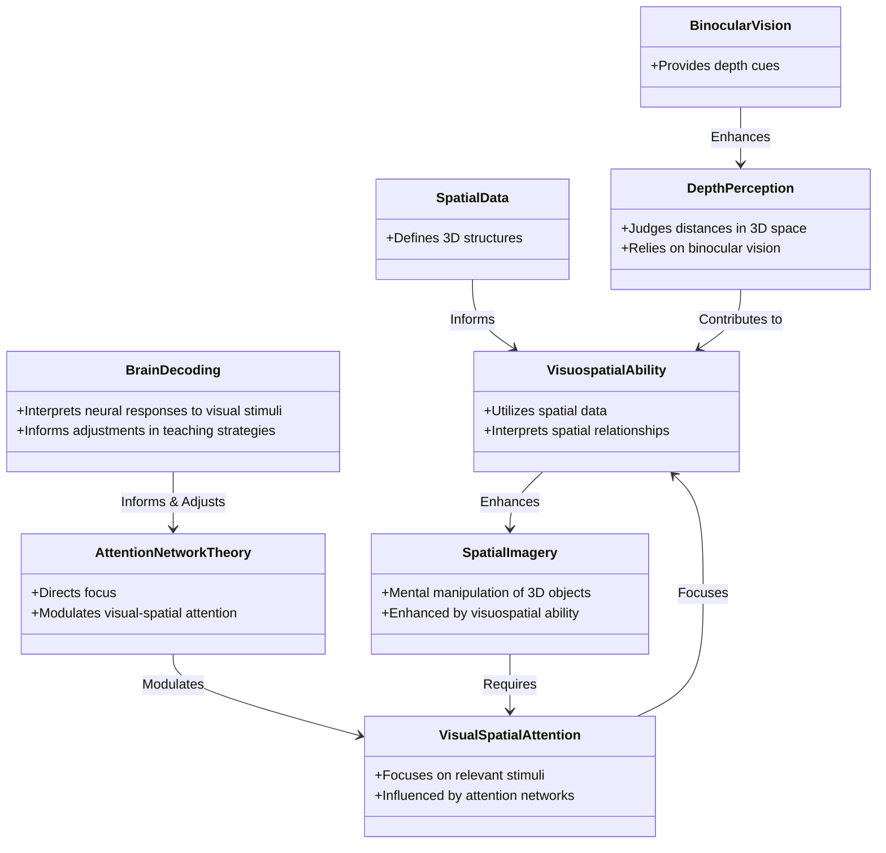

- [[Binocular Vision]] enhances [[Depth Perception]] by providing depth cues. 双目视觉通过提供深度提示来增强深度感知。
- [[Spatial Data]] informs [[Visuospatial Ability]] by defining the 3D structures and environment. 空间数据通过定义 3D 结构和环境来告知视觉空间能力。
- [[Visuospatial Ability]] enhances [[Spatial Imagery]] by allowing mental manipulation of 3D objects. 视觉空间能力通过允许对 3D 对象进行心理操作来增强空间图像。
- [[Attention Network Theory]] modulates [[Visual-Spatial Attention]] by directing focus. 注意力网络理论通过引导焦点来调节视觉-空间注意力。
- [[Visual-Spatial Attention]] focuses [[Visuospatial Ability]] by concentrating on relevant stimuli. 视觉 - 空间注意力通过专注于相关刺激来关注视觉空间能力。
- [[Brain Decoding]] informs and adjusts [[Attention Network Theory]] by interpreting neural responses to visual stimuli. 大脑解码通过解释对视觉刺激的神经反应来告知和调整注意力网络理论。
- [[Depth Perception]] contributes to [[Visuospatial Ability]] by judging distances in 3D space. 深度知觉通过判断 3D 空间中的距离来促进视觉空间能力。
- [[Spatial Imagery]] requires [[Visual-Spatial Attention]] for effective mental manipulation of 3D objects. 空间意象需要视觉-空间注意力才能对 3D 对象进行有效的心理操作。