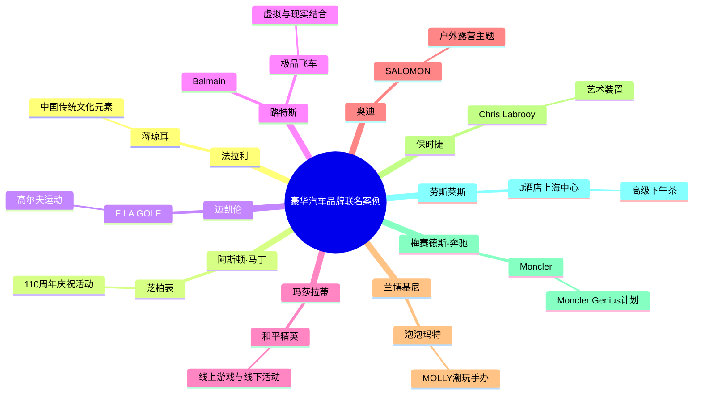

```
豪华汽车品牌怎么做“联名”？这十佳案例值得 mark!
 174次阅读 没有评论
《华丽志》于2022年11月首发「华丽汽车品牌榜」，迄今共收录到150条高端汽车品牌的跨界联名动向。其中：

联名最多的豪华汽车品牌是意大利的兰博基尼（Lamborghini），共开展了15项联名合作；
联名最多的豪华汽车品牌是意大利的兰博基尼（Lamborghini），共开展了15项联名合作；

与汽车界联名最多的服饰品牌是德国的彪马（PUMA），与3家汽车品牌开展了合作。

豪华汽车品牌怎么做“联名”？这十佳案例值得 mark!

跨界联名是汽车品牌沟通高端消费者，拓展潜在受众群体的重要手段。源于受众人群的高度重合，高端汽车品牌长久以来已经与高级音响耳机、高级手表以及运动鞋等品类深刻绑定。

根据「华丽汽车品牌榜」和华丽志旗下全球首个时尚商业实时动态平台「华丽通」一年来的追踪，我们观察到，豪华汽车品牌正在将触角延伸到更广阔的领域，比如艺术、游戏、文化IP，以及高尔夫、露营、咖啡等热门生活方式场景。

本文将盘点过去一年来令人印象最深刻的10大豪华汽车品牌联名案例：

法拉利×蒋琼耳
豪华汽车品牌怎么做“联名”？这十佳案例值得 mark!

「华丽点评」

蒋琼耳是中国知名设计师、艺术家。2009年，她携手爱马仕创办当代生活方式品牌 SHANG XIA 上下，后者是首批登上国际奢侈品舞台的中国品牌之一。

这辆车以法拉利标志性的哑光银色（Sanusilver Matte）搭配近似中国传统色胭脂红的红色（Rosso Magma Glossy）作为设计主基调。车身和座椅的条纹设计取自中国明式家具，车载配件采用中国手工艺，包括紫檀熏香、大漆纸巾盒等。
透过蒋琼耳的创意视角，这辆独一无二的法拉利融合了对中国传统文化的独到见解，汽车的当代科技属性与传统东方文化碰撞出灵感火花。

在法拉利献礼中国30周年之际，品牌开展了一系列声势浩大的庆祝活动，与蒋琼耳的联名合作是系列庆祝活动中非常亮眼的一环：不仅展示出法拉利对中国市场的重视，拉进了与中国消费者的心理距离；也在硬核造车形象以外，展现出了法拉利品牌丰厚的历史底蕴和积淀，传递出了品牌在文化方面的深度思考。

阿斯顿·马丁×芝柏表
豪华汽车品牌怎么做“联名”？这十佳案例值得 mark!

豪华汽车品牌怎么做“联名”？这十佳案例值得 mark!

「华丽点评」

阿斯顿·马丁与芝柏表的合作始于2021年，至今共合作推出6款手表。双方持续挖掘品牌契合点，带来令人耳目一新的作品。

2023年3月，联名手表的发布活动选址于“海上第一名园”张园；5月，阿斯顿•马丁又在这里举办了入华以来规模最大的品牌系列主题活动“110年·动容不止”，上海张园的茂名北路被布置成了“阿斯顿·马丁大道”。与芝柏表的联名系列有机融入到阿斯顿•马丁110周年的庆祝活动之中。

源于高度重合的客群画像，和对精密机械的共同追求，手表是汽车品牌常见的联名对象。2023年以来，汽车与手表的联名还有：梅赛德斯-奔驰（Mercedes-Benz）×IWC万国表，兰博基尼（Lamborghini）×罗杰杜彼（Roger Dubuis），保时捷（Porsche）×泰格豪雅（TAG Heuer），保时捷（Porsche）×佳明（Garmin）。
迈凯伦×FILA GOLF
豪华汽车品牌怎么做“联名”？这十佳案例值得 mark!

豪华汽车品牌怎么做“联名”？这十佳案例值得 mark!

「华丽点评」

这是迈凯伦首次与时装品牌合作。据迈凯伦中国区总经理王娜介绍，这也是第一次在高尔夫运动的专业装备中使用超级跑车的创新科技。

2023年4月，该联名系列在东莞观澜湖球场举行了首发活动。10月，伴随“FILA GOLF × McLAREN”2023 WINTER COLLECTION新季作品发布，又在北京SKP 开设了双品牌联展快闪空间。
当前高尔夫运动在中国不断升温，高尔夫不仅契合了户外运动生活方式的潮流趋势，也是高端商务社交的热门场景。一直以来，汽车文化都与专业运动存在着强关联（比如赛车）。专业的赛车运动影响了汽车文化的发展，赛车运动和汽车文化也给予了时尚潮流发展的灵感。

借助高尔夫这一细分运动领域，迈凯伦开辟了一个与高端运动人士沟通的新触点。

路特斯×Balmain×极品飞车
豪华汽车品牌怎么做“联名”？这十佳案例值得 mark!

豪华汽车品牌怎么做“联名”？这十佳案例值得 mark!

「华丽点评」

汽车品牌经常在赛车竞速游戏中更新虚拟涂装，路特斯与经典赛车游戏IP《极品飞车™》的合作因法国奢侈品牌Balmain的加入而更具看点。车手服灵感源自Balmain 2022 秋冬系列时装秀。

《极品飞车™》为此次联名推出的全新赛车手角色Eléonore让人联想到了Balmain创意总监 Olivier Rousteing。Olivier Rousteing常活跃于社交媒体，其鲜明的个人形象对Balmain品牌的塑造也起到了重要作用。

从游戏角色到服装和汽车涂装，此次联名三方在设计风格和品牌气质上达成了很高的契合度。

此外，游戏中的联名特别版B-IT运动鞋发布了实体版本，于Balmain官网限量发售100件。这种打破次元壁的做法，帮助路特斯在汽车游戏爱好者以外，触达了更广泛的潜在受众。

玛莎拉蒂×和平精英
豪华汽车品牌怎么做“联名”？这十佳案例值得 mark!

豪华汽车品牌怎么做“联名”？这十佳案例值得 mark!

「华丽点评」

玛莎拉蒂与《和平精英》的合作始于2020年。最新合作打破了在游戏中推出载具涂装的常规形式，延伸到线下体验活动，玩家可以深度参与内容共创。

在2023年4月的TGC腾讯游戏超级世界·武汉站线下活动中，联名载具SUVGrecale化为现实，空降TGC《和平精英》展台，涂装采用双方共创的独特颜色——“幻星粉”。现场邀请玩家参与角色试镜考核，可加入和平精英×玛莎拉蒂冒险大片剧组，担任主角完成影片拍摄。
玛莎拉蒂联名中国知名的游戏IP，不仅深度沟通了中国年轻的汽车爱好者和数字用户，而且融入了精彩的在地文化叙事。影片中，玩家驾驶玛莎拉蒂全新SUVGrecale，从“武汉长江大桥”穿越至游戏海岛，开启一场燃擎冒险之旅。

《和平精英》曾与多个汽车品牌跨界联动推出定制载具皮肤，还包括阿斯顿马丁（Aston Martin）、特斯拉（Tesla）、兰博基尼（Lamborghini）和路特斯（Lotus）等。

奥迪×SALOMON
豪华汽车品牌怎么做“联名”？这十佳案例值得 mark!

豪华汽车品牌怎么做“联名”？这十佳案例值得 mark!

「华丽点评」

汽车品牌与运动鞋的联名合作渊源深厚，而奥迪与SALOMON进一步定位到了当前非常热门的户外露营细分领域。

在这一联名发布之前，奥迪旅行车大探险家已经围绕户外露营主题做了一些营销活动，包括携手高端帐篷品牌自由之魂、水上户外运动品牌BoteBoards 、折叠自行车品牌BROMPTON、车顶架系统制造商拓乐THULE等多位“志同道合的露营老友”上线了户外露营主题视频短片。

SALOMON 以往与法国设计师品牌 Maison Margiela（马吉拉时装屋）旗下女装副线 MM6 Maison Margiela、与日本设计大师川久保玲 Comme des Garçons 等的合作都非常轰动，这是SALOMON难得一见的汽车联名合作。SALOMON的高话题度，使这个仅一款产品的联名合作足够令人印象深刻。

兰博基尼×泡泡玛特
豪华汽车品牌怎么做“联名”？这十佳案例值得 mark!

「华丽点评」

泡泡玛特的MOLLY作为热门的潮玩IP深受年轻人喜爱，且联名不断，以往的合作对象包括日本潮流品牌 BEAMS 、RAY-BAN雷朋眼镜、迪士尼、朱雀二号遥三运载火箭等。这是MOLLY首次与超跑品牌跨界合作。

年轻人将泡泡玛特的潮玩手办视作具有艺术价值的收藏品，限量联名款更是抢手。此次兰博基尼联名MOLLY，1000%尺寸售价5999元，400%尺寸售价1299元，需要抽签获取购买资格。

与泡泡玛特的合作凸显兰博基尼沟通中国年轻消费者的用意。在2024年元旦节点，兰博基尼还与红米手机合作，发布了K70 Pro冠军版联名手机。

保时捷×艺术家Chris Labrooy
豪华汽车品牌怎么做“联名”？这十佳案例值得 mark!

豪华汽车品牌怎么做“联名”？这十佳案例值得 mark!

「华丽点评」

Chris Labrooy 是保时捷的长期合作伙伴，他的许多 3D 作品都会出现保时捷 911。他创作的“996天鹅”艺术车曾于 2021 年作为保时捷在中国内地 20 周年庆祝活动的一部分在上海展出，并于次年造访成都。996 是 20 年前保时捷在中国大陆销售的第一款 911 车型，具有重要的纪念意义。

此次 Chris Labrooy 通过装置艺术“Dream Big.”表达了对童年梦想的致敬，作品的时尚现代风格与周围的上海传统石库门建筑相映衬，呈现出了一种极强烈的反差感。

作品有意利用了周围富有传统风貌的在地环境，放大了作品所散发出的“新生力量”，保时捷表示：旨在“唤起孩童对跑车的兴趣，激发现场观众对保时捷品牌的热情和勇于探索梦想的遐想。”

这是保时捷在全球开展的“The Art of Dreams”系列展首次登陆中国，保时捷在一份新闻稿中表示，中国是“其全球最大单一市场”。

展出后不久，Chris Labrooy 还参与了影像上海艺术博览会（PHOTOFAIRS Shanghai）上的保时捷「为梦着色」主题展。

保时捷连续多年与全球艺术家合作，一方面展现了品牌深厚的文化底蕴；另一方面借艺术家合作致敬中国市场，足见对中国市场的重视。

梅赛德斯-奔驰×Moncler
豪华汽车品牌怎么做“联名”？这十佳案例值得 mark!

「华丽点评」

Moncler Genius是Moncler备受关注的一项联名合作计划，自2018年以来，通过与不同的设计师合作，共同构建Moncler Genius先锋性的美学概念。

梅赛德斯-奔驰是Moncler Genius合作的首个汽车品牌。PROJECTMONDO G 艺术车成为本届天才创艺大秀上的亮点作品。主办方表示，这件作品象征着“梦想远大，在探索的道路上敢为人先”，也是两家品牌“奢华和开拓精神”共同价值观的融合。

这项难得的合作，显示出品牌双方打破边界，跨越现有领域，参与更广泛的设计形式，与更多受众进行互动的愿景。

梅赛德斯-奔驰集团董事会成员、负责销售与市场营销的 Britta Seeger 女士表示，“梅赛德斯-奔驰致力于参与文化和社会活动”，这项合作开拓了品牌的视野，将为更多的联名合作打开机会之窗。

劳斯莱斯×J酒店上海中心
豪华汽车品牌怎么做“联名”？这十佳案例值得 mark!

「华丽点评」

J酒店上海中心位于“中国第一高楼”上海中心大厦，酒店120层的“天之锦”餐厅被称为世界“建筑物中最高餐厅”，距离地面556米。

J酒店上海中心饼房行政总厨程术将劳斯莱斯诸多经典元素融入下午茶设计中，主要灵感来自劳斯莱斯标志性的进气格栅，形似希腊帕特农神庙。随着整个甜品架360度自动旋转，伫立其上的劳斯莱斯“欢庆女神”亦随之转动。

豪车与酒店同为奢侈生活方式的一部分，通过将品牌体验延伸到车主生活方式的其他领域，豪车品牌更加加强了与车主之间的情感纽带。实际上，一些豪车品牌已经深度涉足酒店业务，比如迪拜等地的瑞吉酒店长期设有宾利套房，保时捷推出了“施柏阁 Porsche Design 酒店品牌”。
而联名，为豪车品牌拓展生活方式领域提供了一种更“轻”的参与方式。

今年情人节前夕，劳斯莱斯汽车上海浦东店还与上海金普顿前滩酒店、英国真丝品牌Silky Miracle共同合作，打造了“臻爱之旅”主题套房。
```


根据您提供的内容，我选择使用思维导图(Mind map)来展示豪华汽车品牌的联名案例。这种图表类型最适合展示主题及其相关的子主题和细节，非常适合总结文章中提到的十大联名案例。

以下是基于内容生成的Mermaid思维导图代码：




注入品牌基因，旨在推动销售

1. 汽车领域:
- 意大利豪华汽车品牌(如法拉利、兰博基尼等)可以与中国知名设计师合作,
- 可以与中国科技公司合作, 开发智能汽车系统或新能源汽车技术。
- 与中国游戏公司合作,在热门游戏中推出虚拟车型或联名皮肤。开发数字藏品或元宇宙体验。
- 中国红旗轿车与意大利设计师联名, 强化中国元素, 打造融合中国元素的限量版车型。

2. 红酒领域:
- 意大利顶级葡萄酒庄可以与中国应聘饮品连锁品牌合作, 推出茶香红酒等创新式饮品。例如_喜茶_ HEYTEA 连锁品牌; 貴州茅台與瑞幸咖啡（Luckin Coffee）跨界合作.

- 与**中国陶瓷** 是很好的联系国际交流的纽带，寓意着丝绸之路, 文化与经济合作，倡导友城关系并续写两国友谊。但需要注意陶瓷瓶的微孔结构会让一定量的空气进入,促进红酒的慢慢氧化,帮助红酒的成熟和口感的改善。但过度氧化会损害红酒的质量。[8](https://zhidao.baidu.com/question/46642305/answer/2354037032.html)


3. 白酒领域:
- 与意大利调酒师联手,开发白酒鸡尾酒。
- 与意大利食品品牌合作,推广白酒与意大利美食的搭配。

以下是一个繁华电影节的优化方案, 目的是将电影节改良成为中国产品销售海外的机会, 请集思广益, 改写并补充建议例如, 
有针对性的选取中国人文的电影题材, 并突出这样办可以吸引更多来自中国国家的支持, 中国企业的赞助, 甚至一些意大利酒店餐饮企业的赞助.

中国正在努力通过增加出口来改善经济。在意大利佛罗伦萨举行的繁华电影节成为了展示中国品牌的好机会。

向西方推广中国产品有一些困难,因为文化不同。比如,意大利人可能不习惯喝中国白酒。要在意大利推广白酒,需要花很多钱来创造特别的环境,让人们了解中国文化。

电影节是一个很好的机会,可以让意大利人看到中国文化。中国电影里经常会出现喝白酒的场景。(特别是古代文学名著, 旅游文化, 中国科技等题材 )看完电影后,可以中国美食主题的酒会, 让意大利人亲自品尝白酒,这样他们会更喜欢这个产品。

我们还邀请意大利餐厅和美食专家来电影节,尝试把白酒和意大利美食搭配在一起,创造新的吃法,让它成为一种新潮流。

邀请网红连锁品牌到现场例如: 喜茶 HEYTEA 连锁品牌, 设计新品, 例如意大利顶级葡萄酒庄可以与中国应聘饮品连锁品牌合作, 推出茶香红酒等创新式饮品。参考: 最近貴州茅台與瑞幸咖啡（Luckin Coffee）跨界合作.

总的来说,电影节为中国品牌打开了进入意大利市场的大门,是推广中国文化和产品的好平台。


```


以下是对繁华电影节优化方案的改写和补充建议,旨在将其打造成为中国产品销售海外的绝佳机会:

1. 有针对性地选取展现中国人文特色的电影题材,如古代文学名著改编、现代都市生活、乡村振兴故事等,以吸引国际观众对中国文化的兴趣。

2. 突出此举可吸引更多来自中国的支持:
   - 邀请中国国家电影局、文化和旅游部等机构参与,提升电影节的官方地位。
   - 吸引中国大型企业如阿里巴巴、腾讯等成为主要赞助商。
   - 争取中国驻意大利使馆的支持,助力文化交流。

3. 设立"中国主宾国"单元,集中展示中国优秀电影作品和文化产品。

4. 组织中国品牌展览区,展示中国高科技产品、传统工艺品、时尚服饰等。

5. 举办中国美食节,邀请知名中国厨师现场烹饪,推广中国美食文化。

6. 策划中国白酒与意大利美食的创新搭配活动,邀请意大利名厨参与,创造独特的跨文化美食体验。

7. 举办中国传统文化体验活动,如书法、茶艺、中医养生等,增进意大利观众对中国文化的了解。

8. 邀请意大利当地酒店、餐饮企业参与赞助,为其提供与中国品牌合作的机会,如举办中国主题晚宴等。

9. 组织中意企业家交流会,促进两国商业合作。

10. 设立"一带一路"电影单元,展示中国与意大利在文化、经贸等方面的合作成果。

11. 利用社交媒体平台进行全方位宣传,吸引更多国际观众关注。

12. 邀请国际知名影星担任中国电影和产品的推广大使,提升影响力。

通过这些举措,繁华电影节不仅能成为展示中国文化的窗口,还能成为中国产品进入意大利乃至欧洲市场的重要平台,实现文化交流与经贸合作的双赢。
```