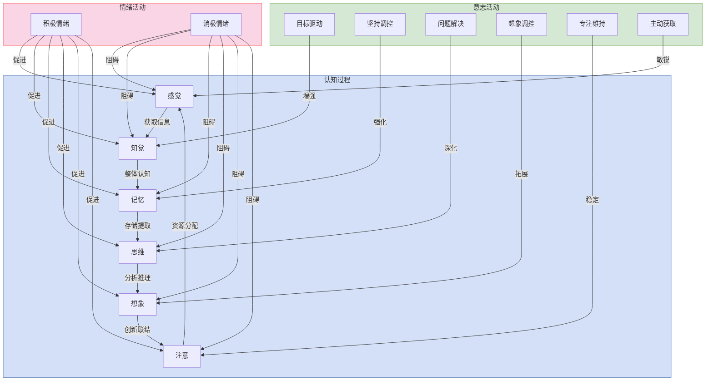

维冯. 2020. 高等教育心理学. 西南师范大学出版社.
[[@2020WeiGaoDengJiaoYuXinLiXue]]

## 大学生心理现象分类

大学生的心理现象可以系统地分类如下：

*   **心理过程**
    *  **认知过程**：是大学生获取知识和运用知识的心理过程。包括: 感觉、知觉(感知)、记忆、思维、想象、注意。
    *   **情绪活动**：大学生在认知客观事物时产生的特定体验。例如，高兴、悲伤、愤怒、焦虑等。
    *   **意志活动**：有意识、有目的地调节和支配大学生行动的过程。
*   **个性心理**
    *   个性倾向性
    *   个性心理特征
*   **群体心理**：是在一定社会环境下的群体心理现象及其规律的反映。例如，同学之间的竞争与合作、从众心理、班级的凝聚力与规范等。

### 一、心理过程  
心理过程是大学生对外界刺激的主观反应和内在活动的动态过程，主要包括以下几个方面：  

**认知过程**  
大学生获取和运用知识的心理过程，包括感觉、知觉、记忆、思维、想象和注意等。感觉和知觉是认识世界的门户，记忆是将过去感知过的事物储存在头脑中并提取出来的过程，思维是对事物本质和规律的间接概括反映，想象是在头脑中创造出新事物的形象，而注意伴随着各种认知过程。  
1. **感觉**：通过感觉器官获取事物的基本信息（如颜色、形状等）。  
2.  **知觉**：认识事物的整体及其属性关系。  是在感觉的基础上，反映==事物的整体以及各属性之间的关系==
3. **记忆**：==储存和提取过去感知过的事物==。  思考过的问题、体验过的情绪、操作过的动作，以映像的形式储存在头脑中.
4. **思维**：==为了完成任务，达到目的，需要解决多问题时逻辑推理过程。思维是对事物本质和规律的间接的概括反映==。例如，通过对电闪雷鸣的感知，了解其知识、原理和规律。
5. **想象**：==创造新事物的形象。==  是在感知、记忆、思维的基础上，在头脑中创造出新事物的形象。例如，想象外星人的形象。
6. **注意**：认知过程的核心，是认知事物的必要条件。大学生的感知、记忆、思维、想象等都必须有注意的参与.  

认知是情绪和意志的基础：大学生的认知活动是情绪和意志产生的基础，能够推动情绪和意志的发展。例如，当大学生认识到学习的重要性时，会热爱学习并努力克服学习中的困难。

**意志活动** 和 **情绪活动**对学生认知过程的干预: 
在意志活动中，教师可通过目标驱动学生的知觉、调控记忆、问题解决、想象调控以及专注维持等方式，深化学生的认知过程。
在情绪活动中，情绪活动中对感觉的干预是提升学生整体认知能力的高效途径。优先关注学生的“**感觉**”，这是认知链条的起点，改善学生的感觉体验可带来连锁反应，优化知觉、记忆、思维、想象和注意等后续认知因素(**知觉,记忆, 思维,想象,注意**)的表现。 

**情绪活动**  
大学生在认知客观事物时所产生的特定体验，如高兴、悲伤、愤怒、焦虑等。情绪、情感是与大学生的生理性需要和社会需要相联系的心理活动，具有特定的主观体验、外显表情和生理变化。
   - **定义**：大学生在态度体验中所产生的情绪和情感。  
   - **具体表现**：情绪体验是大学生对外界刺激的主观感受，具有个体差异。  

 **意志活动**  
 大学生为了完成一定的任务，达到一定的目的，有意识、有目的地调节和支配行动的过程。在这个过程中，大学生需要提出奋斗或生活的目标，制订计划，选择达到目标的途径与方法，并且要克服各种困难和障碍，并坚持努力下去。
   - **定义**：大学生改造客观事物的意志。  
   - **具体表现**：意志活动是大学生通过努力克服困难、实现目标的过程。  

---

### 二、个性心理  
个性心理反映了大学生之间的稳定心理差异特征，包括个性倾向性和个性心理特征：  

10. **个性心理特征**  
   - **定义**：大学生独特的心理特征的组合。  
   - **具体表现**：  
     - **能力**：在写作、体育、音乐等方面的差异。  
     - **气质**：生理和神经系统活动的特点（如情绪化或冷静）。  
     - **性格**：行为和态度的稳定模式（如急躁、理性等）。  

11. **个性倾向性**  
   - **定义**：推动大学生活动的动力系统。  
   - **具体表现**：  
     - **需要**：对内外环境的客观需求反映（如安全、归属、尊重等）。  
     - **动机**：引起和维持大学生活动的内在动力（如学业成就动机）。  
     - **价值观**：对事物重要性的认识，指导行为选择。  

---

### 三、群体心理  
大学生生活在各种社会环境和社会关系中，受到校风、规章制度、师生关系、同伴关系等的影响，形成群体心理现象：  
- **定义**：反映一定社会环境下的群体心理现象及其规律。  
- **具体表现**：大学生在集体中可能表现出与个体不同的心理特征和行为模式。  

---

#### 四、心理实质  
- **定义**：大学生的心理实质是脑的机能，是对客观现实的主观反映。  
- **具体表现**：心理过程和个性心理相互作用，既是基础也是制约因素。  

---

